# 2022 Research Daily

## 2022/8/4

Seminar:

* Write my research plan

* Read the paper: Goto, K., & Geijn, R. A. V. D. (2008). Anatomy of high-performance matrix multiplication. *ACM Transactions on Mathematical Software* *(TOMS)*, *34*(3), 1-25.

* I wanna write a GEMM program which has a better performance

## 2022/8/1

I change the memory of GPU with  `raspi-config` tool, but the program cannot running, too.

So instead of solving this problem I decide to measure the running time in other threads.

The benchmark data is as follow: (Size 16384 is not be evaluated because of the problem of memory)


-> QPU has a very low performance and the performance of py-videocore6 library is not very good, too.

---

Meeting with Prof. Ueda:

* About

```
Blocking does not improve the performance of matrix multiply on the Core i7, because of its sophisticated prefetching hardware.
```

in CSAPP:

```
この文だけを取り出すと後町君のようなコメントが返ってきてしまうかもしれないけど，この文は，教科書の説明の文脈の中で理解する必要があります．この章はblockingのいくつかの実験結果と分析を示しているだけで，ベストの性能を出すことを目標にはしていません．
```

So, this conclusion is only the results and analysis obtained from the data in this chapter, and is not intended to write high-performance programs like OpenBLAS.

* The performance of Raspi's GPU is not very good, so I should give up the research on it.
* Raspi's CPU is another research theme. (other CPU is also a good theme, so Raspi is not the only choice)
* Or I can also focus on smart phone. I should investigate the parallel programming environment for smartphones and build the environment on my own. A interesting parallel applications for smartphones is the final goal.
* Arranging my daily and make all the data together.
* Revision of seminar presentation slides.

## 2022/7/31

These days I'm working on various end-of-semester reports.

## 2022/7/28

Seminar:

I ask Mr. Gocho the problem met last week (why the throughput of AppleBLAS program is better than theoretical value).

Record here:

* My reasearch diary cannot be accessed by others becasue some problem of domain's DNS, I will put my diary in the pukiwiki of lab. (maybe take several days, and before I put all my reasearch diary to the pukiwiki, I will update my daily here)
* I must ask question in the slack channels, do not ask people in private chat. (I'm not sure if it can be done becasue of my social anxiety)
* Investigating AppleBLAS is meaningless, running the tools wrote by others is not a meaningful research, too.
* The tools of Apple is not very famous, so I must cite the source of the tool when asking others for help, and must tell others the running CPU and the theoretical performance of CPU etc. And I must using the tools under my understanding and analysis.

## 2022/7/27

Testing the library py-videocore6.

The example gemm program is wrote in asm, it is a little difficult to understand it.

Changing the code in `sgemm.py` to change the size of matrix and the number of threads:

```python
def sgemm_rnn_naive():
    thread = 8
    P = 512
    Q = 512
    R = 512
    ...
```

But It can only run with 1, 8, 16 threads.

And when I change the size to 1024, I get an error to tell me the size is bigger than buffer.

For solving this problem, changing the code in the library file `driver.py`:

```python
DEFAULT_CODE_AREA_SIZE = 1024 * 1024
DEFAULT_DATA_AREA_SIZE = 32 * 1024 * 1024
```

to

```python
DEFAULT_CODE_AREA_SIZE = 1024 * 1024
DEFAULT_DATA_AREA_SIZE = 32 * SIZE * SIZE
```

`SIZE` is the size of matrix.

But, when the size increases to 4096, I got another error:

```
[Errno 62] Timer expired
```

Change the code in file `driver.py`:

```python
def __init__(self, drm, bo_handles, timeout_sec=10):
        self.drm = drm
        self.bo_handles = bo_handles
        self.timeout_sec = timeout_sec
```

to

```python
def __init__(self, drm, bo_handles, timeout_sec=10):
        self.drm = drm
        self.bo_handles = bo_handles
        self.timeout_sec = 1e7
```

But, the library cannot alloc memory for size 16384, it will throw an error:

```
Traceback (most recent call last):
  File "/home/pi/GPGPU/py-videocore6/examples/test.py", line 296, in <module>
    main()
  File "/home/pi/GPGPU/py-videocore6/examples/test.py", line 292, in main
    sgemm_rnn_naive()
  File "/home/pi/GPGPU/py-videocore6/examples/test.py", line 223, in sgemm_rnn_naive
    with Driver() as drv:
  File "/home/pi/pyvenv/lib/python3.9/site-packages/videocore6/driver.py", line 171, in __init__
    raise e
  File "/home/pi/pyvenv/lib/python3.9/site-packages/videocore6/driver.py", line 164, in __init__
    self.memory = Memory(self.drm, total_size)
  File "/home/pi/pyvenv/lib/python3.9/site-packages/videocore6/driver.py", line 76, in __init__
    raise e
  File "/home/pi/pyvenv/lib/python3.9/site-packages/videocore6/driver.py", line 68, in __init__
    self.buffer = mmap.mmap(fileno=drm.fd, length=size,
OSError: [Errno 22] Invalid argument
```

I will increse the GPU memory with `raspi-config` tool and try to solve this problem.

## 2022/7/26

After searching, I know I used a wrong command to compile the file, the library linked must write behand the file wrote by own:

```
gcc -O3 -ogemm ./main.c -pthread -lopenblas
```

With this command I compile the file rightly and get the data:

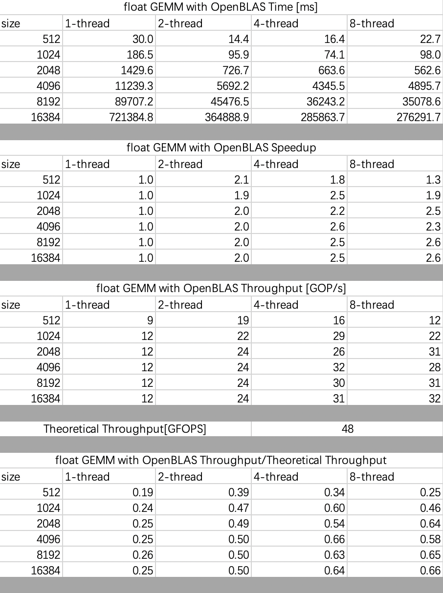

## 2022/7/25

I write this code to test the performance of OpenBLAS:

```c++
#include <stdio.h>
#include <stdlib.h>
#include <cblas.h>
#include <sys/time.h>

#define THREADS_NUM 8

int main(int argc, char const *argv[])
{
    int size = argc >= 2 ? atoi(argv[1]) : 16384;
    int ld = size + 32;
    float *a = malloc(sizeof(float) * size * ld);
    float *b = malloc(sizeof(float) * size * ld);
    float *c = malloc(sizeof(float) * size * ld);
    openblas_set_num_threads(THREADS_NUM);
    struct timeval start, end;
    gettimeofday(&start, NULL);
    cblas_sgemm(CblasRowMajor, CblasNoTrans, CblasNoTrans, size, size, size, 1.0, a, ld, b, ld, 1.0, c, ld);
    gettimeofday(&end, NULL);
    double time = (((double)end.tv_sec + end.tv_usec * 1e-6) - ((double)start.tv_sec + start.tv_usec * 1e-6)) * 1e3;
    printf("%.3f ms\n", time);
    return 0;
}
```

But I cannot compile the file becasue of this error:

```
/usr/bin/ld: /tmp/ccKCvlsR.o: in function `main':
main.c:(.text.startup+0x6c): undefined reference to `openblas_set_num_threads'
/usr/bin/ld: main.c:(.text.startup+0xb4): undefined reference to `cblas_sgemm'
collect2: error: ld returned 1 exit status
```

I compile the file with the command:

```
gcc -O3 -ogemm -pthread -lopenblas ./main.c
```

## 2022/7/23

I have assembled the Raspi and bought a new 128GB TF card from Amazon.

 I have burn the offical OS into the TF card with the `Raspberry Pi Imager` tool, and set Wi-Fi, SSH, VNC.

Install the essential software in the Raspi.

## 2022/7/21

Seminar:

Prof. Ueda suggest me to test the performance of Raspi and determine whether the QPU of the Raspi can be used first.

And I get a new Rsapi 4b from my professor.

TODO:

* Testing whether the library py-videocore6 can be used in Raspi.
* If it can be used, measure the performance of the library.

## 2022/7/20

I get some useful idea for my persentation from Mr. Gocho, record here:

```
コメントです。
行列積の図説(p.16等)は、
全て参考文献[3]の図をコピー＆ペーストしたものですね。
基本的に、自分の作業・検討内容を説明する際、
他人の著作物をコピー＆ペーストして使用することは厳禁です。
図説は技術者の必須スキルでもあるので、必ず自分で作図するようにしましょう。
なお、HPC上級者でも、OpenBLASより高性能なGEMMを作ることは困難です。
同様に、ラズパイ4のQPU(GPU)利用も難易度は非常に高いです。
また、CPUの方が高性能なので、GPUを使ってもあまり良い結果は期待できません。
組込環境向けに並列処理の研究をするのであれば、ラズパイよりむしろ、
スマートフォン(Android OS  or macOS)を題材にした方が面白いですね。
```

```
スマートフォンのプロセッサは、
例えば、Qualcomm Snapdragonが有名ですね。
https://en.wikipedia.org/wiki/List_of_Qualcomm_Snapdragon_processors#Snapdragon_8/8+_Gen_1_(2022)
問題は「それで何するの？」ということです。
( 組込システムを選択するならば、組込に適したお題・組込を選ぶ根拠が必要 )
・アプリケーション/APIを高速化する場合。
→ 具体的に何を高速化するのか？
　-行列演算/線形代数：競合技術だらけ。
　-画像処理：DeepLearning(CNN)がホット。競合技術だらけ。
　-グラフ処理：
　　　+ graph convolutional network (GCN) inference
　　　　だいぶ新しい技術。上田研っぽい。
　　　+ ゲノム解析(de bruijn graph)　
　　　　重たい処理として有名。※組込の理由がない。
　　　+ オセロ/将棋/囲碁(スマフォパズルゲームの高速処理)。
　　　　アルゴリズムが機械学習化しているので、
　　　　簡単な組合せ探索アルゴリズムを高速化してもあまり価値がない
　-他
・並列化/チューニングを容易化するフレームワークを作る場合。
→ 具体的に何を作りたいのか？
　-並列化を意識せず (プログラミング言語なし等)、並列アプリを生成するツール。
　　　+ 画像処理では、OpenCV G-APIが開発途上。
　　　　( https://docs.openvino.ai/latest/openvino_docs_gapi_gapi_intro.html )
　　　+ 機械学習では、TensorFlow (処理手順と内容を有向グラフで設計)が有名。
　　　+ Petri NetグラフのGUI設計ツール→組込コード自動生成ツール
　　　　(https://www.mdpi.com/2076-3417/10/21/7662)
　　　+ ビジュアルプログラミングツール
　-グラフ探索処理全般で使える並列コンピューティングフレームワーク
　-CG処理向け並列レイトレーシングフレームワーク
　-組込SoC上のヘテロジニアス計算リソース(CPU/GPU/DSP等)を同時活用する際に
　　負荷分散・タスク分割を自動化する並列プログラミングフレームワーク
　-スマートフォン多数を無線通信で連携させる機能(マルチホップ通信等)ライブラリ
　-他
・ラジコン等の移動物体に組込コンピュータを搭載する場合。
→ 何を使って、何のために、何を実現したいのか？
　-ミニカー/ドローン/水中ドローン + カメラ + 並列処理
　　https://github.com/NVIDIA-AI-IOT/jetracer
　-自律分散制御(マルチエージェント)
　-他
```

I will think about these carefully.

---

I find Apple has it own BLAS library (in library Accelerate), and I write a program with AppleBLAS:

```c
#include <stdio.h>
#include <stdlib.h>
#include <Accelerate/Accelerate.h>
#include <sys/time.h>

int main(int argc, char const *argv[])
{
    int size = argc >= 2 ? atoi(argv[1]) : 16384;
    int ld = size + 32;
    float *a = malloc(sizeof(float) * size * ld);
    float *b = malloc(sizeof(float) * size * ld);
    float *c = malloc(sizeof(float) * size * ld);
    struct timeval start, end;
    gettimeofday(&start, NULL);
    cblas_sgemm(CblasRowMajor, CblasNoTrans, CblasNoTrans, size, size, size, 1.0, a, ld, b, ld, 1.0, c, ld);
    gettimeofday(&end, NULL);
    double time = (((double)end.tv_sec + end.tv_usec * 1e-6) - ((double)start.tv_sec + start.tv_usec * 1e-6)) * 1e3;
    printf("%.3f ms\n", time);
    return 0;
}
```

Comparing the performance with OpenBLAS:

* Machine: MacBook Pro (14-inch, 2021)
* CPU: Apple M1 Pro
* Memory: 16GB
* OS: macOS 12.4 (Darwin Kernel Version 21.5.0)
* Theoretical Performance [GFLOP/s]:
  * `SIMD  width`: 128
  * `float  width`: 32
  * `# of SIMD Unit`: 4
  * `#  of operation per SIMD (=FMA)`: 2
  * `clock`: 3.22
  * `core`: 10
  * ===> Theoretical Throughput: 1030.4

Time: [s]

| N     | AppleBLAS # thread(s) | OpenBLAS # thread(s) |
| ----- | --------------------- | -------------------- |
|       | 10                    | 10                   |
| 512   | 1.6                   | 3.1                  |
| 1024  | 4.9                   | 15.4                 |
| 2048  | 27.5                  | 59.3                 |
| 4096  | 123.6                 | 265.2                |
| 8192  | 652.3                 | 1624.5               |
| 16384 | 4550.8                | 12116.3              |

Throughput: [GOP/s]

| N     | AppleBLAS # thread(s) | OpenBLAS # thread(s) |
| ----- | --------------------- | -------------------- |
|       | 10                    |                      |
| 512   | 170                   | 87                   |
| 1024  | 440                   | 139                  |
| 2048  | 623                   | 290                  |
| 4096  | 1112                  | 518                  |
| 8192  | 1685                  | 677                  |
| 16384 | 1933                  | 726                  |

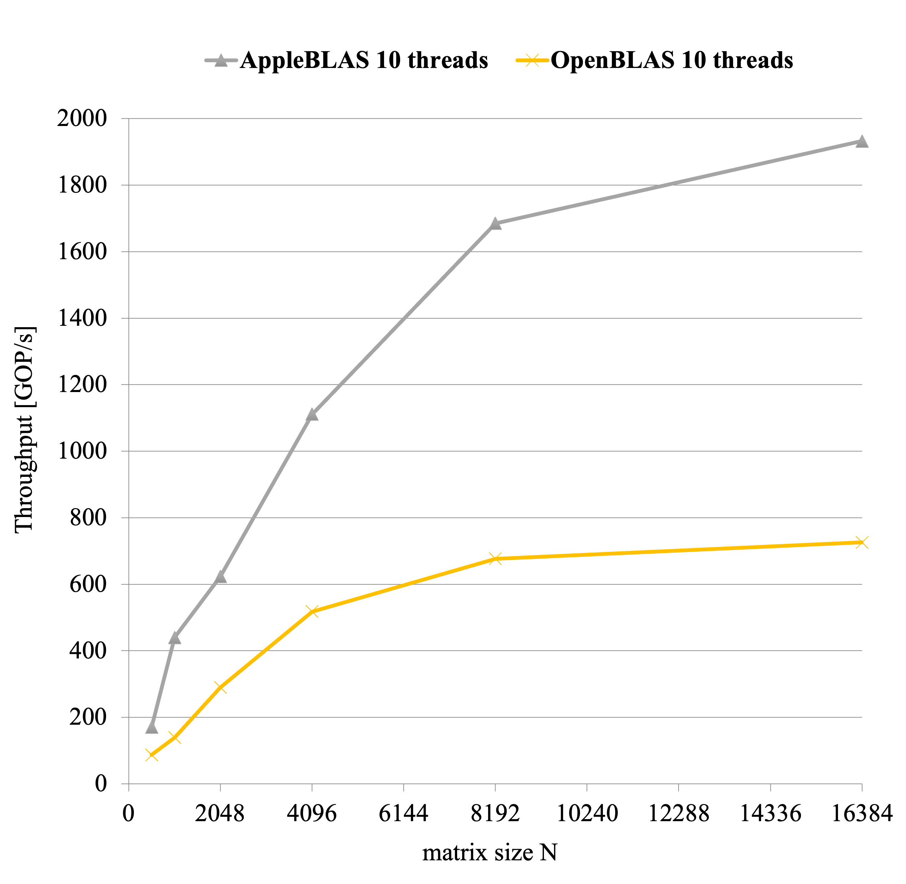

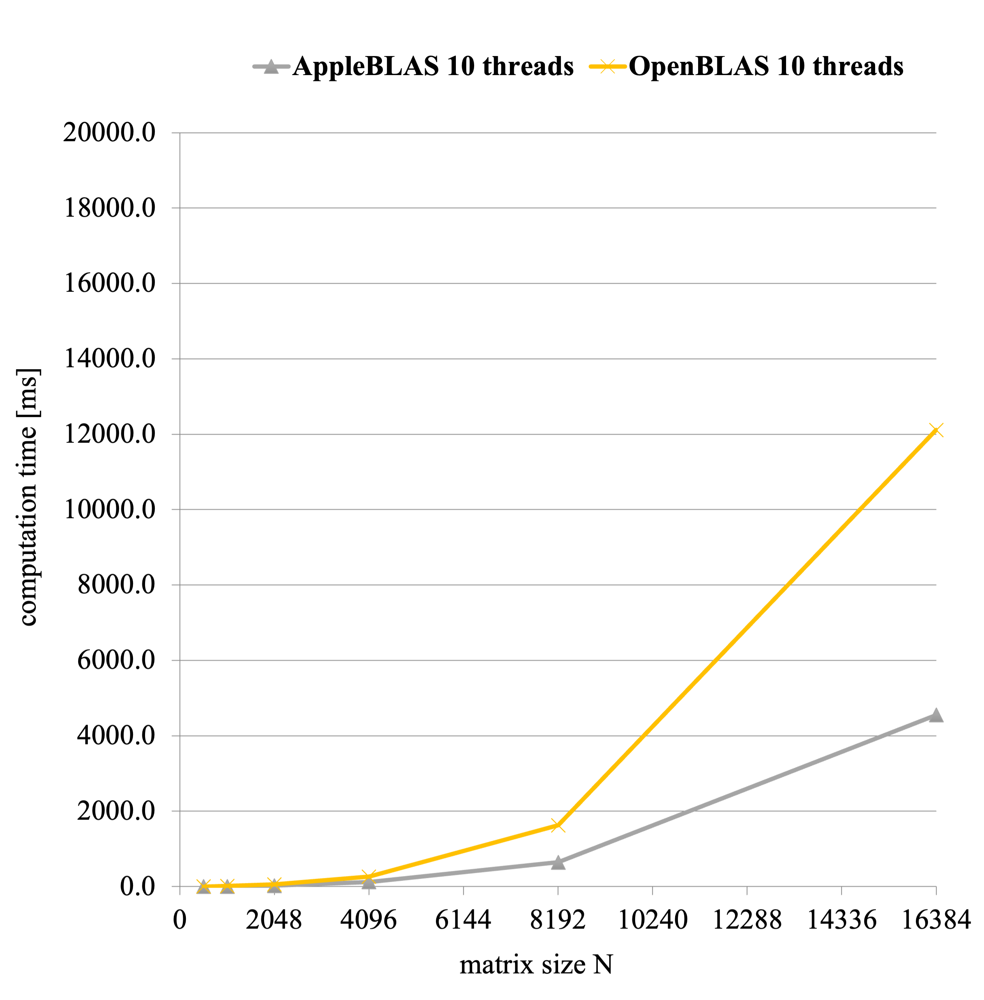

AppleBLAS has a much better performance in Apple Device than OpenBLAS.

But the throughput of AppleBLAS is higher than the theoretical value, maybe AppleBLAS use not only the CPU of Apple Silicon but also other calculation unit in Apple Silicon.

## 2022/7/19

These days I was preparing to the persentation.

The PDF material of the persentation: [20220719pdf](./data/20220719.pdf)

For preparing my persentation, I asked Mr. Gocho some questions and get lots of awesome answers, record here:

* -Z>

```
Tilingが行列掛け算を加速できる原因を調べていますが、教科書でこう書いています：
Blocking does not improve the performance of matrix multiply on the Core i7, because of its sophisticated prefetching hardware.
今使っているCPUがCore i7よりもっと高級はずです、でもTilingは確かに行列掛け算を加速できます。どうして教科書はTilingが行列掛け算の性能を改善できないって書きますか、ちょっと気になります。
```

-G>

```
どんなプロセッサでも、(Core i7、ハイエンドCPU、GPU等でも)
GEMMを高速化するために、Tiling(blocking)は有効なテクニックです。( 行列が小さすぎる場合は除く)
「より速いGEMMプログラムを書く」ことは、並列コンピューティング分野の基本的なトレーニングですが、
超高速な性能を実現するには、高い専門スキルが求められます。
教科書の著者は、スキルがなく、遅いGEMMしか実装できず,
それで、性能分析に関して、誤った説明をしているのでしょう。
要するに、教科書が間違っています。
Blocking is always effective techniques to accelerate GEMM processing
on any processors such as Core i7, more high-end CPU, and GPU, unless the matrices are too small.
The "writing faster GEMM program" is fundamental training in parallel computing area.
High professional skills of this area are required to achieve the ultra faster performance.
I think that authors of your textbook can only implement slow GEMM programs, because of their poor skills.
So, they incorrectly described the performance analysis.
In summary, your textbook is incorrect.
GEMM: general matrix multiplication
```

* -Z>

```
lda, ldb, ldc は大きなメモリの一部を行列として使う際には意味があるってわかっていますが、全部のメモリを行列として使う時は lda, ldb, ldc が性能方面の意味がありますか。
I know when I only want to work with smaller tiles inside a larger matrix, the leading dimensions parameters can give a lot of flexibility. But if I want to work with the whole larger matrix, do the leading dimensions parameters have any other significance on performance improvement?
```

-G>

```
各行列にleading dimension sizeを設定する目的は例えば以下の通りです。
・各行先頭のアドレスのalignmentを調整する。
・2冪サイズ使用時によく発生するキャッシュライン衝突を回避する。
For example, the purpose of setting the "leading dimension size" is as follows:
-Adjust the address alignment of each row; and
-Avoid cache line conflicts that are often occurred when the size is a power of 2.
```

-Z>

```
Adjusting the address alignment of each row means, for example, if I want to do a 1000*1000 matrix multiplication, I can adjust the row to 1024 so that the size of row can be aligned with the memory, is that right?
```

-G>

```
lds=10 (x 4byte = 40bit)
row0: 00 = 00000000 (32byte-aligned)
row1: 40 = 00101000 (  4byte-aligned)
row2: 80 = 01010000 (  8byte-aligned)
row3:120= 01111000 (  4byte-aligned)
lds=16 (x 4byte = 64bit)
row0:  00 = 00000000 (32byte-aligned)
row1:  64 = 01000000 (32byte-aligned)
row2:128 = 10000000 (64byte-aligned)
row3:192 = 11000000 (32byte-aligned)
AVX load/store operations for unaligned addresses have performance penalty.
| is that right?
Yes. But, the 1024 is "power of 2", which will cause cache-line conflicts.
```

```
* Example.
Cache size : 8KiB (8 * 1024 bytes)
Cache line : 64byte
Cache architecture: 8-way set associative with X tags, where X = (8*1024 [KiB]) / 64byte = 128.
　tag000: way0 way1 way2 way3 way4 way5 way6 way7 (= total 64byte x 8way )
　tag001: way0 way1 way2 way3 way4 way5 way6 way7 (= total 64byte x 8way )
　tag002: way0 way1 way2 way3 way4 way5 way6 way7 (= total 64byte x 8way )
　...
　tag127: way0 way1 way2 way3 way4 way5 way6 way7 (= total 64byte x 8way )
The tag is determined by
　tag( addr ) = (addr/64) % 128,
where 64 is the size of cache line, 128 is the number of tags, and "addr" is the accessing address.
* case: lds=4096
--> leading dimension、Cached-tile ■
■ ■ ■ ■
■ ■ ■ ■ | iteration
■ ■ ■ ■ v
■ ■ ■ ■
cached data, and tag
- row00　addr 000000　tag 0
- row01　addr 004096　tag 64
- row02　addr 008192　tag 0
- row03　addr 012288　tag 64
- row04　addr 016384　tag 0
- row05　addr 020480　tag 64
- row06　addr 024576　tag 0
- row07　addr 028672　tag 64
In this case, two tags (tag0,64) are only used.
Therefore, the limit of cached size is 1024bytes (2tags x 8way x 64byte line), which is only 1/8 the size of the entire cache memory.
When new data is cached into the tag, in which all "way"s are already used, the LRU(Last Recently Used) cache-line way will be removed from the tag.
This is called as "cache conflict" or "cache collision".
If you use the cache architecture, in which each tag can manage only 2 ways,
　 accessing row00 is "cache-miss" after accessing row01, and row02.
　 accessing row01 is "cache-miss" after accessing row02, and row04.
　 accessing row02 is "cache-miss" after accessing row04, and row01.
In this situation (called as "cache pollution), the blocking techniques provides no effects or huge performance penalty.
* case: lds=4096+32 = 4128 (32byte aligned and conflict-free size)
cached data, and tag
- row00　addr 000000　tag 0
- row01　addr 004128　tag 64
- row02　addr 008256　tag 1
- row03　addr 012384　tag 65
- row04　addr 016512　tag 2
- row05　addr 020640　tag 66
- row06　addr 024768　tag 3
- row07　addr 028896　tag 67
...
In this case, all tags (tag0,1,2,3,..., 64,65,66,67,... ) are used.
Therefore, the limit of cached size is 8192 bytes, which is the entire cache memory.
```

* -Z>

```
I had reviewed the calculation of the theoretical peak performance of ‘parmigiano’, and I found we used cores 16 when did this calculation. But according to this (https://www.amd.com/en/products/cpu/amd-ryzen-threadripper-2990wx) webpage, there are 32 cores in this CPU. So, should we use 32 instead of 16 for calculation?
I remember the avx instructions run at a lower frequency than the base frequency. So, does this mean that the program using the avx instructions cannot achieve the throughput calculated with the base frequency?
Thank you very much! Looking forward to your message.
```

-G>

```
You can use the 16 cores to calculate the theoretical peak performance
for 16-threaded code.
| avx instructions cannot achieve the throughput calculated with the base frequency
Yes, correct.
When using SIMD instructions, the CPU downclocks from the base clock.
Therefore, it is not possible to achieve 100% of the theoretical peak performance.
If the actual  performance is 80% to 95% of the theoretical performance,
your tuning is perfect.
```

## 2022/7/16

Comparing my program with OpenBLAS:

Time: [ms]

| N     | Tling # thread(s) |          |         |         |         |         | OpenBLAS # thread(s) |         |         |         |         |        |
| ----- | ----------------- | -------- | ------- | ------- | ------- | ------- | -------------------- | ------- | ------- | ------- | ------- | ------ |
|       | 1                 | 2        | 4       | 8       | 16      | 32      | 1                    | 2       | 4       | 8       | 16      | 32     |
| 512   | 14.0              | 9.5      | 6.5     | 5.0     | 4.7     | 5.1     | 14.5                 | 17.3    | 6.6     | 8.2     | 9.2     | 11.8   |
| 1024  | 96.5              | 54.2     | 32.4    | 21.6    | 18.2    | 17.1    | 61.5                 | 58.2    | 27.3    | 23.9    | 18.5    | 17.9   |
| 2048  | 730.1             | 369.9    | 193.3   | 109.8   | 83.1    | 46.3    | 362.0                | 192.8   | 110.7   | 59.5    | 51.2    | 47.6   |
| 4096  | 5634.6            | 2871.5   | 1482.8  | 855.6   | 487.1   | 350.6   | 2303.9               | 1235.4  | 673.2   | 361.6   | 203.8   | 125.4  |
| 8192  | 45421.6           | 22759.0  | 11592.5 | 6090.3  | 3433.1  | 2177.4  | 17951.3              | 9322.5  | 4835.7  | 2516.6  | 1439.7  | 810.6  |
| 16384 | 366541.7          | 183905.7 | 93005.1 | 48172.2 | 26391.1 | 16009.8 | 142728.5             | 73427.9 | 37553.3 | 19562.5 | 10657.5 | 6407.3 |

Speedup:

| N     | Tling # thread(s) |      |      |      |      |      | OpenBLAS # thread(s) |      |      |      |      |      |
| ----- | ----------------- | ---- | ---- | ---- | ---- | ---- | -------------------- | ---- | ---- | ---- | ---- | ---- |
|       | 1                 | 2    | 4    | 8    | 16   | 32   | 1                    | 2    | 4    | 8    | 16   | 32   |
| 512   | 1.0               | 1.5  | 2.2  | 2.8  | 3.0  | 2.8  | 1.0                  | 0.8  | 2.2  | 1.8  | 1.6  | 1.2  |
| 1024  | 1.0               | 1.8  | 3.0  | 4.5  | 5.3  | 5.7  | 1.0                  | 1.1  | 2.3  | 2.6  | 3.3  | 3.4  |
| 2048  | 1.0               | 2.0  | 3.8  | 6.7  | 8.8  | 15.8 | 1.0                  | 1.9  | 3.3  | 6.1  | 7.1  | 7.6  |
| 4096  | 1.0               | 2.0  | 3.8  | 6.6  | 11.6 | 16.1 | 1.0                  | 1.9  | 3.4  | 6.4  | 11.3 | 18.4 |
| 8192  | 1.0               | 2.0  | 3.9  | 7.5  | 13.2 | 20.9 | 1.0                  | 1.9  | 3.7  | 7.1  | 12.5 | 22.1 |
| 16384 | 1.0               | 2.0  | 3.9  | 7.6  | 13.9 | 22.9 | 1.0                  | 1.9  | 3.8  | 7.3  | 13.4 | 22.3 |

Throughput: [GOP/s]

| N     | Tling # thread(s) |      |      |      |      |      | OpenBLAS # thread(s) |      |      |      |      |      |
| ----- | ----------------- | ---- | ---- | ---- | ---- | ---- | -------------------- | ---- | ---- | ---- | ---- | ---- |
|       | 1                 | 2    | 4    | 8    | 16   | 32   | 1                    | 2    | 4    | 8    | 16   | 32   |
| 512   | 19                | 28   | 41   | 53   | 57   | 53   | 19                   | 15   | 41   | 33   | 29   | 23   |
| 1024  | 22                | 40   | 66   | 99   | 118  | 126  | 35                   | 37   | 79   | 90   | 116  | 120  |
| 2048  | 24                | 46   | 89   | 156  | 207  | 370  | 47                   | 89   | 155  | 289  | 336  | 360  |
| 4096  | 24                | 48   | 93   | 161  | 282  | 392  | 60                   | 111  | 204  | 380  | 674  | 1096 |
| 8192  | 24                | 48   | 95   | 181  | 320  | 505  | 61                   | 118  | 227  | 437  | 764  | 1356 |
| 16384 | 24                | 48   | 95   | 183  | 333  | 549  | 62                   | 120  | 234  | 450  | 825  | 1373 |

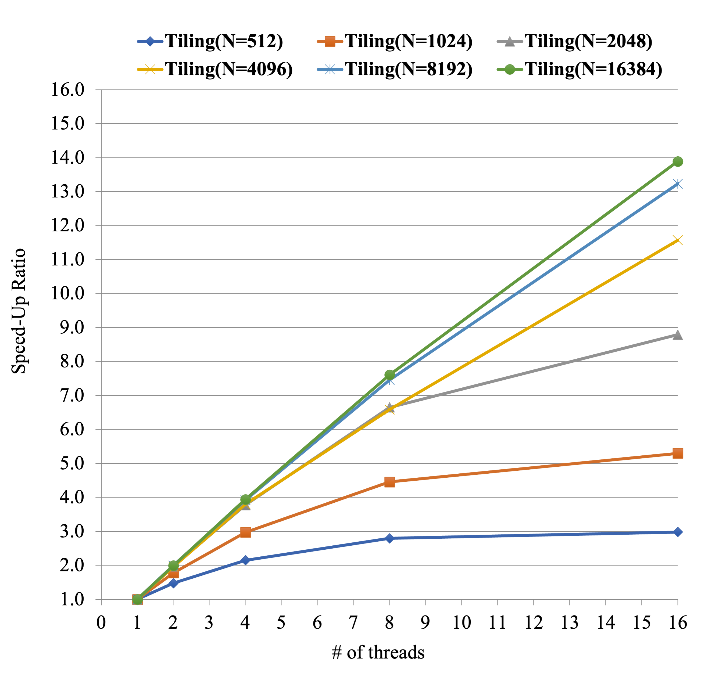

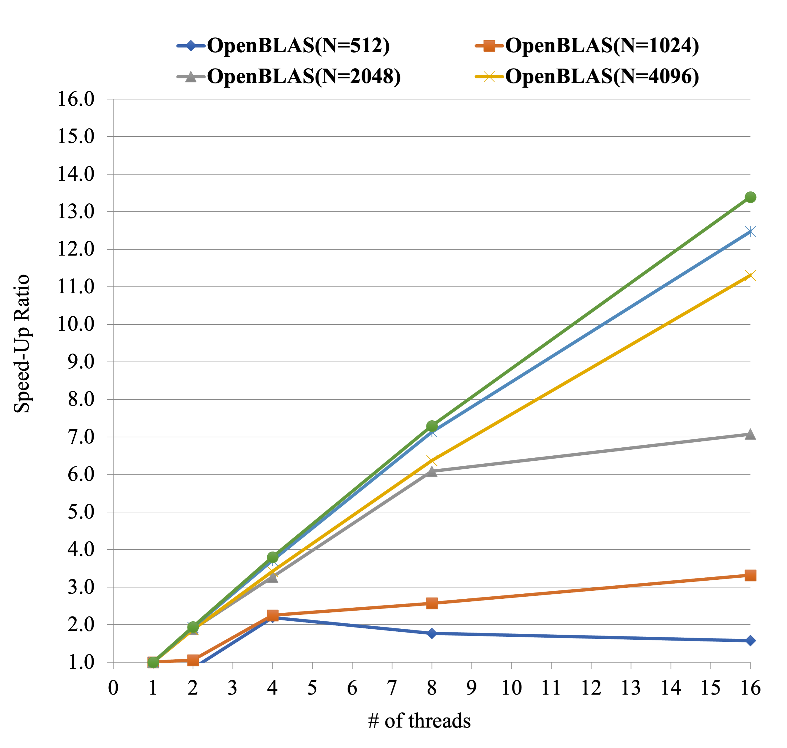

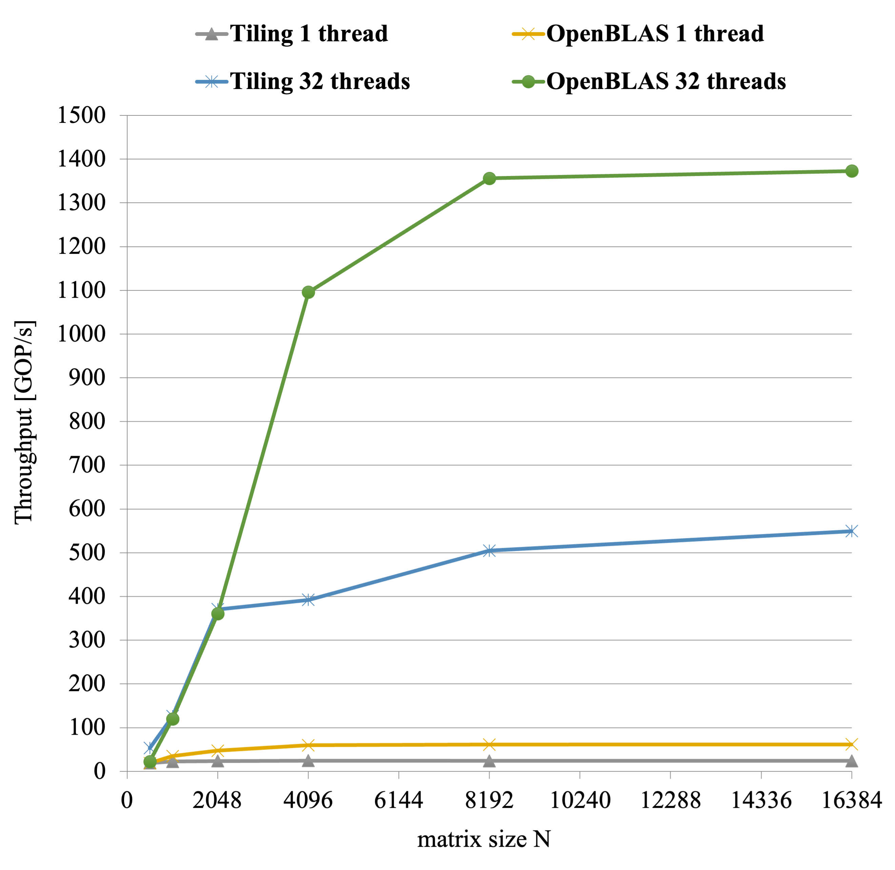

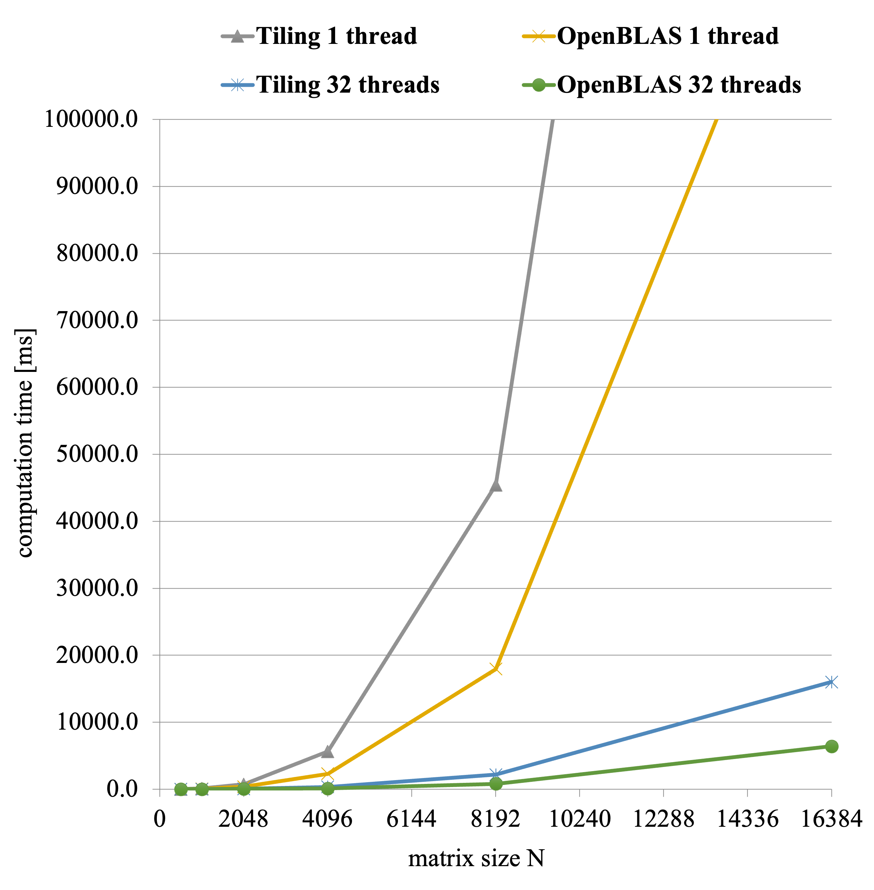

The performance of OpenBLAS is much better than my program.

So I should keep improving my program.

## 2022/7/15

Benchmark for:

* AVX256
* Block size 64
* Loop: ijk

Time: [ms]

| N     | Tiling  1thread | Tiling 2threads | Tiling 4threads | Tiling 8threads | Tiling 16threads |
| ----- | --------------- | --------------- | --------------- | --------------- | ---------------- |
| 512   | 17.6            | 10.3            | 6.5             | 5.8             | 5.2              |
| 1024  | 90.6            | 53.4            | 31.7            | 23.8            | 18.1             |
| 2048  | 729.0           | 375.5           | 205.4           | 116.6           | 77.1             |
| 4096  | 5787.9          | 2934.2          | 1520.6          | 824.6           | 533.5            |
| 8192  | 46160.5         | 23487.3         | 12040.4         | 6283.1          | 3770.9           |
| 16384 | 375556.0        | 188294.8        | 95516.3         | 49292.0         | 28163.3          |

Speedup:

| N     | Tiling  1thread | Tiling 2threads | Tiling 4threads | Tiling 8threads | Tiling 16threads |
| ----- | --------------- | --------------- | --------------- | --------------- | ---------------- |
| 512   | 1.0             | 1.7             | 2.7             | 3.0             | 3.4              |
| 1024  | 1.0             | 1.7             | 2.9             | 3.8             | 5.0              |
| 2048  | 1.0             | 1.9             | 3.5             | 6.3             | 9.4              |
| 4096  | 1.0             | 2.0             | 3.8             | 7.0             | 10.8             |
| 8192  | 1.0             | 2.0             | 3.8             | 7.3             | 12.2             |
| 16384 | 1.0             | 2.0             | 3.9             | 7.6             | 13.3             |

Throughput: [GOP/s]

| N     | Tiling  1thread | Tiling 2threads | Tiling 4threads | Tiling 8threads | Tiling 16threads |
| ----- | --------------- | --------------- | --------------- | --------------- | ---------------- |
| 512   | 15              | 26              | 41              | 46              | 51               |
| 1024  | 24              | 40              | 68              | 90              | 119              |
| 2048  | 24              | 46              | 84              | 147             | 223              |
| 4096  | 24              | 47              | 90              | 167             | 258              |
| 8192  | 24              | 47              | 91              | 175             | 292              |
| 16384 | 23              | 47              | 92              | 178             | 312              |

Comparing ijk with ikj:

Times: [ms]

| N     | ijk  1thread | ijk 2threads | ijk 4threads | ijk 8threads | ijk 16threads | ikj 1thread | ikj 2threads | ikj 4threads | ikj 8threads | ikj 16threads |
| ----- | ------------ | ------------ | ------------ | ------------ | ------------- | ----------- | ------------ | ------------ | ------------ | ------------- |
| 512   | 17.6         | 10.3         | 6.5          | 5.8          | 5.2           | 14.3        | 10.6         | 5.9          | 4.5          | 5.6           |
| 1024  | 90.6         | 53.4         | 31.7         | 23.8         | 18.1          | 89.8        | 52.3         | 31.5         | 23.2         | 16.5          |
| 2048  | 729.0        | 375.5        | 205.4        | 116.6        | 77.1          | 704.1       | 367.3        | 193.3        | 116.3        | 77.7          |
| 4096  | 5787.9       | 2934.2       | 1520.6       | 824.6        | 533.5         | 5665.1      | 2816.5       | 1467.5       | 815.5        | 523.1         |
| 8192  | 46160.5      | 23487.3      | 12040.4      | 6283.1       | 3770.9        | 44480.3     | 22643.2      | 11514.2      | 6151.9       | 3650.4        |
| 16384 | 375556.0     | 188294.8     | 95516.3      | 49292.0      | 28163.3       | 359113.7    | 179784.7     | 91564.8      | 48216.2      | 26877.2       |

Speedup:

| N     | ijk  1thread | ijk 2threads | ijk 4threads | ijk 8threads | ijk 16threads | ikj 1thread | ikj 2threads | ikj 4threads | ikj 8threads | ikj 16threads |
| ----- | ------------ | ------------ | ------------ | ------------ | ------------- | ----------- | ------------ | ------------ | ------------ | ------------- |
| 512   | 1.0          | 1.7          | 2.7          | 3.0          | 3.4           | 1.0         | 1.3          | 2.4          | 3.2          | 2.6           |
| 1024  | 1.0          | 1.7          | 2.9          | 3.8          | 5.0           | 1.0         | 1.7          | 2.9          | 3.9          | 5.4           |
| 2048  | 1.0          | 1.9          | 3.5          | 6.3          | 9.4           | 1.0         | 1.9          | 3.6          | 6.1          | 9.1           |
| 4096  | 1.0          | 2.0          | 3.8          | 7.0          | 10.8          | 1.0         | 2.0          | 3.9          | 6.9          | 10.8          |
| 8192  | 1.0          | 2.0          | 3.8          | 7.3          | 12.2          | 1.0         | 2.0          | 3.9          | 7.2          | 12.2          |
| 16384 | 1.0          | 2.0          | 3.9          | 7.6          | 13.3          | 1.0         | 2.0          | 3.9          | 7.4          | 13.4          |

Throughput: [GOP/s]

| N     | ijk  1thread | ijk 2threads | ijk 4threads | ijk 8threads | ijk 16threads | ikj 1thread | ikj 2threads | ikj 4threads | ikj 8threads | ikj 16threads |
| ----- | ------------ | ------------ | ------------ | ------------ | ------------- | ----------- | ------------ | ------------ | ------------ | ------------- |
| 512   | 15           | 26           | 41           | 46           | 51            | 19          | 25           | 45           | 59           | 48            |
| 1024  | 24           | 40           | 68           | 90           | 119           | 24          | 41           | 68           | 93           | 130           |
| 2048  | 24           | 46           | 84           | 147          | 223           | 24          | 47           | 89           | 148          | 221           |
| 4096  | 24           | 47           | 90           | 167          | 258           | 24          | 49           | 94           | 169          | 263           |
| 8192  | 24           | 47           | 91           | 175          | 292           | 25          | 49           | 95           | 179          | 301           |
| 16384 | 23           | 47           | 92           | 178          | 312           | 24          | 49           | 96           | 182          | 327           |

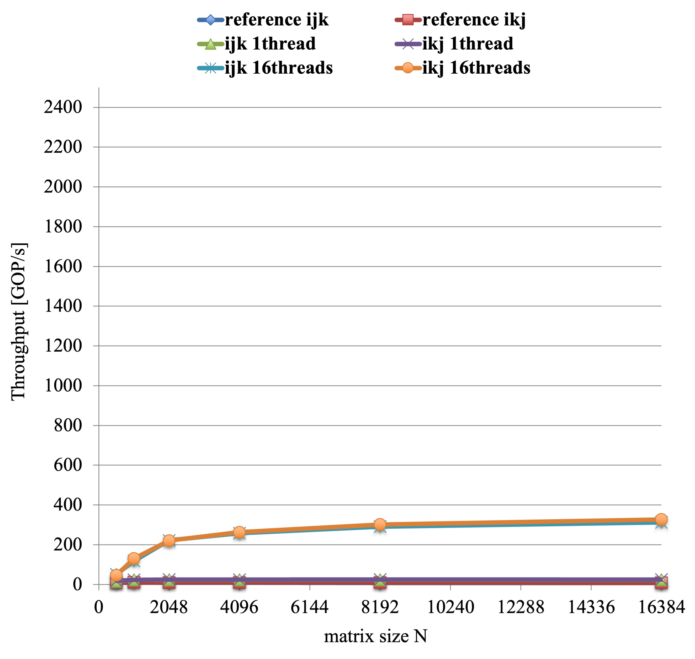

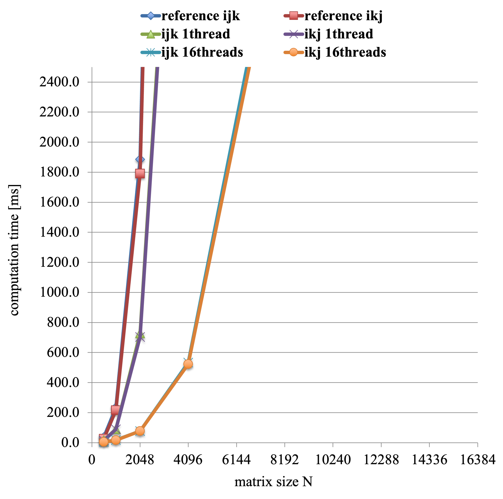

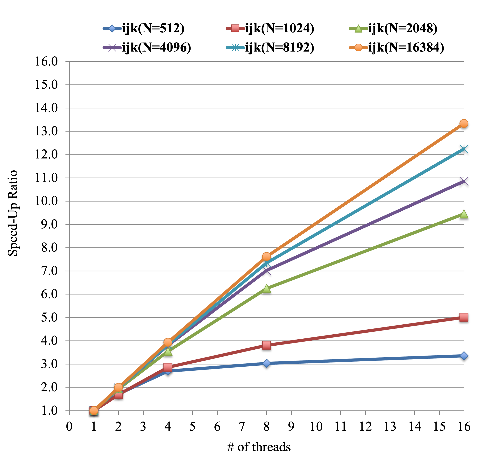

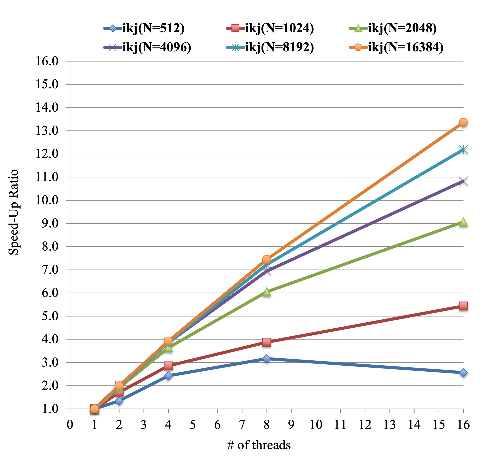

Obviously, ikj has a better performance than ijk.

## 2022/7/14

Seminar:

* Searching why the tiling can improve the performance of matrix multiplication.
* Writing a tiling ijk matrix multiplication program.
* Think about my research plan.

## 2022/7/13

Also test the situation of AVX128 and block size 32:

Time: [ms]

| N     | Tiling  1thread | Tiling 2threads | Tiling 4threads | Tiling 8threads | Tiling 16threads |
| ----- | --------------- | --------------- | --------------- | --------------- | ---------------- |
| 512   | 16.7            | 11.2            | 6.8             | 5.3             | 7.2              |
| 1024  | 162.2           | 88.4            | 49.4            | 32.2            | 20.8             |
| 2048  | 1246.3          | 630.4           | 325.0           | 189.3           | 128.5            |
| 4096  | 9769.4          | 5005.0          | 2504.8          | 1347.0          | 795.8            |
| 8192  | 76666.5         | 38573.1         | 19836.8         | 10268.8         | 5910.4           |
| 16384 | 631604.0        | 314554.8        | 160507.0        | 82694.2         | 46568.4          |

Speedup:

| N     | Tiling  1thread | Tiling 2threads | Tiling 4threads | Tiling 8threads | Tiling 16threads |
| ----- | --------------- | --------------- | --------------- | --------------- | ---------------- |
| 512   | 1.0             | 1.5             | 2.4             | 3.2             | 2.3              |
| 1024  | 1.0             | 1.8             | 3.3             | 5.0             | 7.8              |
| 2048  | 1.0             | 2.0             | 3.8             | 6.6             | 9.7              |
| 4096  | 1.0             | 2.0             | 3.9             | 7.3             | 12.3             |
| 8192  | 1.0             | 2.0             | 3.9             | 7.5             | 13.0             |
| 16384 | 1.0             | 2.0             | 3.9             | 7.6             | 13.6             |

Throughput: [GOP/s]

| N     | Tiling  1thread | Tiling 2threads | Tiling 4threads | Tiling 8threads | Tiling 16threads |
| ----- | --------------- | --------------- | --------------- | --------------- | ---------------- |
| 512   | 16              | 24              | 39              | 51              | 37               |
| 1024  | 13              | 24              | 43              | 67              | 103              |
| 2048  | 14              | 27              | 53              | 91              | 134              |
| 4096  | 14              | 27              | 55              | 102             | 173              |
| 8192  | 14              | 29              | 55              | 107             | 186              |
| 16384 | 14              | 28              | 55              | 106             | 189              |


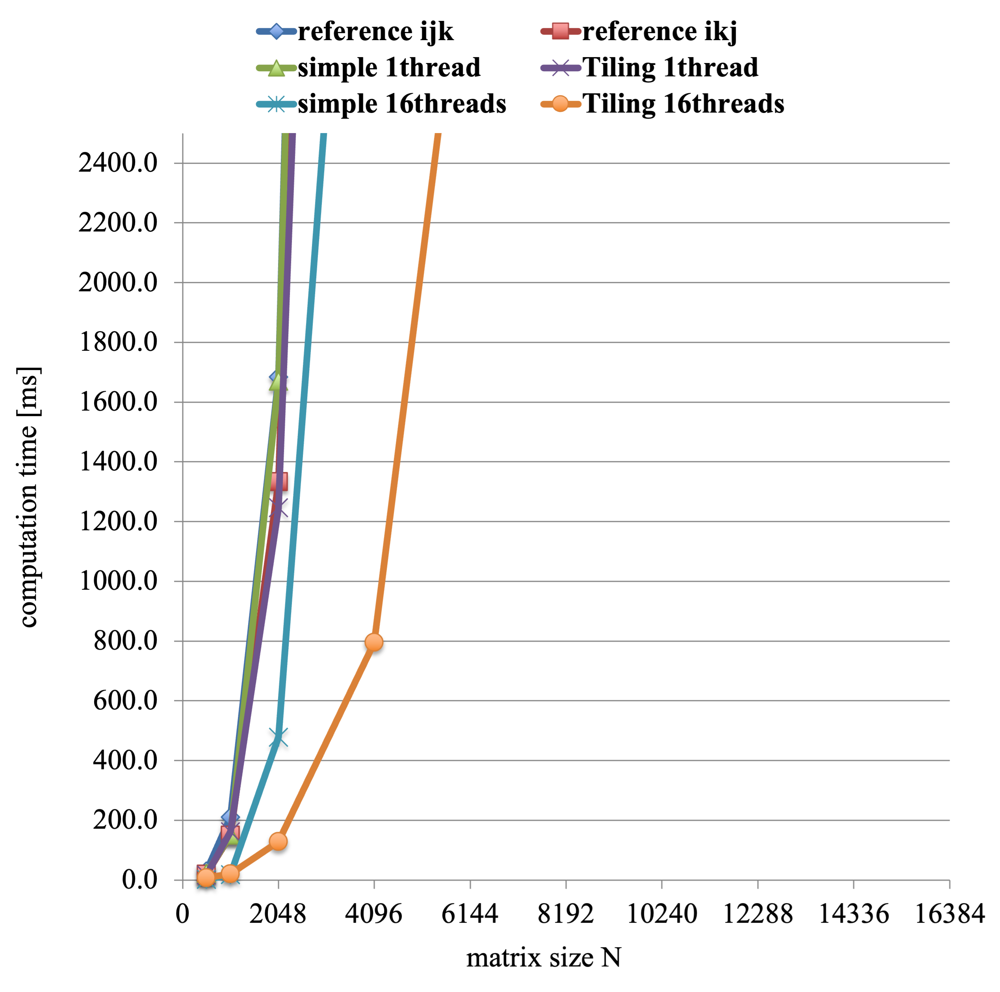


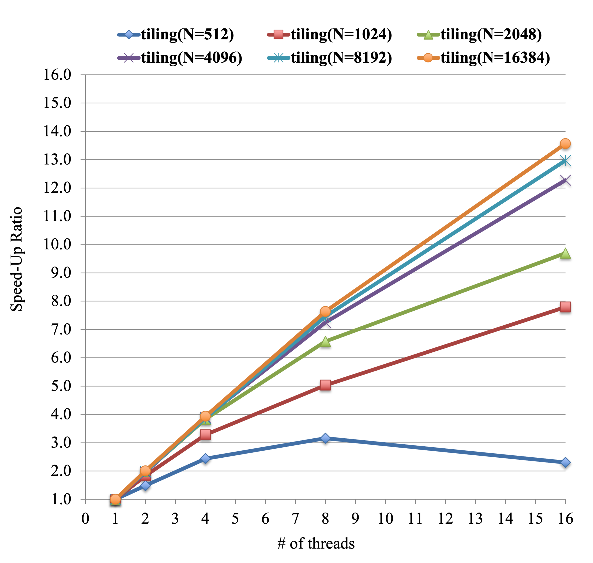

---

Comparing:

Threads 16:

Time: [ms]

| N     | avx256&blk32 | avx256&blk64 | avx256&blk128 | sse&blk32 | sse&blk64 |
| ----- | ------------ | ------------ | ------------- | --------- | --------- |
| 512   | 6.6          | 5.6          | 9.7           | 7.2       | 4.9       |
| 1024  | 25.3         | 19.8         | 27.1          | 20.8      | 17.0      |
| 2048  | 134.3        | 86.0         | 92.1          | 128.5     | 83.2      |
| 4096  | 876.8        | 542.5        | 644.4         | 795.8     | 516.4     |
| 8192  | 6056.6       | 3689.4       | 4928.4        | 5910.4    | 3435.4    |
| 16384 | 47472.0      | 28283.9      | 50903.8       | 46568.4   | 25101.2   |

Throughput: [GOP/s]

| N     | avx256&blk32 | avx256&blk64 | avx256&blk128 | sse&blk32 | sse&blk64 |
| ----- | ------------ | ------------ | ------------- | --------- | --------- |
| 512   | 40           | 48           | 28            | 37        | 55        |
| 1024  | 85           | 109          | 79            | 103       | 126       |
| 2048  | 128          | 200          | 186           | 134       | 206       |
| 4096  | 157          | 253          | 213           | 173       | 266       |
| 8192  | 182          | 298          | 223           | 186       | 320       |
| 16384 | 185          | 311          | 173           | 189       | 350       |

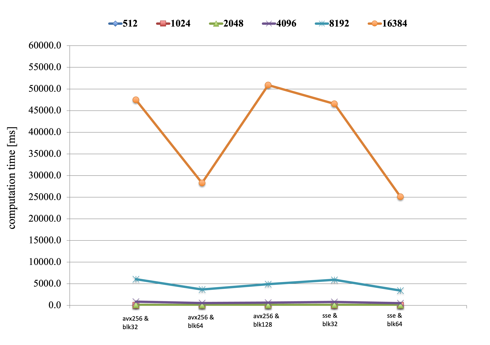

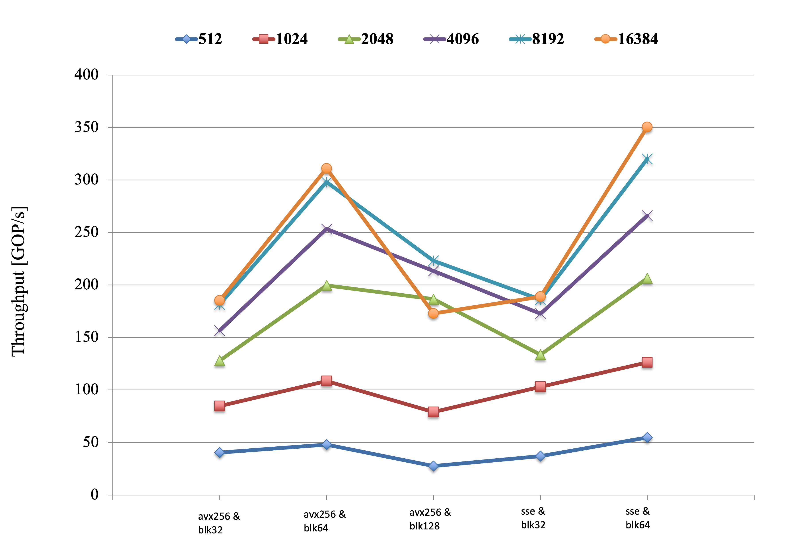

Surprisingly, AVX128 with block size 64 has the best performance.

## 2022/7/12

Benchmark of block size 32, 128: (AVX256)

* Block size 32:

Time: [ms]

| N     | Tiling  1thread | Tiling 2threads | Tiling 4threads | Tiling 8threads | Tiling 16threads |
| ----- | --------------- | --------------- | --------------- | --------------- | ---------------- |
| 512   | 17.0            | 11.0            | 6.3             | 4.4             | 6.6              |
| 1024  | 162.2           | 89.7            | 51.3            | 33.2            | 25.3             |
| 2048  | 1248.2          | 641.5           | 331.8           | 192.9           | 134.3            |
| 4096  | 9982.2          | 5076.9          | 2579.3          | 1389.3          | 876.8            |
| 8192  | 80277.2         | 39667.0         | 20265.1         | 10607.3         | 6056.6           |
| 16384 | 647144.7        | 324432.8        | 164810.2        | 85137.5         | 47472.0          |

Speedup:

| N     | Tiling  1thread | Tiling 2threads | Tiling 4threads | Tiling 8threads | Tiling 16threads |
| ----- | --------------- | --------------- | --------------- | --------------- | ---------------- |
| 512   | 1.0             | 1.5             | 2.7             | 3.9             | 2.6              |
| 1024  | 1.0             | 1.8             | 3.2             | 4.9             | 6.4              |
| 2048  | 1.0             | 1.9             | 3.8             | 6.5             | 9.3              |
| 4096  | 1.0             | 2.0             | 3.9             | 7.2             | 11.4             |
| 8192  | 1.0             | 2.0             | 4.0             | 7.6             | 13.3             |
| 16384 | 1.0             | 2.0             | 3.9             | 7.6             | 13.6             |

Throughput: [GOP/s]

| N     | Tiling  1thread | Tiling 2threads | Tiling 4threads | Tiling 8threads | Tiling 16threads |
| ----- | --------------- | --------------- | --------------- | --------------- | ---------------- |
| 512   | 16              | 24              | 43              | 61              | 40               |
| 1024  | 13              | 24              | 42              | 65              | 85               |
| 2048  | 14              | 27              | 52              | 89              | 128              |
| 4096  | 14              | 27              | 53              | 99              | 157              |
| 8192  | 14              | 28              | 54              | 104             | 182              |
| 16384 | 14              | 27              | 53              | 103             | 185              |

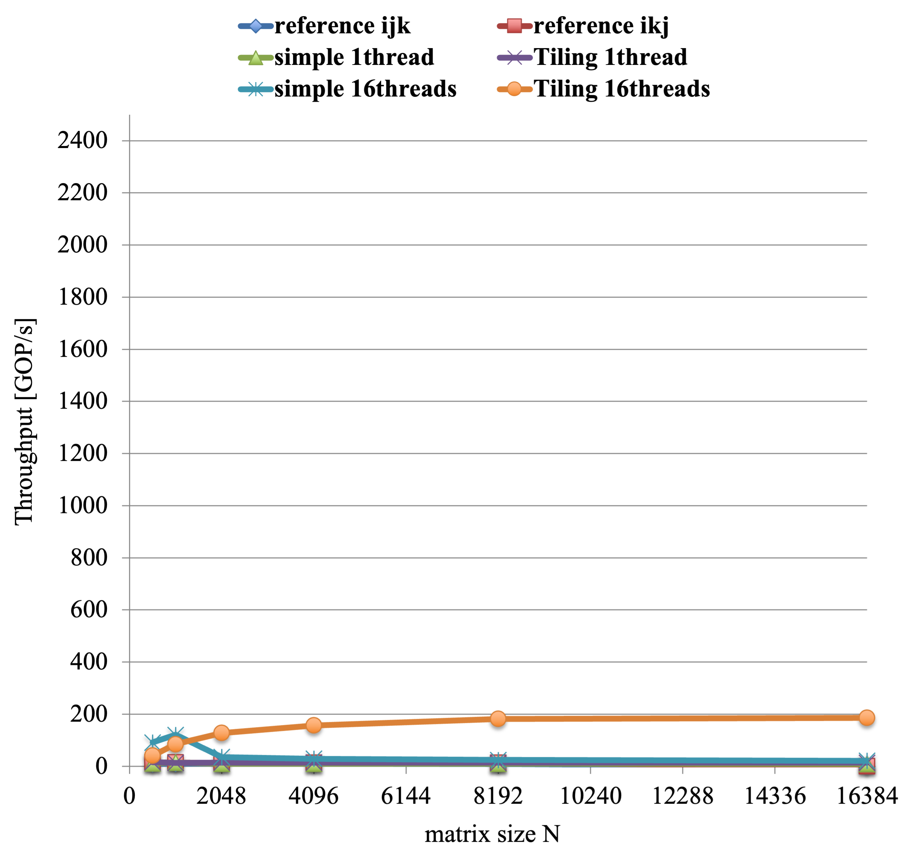

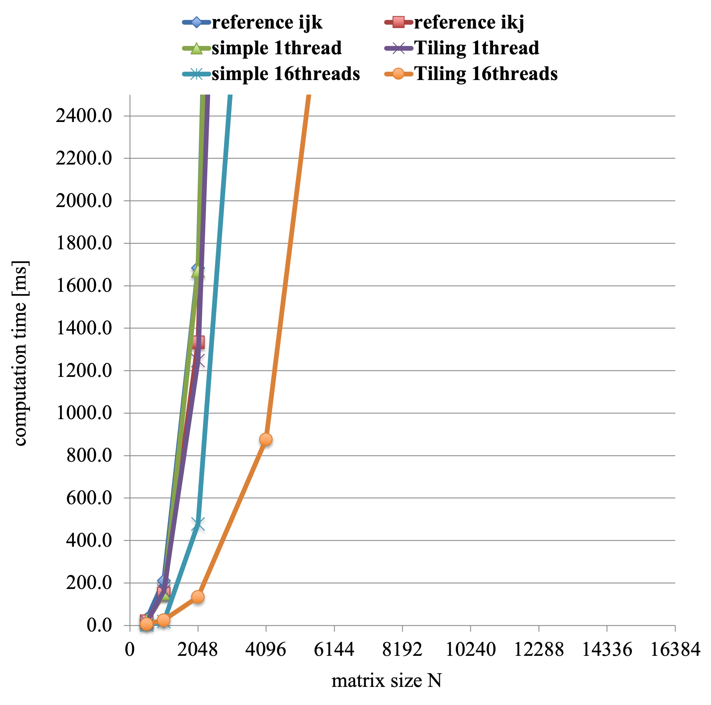

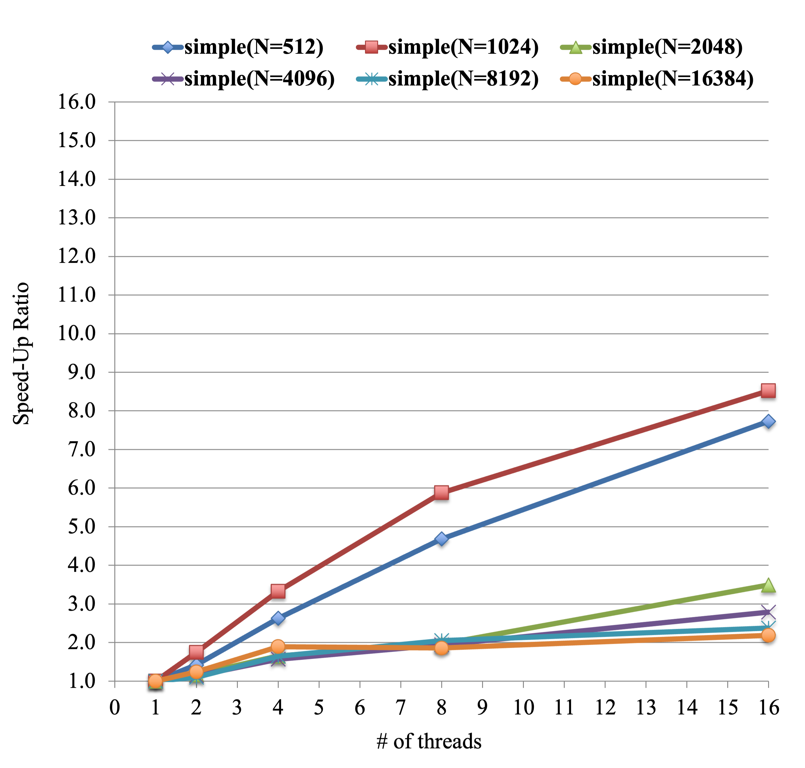

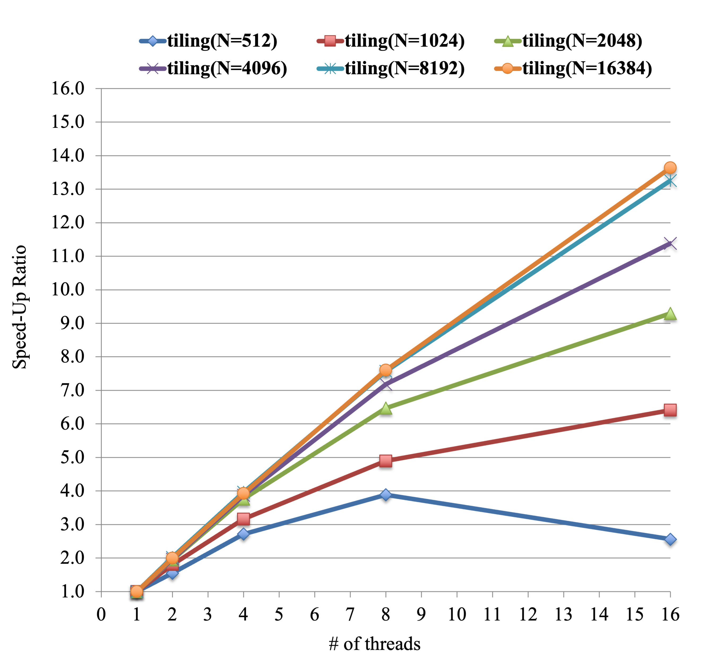

* Block size 128:

Time: [ms]

| N     | Tiling  1thread | Tiling 2threads | Tiling 4threads | Tiling 8threads | Tiling 16threads |
| ----- | --------------- | --------------- | --------------- | --------------- | ---------------- |
| 512   | 22.2            | 14.5            | 9.0             | 9.3             | 9.7              |
| 1024  | 134.5           | 73.7            | 41.6            | 30.3            | 27.1             |
| 2048  | 1024.9          | 523.6           | 271.2           | 155.9           | 92.1             |
| 4096  | 8186.4          | 4114.8          | 2104.0          | 1144.9          | 644.4            |
| 8192  | 64546.0         | 32720.1         | 16691.0         | 8752.2          | 4928.4           |
| 16384 | 699948.5        | 352270.5        | 178378.1        | 91919.8         | 50903.8          |

Speedup:

| N     | Tiling  1thread | Tiling 2threads | Tiling 4threads | Tiling 8threads | Tiling 16threads |
| ----- | --------------- | --------------- | --------------- | --------------- | ---------------- |
| 512   | 1.0             | 1.5             | 2.5             | 2.4             | 2.3              |
| 1024  | 1.0             | 1.8             | 3.2             | 4.4             | 5.0              |
| 2048  | 1.0             | 2.0             | 3.8             | 6.6             | 11.1             |
| 4096  | 1.0             | 2.0             | 3.9             | 7.2             | 12.7             |
| 8192  | 1.0             | 2.0             | 3.9             | 7.4             | 13.1             |
| 16384 | 1.0             | 2.0             | 3.9             | 7.6             | 13.8             |

Throughput: [GOP/s]

| N     | Tiling  1thread | Tiling 2threads | Tiling 4threads | Tiling 8threads | Tiling 16threads |
| ----- | --------------- | --------------- | --------------- | --------------- | ---------------- |
| 512   | 12              | 18              | 30              | 29              | 28               |
| 1024  | 16              | 29              | 52              | 71              | 79               |
| 2048  | 17              | 33              | 63              | 110             | 186              |
| 4096  | 17              | 33              | 65              | 120             | 213              |
| 8192  | 17              | 34              | 66              | 126             | 223              |
| 16384 | 13              | 25              | 49              | 96              | 173              |

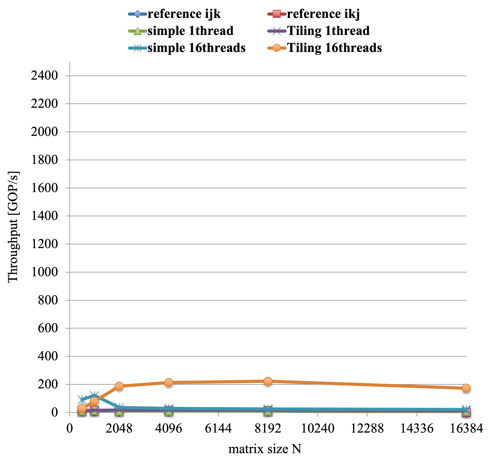

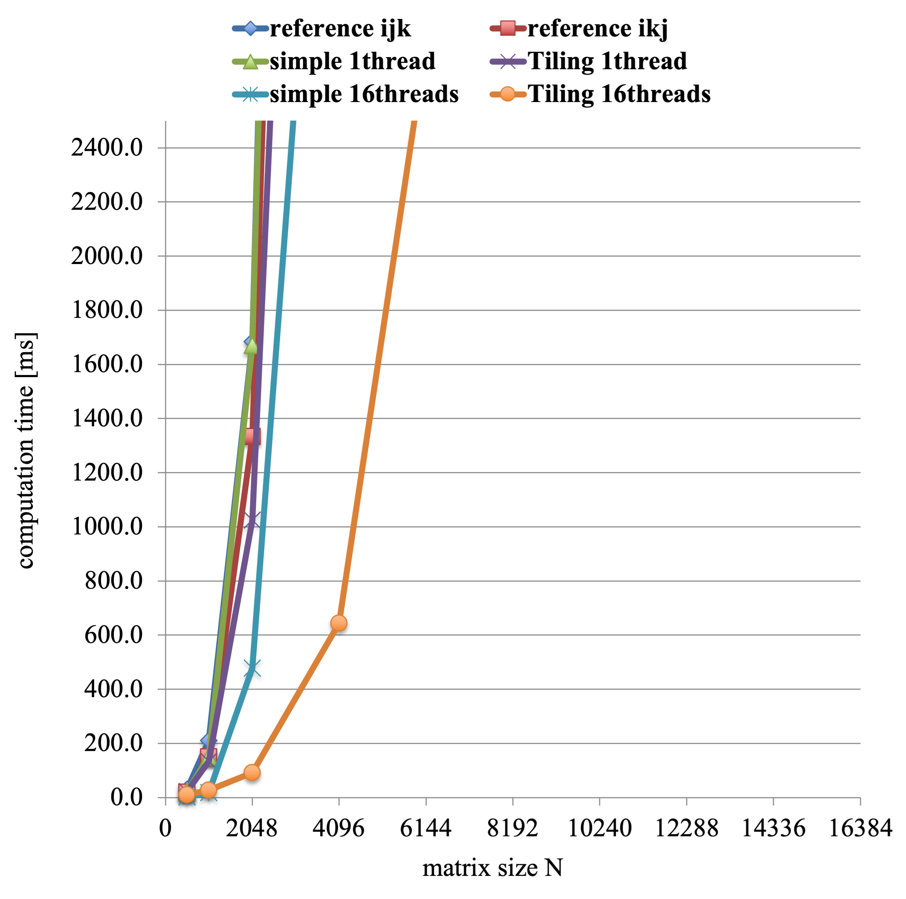


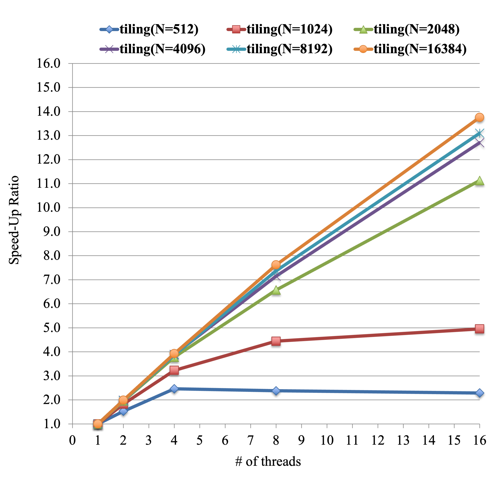

## 2022/7/10

The benchmark of AVX128: (block size is 64)

```c
static __attribute__((always_inline)) inline
void blk_gemm_avx(const float *__restrict__ a, size_t lda,
                  const float *__restrict__ b, size_t ldb,
                  float       *__restrict__ c, size_t ldc)
{
    for (int m = 0; m < BLK_M; m++, c += ldc, a += lda)
        for (int k = 0; k < BLK_K; k++) {
            const float *bk = b + k * ldb;
            __m128 amk = _mm_set1_ps(a[k]);
            for (int n = 0; n < BLK_N; n += 4) {
                __m128 cmn = _mm_loadu_ps(c + n);
                __m128 bkn = _mm_loadu_ps(bk + n);
                cmn = _mm_fmadd_ps(amk, bkn, cmn);
                _mm_storeu_ps(c + n, cmn);
            }
        }
}
```

Time: [ms]

| N     | Tiling  1thread | Tiling 2threads | Tiling 4threads | Tiling 8threads | Tiling 16threads |
| ----- | --------------- | --------------- | --------------- | --------------- | ---------------- |
| 512   | 12.6            | 7.9             | 5.4             | 5.3             | 4.9              |
| 1024  | 87.5            | 50.2            | 30.7            | 21.2            | 17.0             |
| 2048  | 642.0           | 336.6           | 177.6           | 102.4           | 83.2             |
| 4096  | 5037.0          | 2589.3          | 1335.6          | 765.8           | 516.4            |
| 8192  | 40192.9         | 20552.4         | 10541.8         | 5541.8          | 3435.4           |
| 16384 | 324926.7        | 165157.7        | 83959.4         | 43579.5         | 25101.2          |

Speedup:

| N     | Tiling  1thread | Tiling 2threads | Tiling 4threads | Tiling 8threads | Tiling 16threads |
| ----- | --------------- | --------------- | --------------- | --------------- | ---------------- |
| 512   | 1.0             | 1.6             | 2.3             | 2.4             | 2.6              |
| 1024  | 1.0             | 1.7             | 2.8             | 4.1             | 5.1              |
| 2048  | 1.0             | 1.9             | 3.6             | 6.3             | 7.7              |
| 4096  | 1.0             | 1.9             | 3.8             | 6.6             | 9.8              |
| 8192  | 1.0             | 2.0             | 3.8             | 7.3             | 11.7             |
| 16384 | 1.0             | 2.0             | 3.9             | 7.5             | 12.9             |

Throughput: [GOP/s]

| N     | Tiling  1thread | Tiling 2threads | Tiling 4threads | Tiling 8threads | Tiling 16threads |
| ----- | --------------- | --------------- | --------------- | --------------- | ---------------- |
| 512   | 21              | 34              | 49              | 50              | 55               |
| 1024  | 25              | 43              | 70              | 101             | 126              |
| 2048  | 27              | 51              | 97              | 168             | 206              |
| 4096  | 27              | 53              | 103             | 179             | 266              |
| 8192  | 27              | 53              | 104             | 198             | 320              |
| 16384 | 27              | 53              | 105             | 202             | 350              |

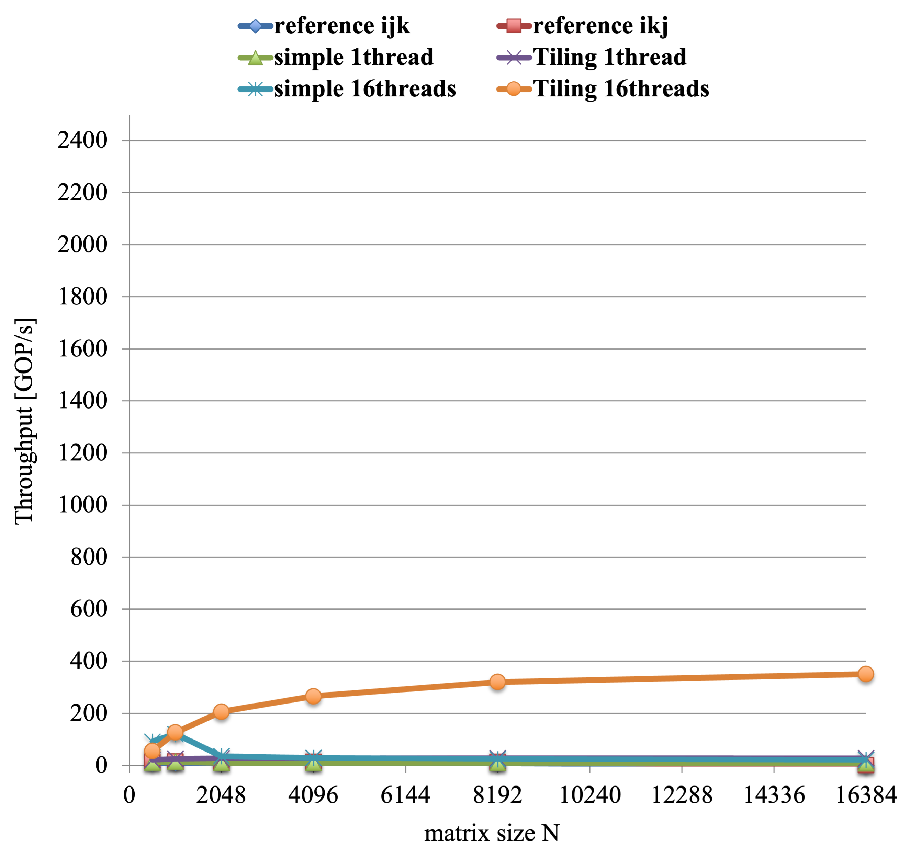

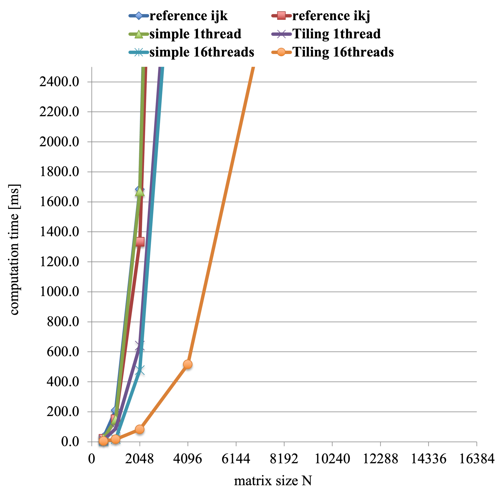


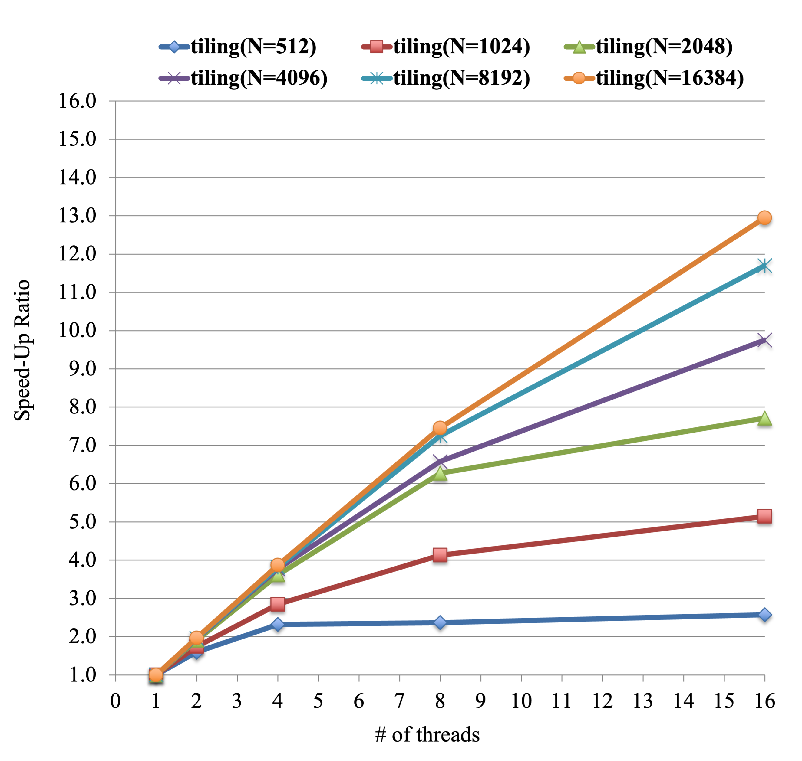

## 2022/7/8

Testing AVX512 instruction with vector add program:

```c
#include <stddef.h>
#include <immintrin.h>

#define FLOAT_PER_512BIT (512 / 32)

void vadd(float const *__restrict__ a,
          float const *__restrict__ b,
          float       *__restrict__ c, int size)
{
    size_t block = size / FLOAT_PER_512BIT;
    __m512 va, vb, vc;
    for (size_t i = 0; i < block; i++) {
        va = _mm512_load_ps(&a[i * FLOAT_PER_512BIT]);
        vb = _mm512_load_ps(&b[i * FLOAT_PER_512BIT]);
        vc = _mm512_add_ps(va, vb);
        _mm512_store_ps(&c[i * FLOAT_PER_512BIT], vc);
    }
}
// main function is as same as last week
```

Compiling the code with:

```
gcc -c -Wall -O3 -mavx -mavx2 -mavx512f -mfma -funroll-loops -omain.o main.c
gcc -c -Wall -O3 -mavx -mavx2 -mavx512f -mfma -funroll-loops -oadd.o add.c
gcc -c -Wall -O3 -mavx -mavx2 -mavx512f -mfma -funroll-loops -ovadd.o vadd.c
gcc -Wall -O3 -mavx -mavx2 -mavx512f -mfma -funroll-loops -omain main.o add.o vadd.o
```

The program can be compiled but can not run, it will throw an error:

```
Illegal instruction (core dumped)
```

By searching on Internet, I think the computer (parmigiano) does not support the AVX512 instruction.

This [link](https://stackoverflow.com/questions/51834585/avx512-illegal-instruction).

I decide to try avx128.

## 2022/7/7

Seminar:

* Try other AVX instructions
* Try other block size
* Makiing a benchmark

## 2022/7/6

Benchmark for the GEMM program from Mr. Gocho: (Block size 64, AVX256)

Times: [ms]

| N     | simple  1thread | simple 2threads | simple 4threads | simple 8threads | simple 16threads | Tiling 1thread | Tiling 2threads | Tiling 4threads | Tiling 8threads | Tiling 16threads |
| ----- | --------------- | --------------- | --------------- | --------------- | ---------------- | -------------- | --------------- | --------------- | --------------- | ---------------- |
| 512   | 22.5            | 15.9            | 8.6             | 4.8             | 2.9              | 14.3           | 10.6            | 5.9             | 4.5             | 5.6              |
| 1024  | 150.9           | 86.4            | 45.3            | 25.7            | 17.7             | 89.8           | 52.3            | 31.5            | 23.2            | 16.5             |
| 2048  | 1671.2          | 1430.3          | 1012.1          | 852.4           | 478.6            | 704.1          | 367.3           | 193.3           | 116.3           | 77.7             |
| 4096  | 13254.8         | 11622.6         | 8462.5          | 6826.2          | 4756.8           | 5665.1         | 2816.5          | 1467.5          | 815.5           | 523.1            |
| 8192  | 108617.6        | 98560.2         | 66020.3         | 52963.8         | 45704.0          | 44480.3        | 22643.2         | 11514.2         | 6151.9          | 3650.4           |
| 16384 | 936094.1        | 754361.0        | 495086.0        | 504249.3        | 428548.8         | 359113.7       | 179784.7        | 91564.8         | 48216.2         | 26877.2          |

Speedup:

| N     | simple  1thread | simple 2threads | simple 4threads | simple 8threads | simple 16threads | Tiling 1thread | Tiling 2threads | Tiling 4threads | Tiling 8threads | Tiling 16threads |
| ----- | --------------- | --------------- | --------------- | --------------- | ---------------- | -------------- | --------------- | --------------- | --------------- | ---------------- |
| 512   | 1.0             | 1.4             | 2.6             | 4.7             | 7.7              | 1.0            | 1.3             | 2.4             | 3.2             | 2.6              |
| 1024  | 1.0             | 1.7             | 3.3             | 5.9             | 8.5              | 1.0            | 1.7             | 2.9             | 3.9             | 5.4              |
| 2048  | 1.0             | 1.2             | 1.7             | 2.0             | 3.5              | 1.0            | 1.9             | 3.6             | 6.1             | 9.1              |
| 4096  | 1.0             | 1.1             | 1.6             | 1.9             | 2.8              | 1.0            | 2.0             | 3.9             | 6.9             | 10.8             |
| 8192  | 1.0             | 1.1             | 1.6             | 2.1             | 2.4              | 1.0            | 2.0             | 3.9             | 7.2             | 12.2             |
| 16384 | 1.0             | 1.2             | 1.9             | 1.9             | 2.2              | 1.0            | 2.0             | 3.9             | 7.4             | 13.4             |

Throughput: [GOP/s]

| N     | simple  1thread | simple 2threads | simple 4threads | simple 8threads | simple 16threads | Tiling 1thread | Tiling 2threads | Tiling 4threads | Tiling 8threads | Tiling 16threads |
| ----- | --------------- | --------------- | --------------- | --------------- | ---------------- | -------------- | --------------- | --------------- | --------------- | ---------------- |
| 512   | 12              | 17              | 31              | 56              | 92               | 19             | 25              | 45              | 59              | 48               |
| 1024  | 14              | 25              | 47              | 84              | 121              | 24             | 41              | 68              | 93              | 130              |
| 2048  | 10              | 12              | 17              | 20              | 36               | 24             | 47              | 89              | 148             | 221              |
| 4096  | 10              | 12              | 16              | 20              | 29               | 24             | 49              | 94              | 169             | 263              |
| 8192  | 10              | 11              | 17              | 21              | 24               | 25             | 49              | 95              | 179             | 301              |
| 16384 | 9               | 12              | 18              | 17              | 21               | 24             | 49              | 96              | 182             | 327              |


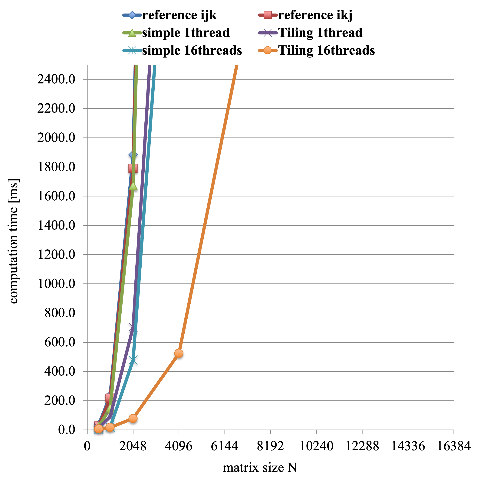

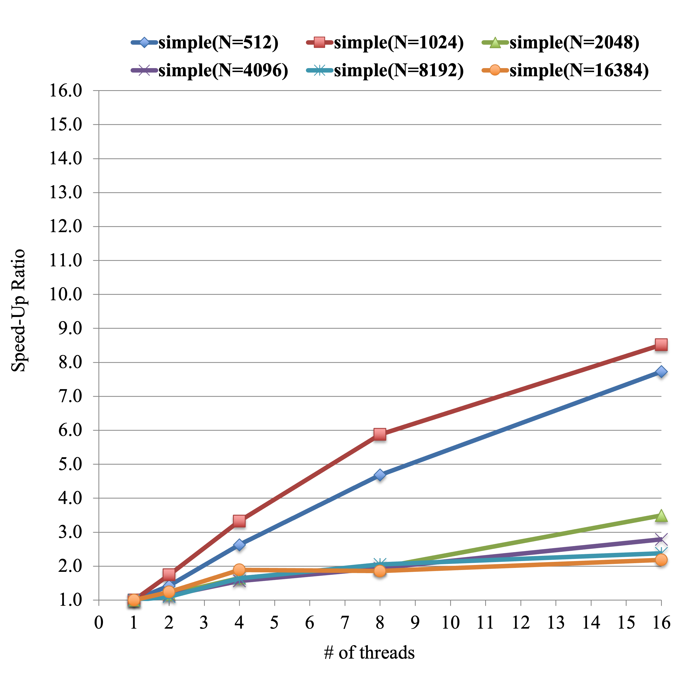

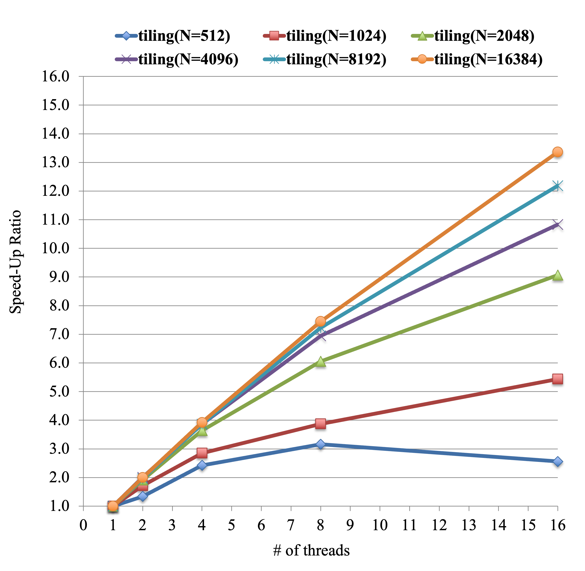

The program has a very good performance especially when the matrix size is large and the number of threads is high.

---

Comparing my program with Mr. Gocho's program:

Firstly, changing the block size of my program to 64 (as same as the program wrote by Mr. Gocho)

Times: [ms]

| N     | Own  1thread | Own 2threads | Own 4threads | Own 8threads | Own 16threads | Gocho 1thread | Gocho 2threads | Gocho 4threads | Gocho 8threads | Gocho 16threads |
| ----- | ------------ | ------------ | ------------ | ------------ | ------------- | ------------- | -------------- | -------------- | -------------- | --------------- |
| 512   | 32.8         | 26.5         | 17.6         | 12.0         | 13.8          | 14.3          | 10.6           | 5.9            | 4.5            | 5.6             |
| 1024  | 231.2        | 167.1        | 97.2         | 121.6        | 69.5          | 89.8          | 52.3           | 31.5           | 23.2           | 16.5            |
| 2048  | 1916.4       | 1919.3       | 638.4        | 336.2        | 294.4         | 704.1         | 367.3          | 193.3          | 116.3          | 77.7            |
| 4096  | 16238.6      | 23642.4      | 6104.2       | 3417.2       | 2688.5        | 5665.1        | 2816.5         | 1467.5         | 815.5          | 523.1           |
| 8192  | 131173.8     | 149475.7     | 47217.5      | 24339.4      | 23780.3       | 44480.3       | 22643.2        | 11514.2        | 6151.9         | 3650.4          |
| 16384 | 1060589.0    | 555490.9     | 350653.6     | 173940.4     | 141819.1      | 359113.7      | 179784.7       | 91564.8        | 48216.2        | 26877.2         |

Speedup:

| N     | Own  1thread | Own 2threads | Own 4threads | Own 8threads | Own 16threads | Gocho 1thread | Gocho 2threads | Gocho 4threads | Gocho 8threads | Gocho 16threads |
| ----- | ------------ | ------------ | ------------ | ------------ | ------------- | ------------- | -------------- | -------------- | -------------- | --------------- |
| 512   | 1.0          | 1.2          | 1.9          | 2.7          | 2.4           | 1.0           | 1.3            | 2.4            | 3.2            | 2.6             |
| 1024  | 1.0          | 1.4          | 2.4          | 1.9          | 3.3           | 1.0           | 1.7            | 2.9            | 3.9            | 5.4             |
| 2048  | 1.0          | 1.0          | 3.0          | 5.7          | 6.5           | 1.0           | 1.9            | 3.6            | 6.1            | 9.1             |
| 4096  | 1.0          | 0.7          | 2.7          | 4.8          | 6.0           | 1.0           | 2.0            | 3.9            | 6.9            | 10.8            |
| 8192  | 1.0          | 0.9          | 2.8          | 5.4          | 5.5           | 1.0           | 2.0            | 3.9            | 7.2            | 12.2            |
| 16384 | 1.0          | 1.9          | 3.0          | 6.1          | 7.5           | 1.0           | 2.0            | 3.9            | 7.4            | 13.4            |

Throughput: [GOP/s]

| N     | Own  1thread | Own 2threads | Own 4threads | Own 8threads | Own 16threads | Gocho 1thread | Gocho 2threads | Gocho 4threads | Gocho 8threads | Gocho 16threads |
| ----- | ------------ | ------------ | ------------ | ------------ | ------------- | ------------- | -------------- | -------------- | -------------- | --------------- |
| 512   | 8            | 10           | 15           | 22           | 19            | 19            | 25             | 45             | 59             | 48              |
| 1024  | 9            | 13           | 22           | 18           | 31            | 24            | 41             | 68             | 93             | 130             |
| 2048  | 9            | 9            | 27           | 51           | 58            | 24            | 47             | 89             | 148            | 221             |
| 4096  | 8            | 6            | 23           | 40           | 51            | 24            | 49             | 94             | 169            | 263             |
| 8192  | 8            | 7            | 23           | 45           | 46            | 25            | 49             | 95             | 179            | 301             |
| 16384 | 8            | 16           | 25           | 51           | 62            | 24            | 49             | 96             | 182            | 327             |

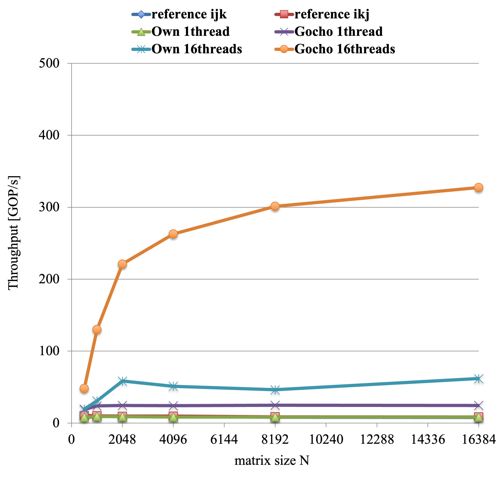

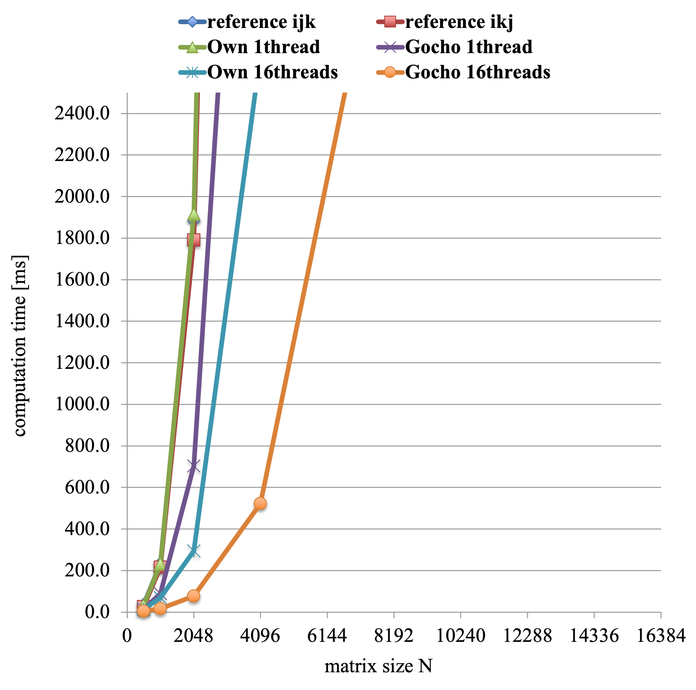

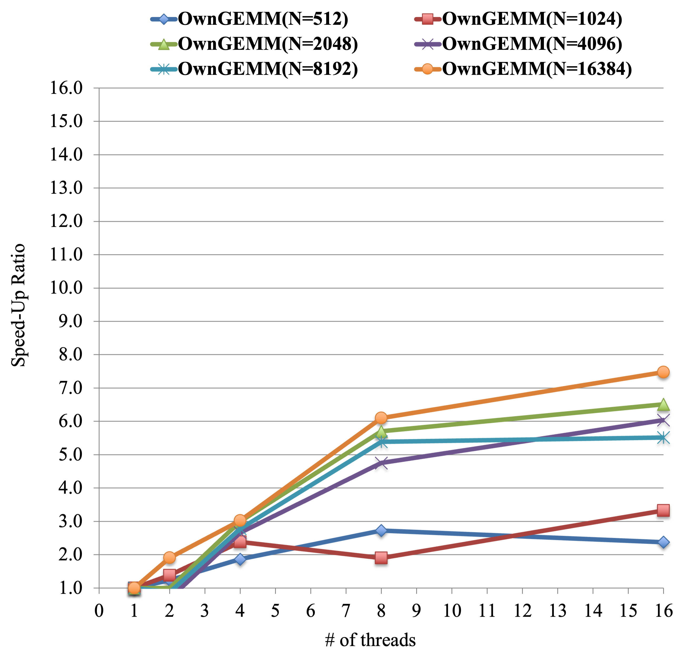

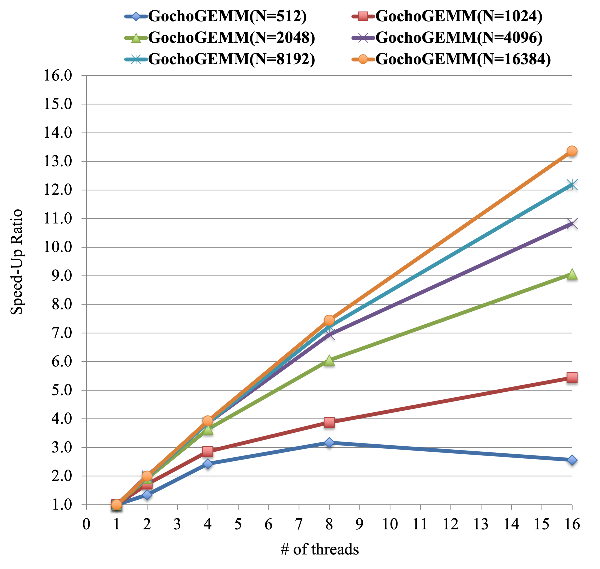

So, the performance of the program from Mr. Gocho is better than the program writen by me.

Using AVX instruction can effectively improve program performance.

## 2022/7/4

The GEMM program from Mr. Gocho: (with a little modification)

```c
#pragma GCC target ("avx,avx2,fma")
#pragma GCC optimize ("unroll-loops")

#include <x86intrin.h>
#include <immintrin.h>
#include <string.h>
#include <omp.h>

#define NDEBUG
#include <assert.h>

#define BLK_M 64 // i
#define BLK_N 64 // j
#define BLK_K 64 // k

#define THREADS 1

#define USE_AVX

static __attribute__((always_inline)) inline
void blk_gemm(const float *__restrict__ a, size_t lda,
              const float *__restrict__ b, size_t ldb,
              float       *__restrict__ c, size_t ldc)
{
    for (int m = 0; m < BLK_M; m++, c += ldc, a += lda)
        for (int k = 0; k < BLK_K; k++) {
            const float *bk = b + k * ldb;
            const float amk = a[k];
#pragma GCC ivdep
            for (int n = 0; n < BLK_N; n++)
                c[n] += amk * bk[n];
        }
}

static __attribute__((always_inline)) inline
void blk_gemm_avx(const float *__restrict__ a, size_t lda,
                  const float *__restrict__ b, size_t ldb,
                  float       *__restrict__ c, size_t ldc)
{
    for (int m = 0; m < BLK_M; m++, c += ldc, a += lda)
        for (int k = 0; k < BLK_K; k++) {
            const float *bk = b + k * ldb;
            __m256 amk = _mm256_set1_ps(a[k]);
            for (int n = 0; n < BLK_N; n += 8) {
                __m256 cmn = _mm256_loadu_ps(c + n);
                __m256 bkn = _mm256_loadu_ps(bk + n);
                cmn = _mm256_fmadd_ps(amk, bkn, cmn);
                _mm256_storeu_ps(c + n, cmn);
            }
        }
}

void tiled_gemm(const float *__restrict__ a, size_t lda,
                const float *__restrict__ b, size_t ldb,
                float       *__restrict__ c, size_t ldc,
                int M, int N, int K)
{
    assert(N % BLK_N == 0 && lda >= K);
    assert(M % BLK_M == 0 && ldb >= N);
    assert(K % BLK_K == 0 && ldc >= N);
    size_t fillsize = sizeof(float) * BLK_N;
    omp_set_num_threads(THREADS);
#pragma omp parallel for
    for (int mb = 0; mb < M; mb += BLK_M)
        for (int nb = 0; nb < N; nb += BLK_N) {
            // clear matrix c
            for (int m = 0; m < BLK_M; m++)
                memset(c + mb * ldc + nb, 0, fillsize);
            // tiled_gemm
            for (int kb = 0; kb < K; kb += BLK_K) {
#ifdef USE_AVX
                blk_gemm_avx(a + mb * lda +kb, lda,
                             b + kb * ldb + nb, ldb,
                             c + mb * ldc + nb, ldc);
#else
                blk_gemm(a + mb * lda +kb, lda,
                         b + kb * ldb + nb, ldb,
                         c + mb * ldc + nb, ldc);
#endif
            }
        }
}
```

I write a main function to using it:

```c
#include <stdio.h>
#include <stdlib.h>
#include <sys/time.h>

void tiled_gemm(float *, size_t,
                float *, size_t,
                float *, size_t,
                int, int, int);

int main(int argc, char const *argv[])
{
    int size = argc >= 2 ? atoi(argv[1]) : 2048;
    int ld = size + 32;
    float *a = malloc(sizeof(float) * size * ld);
    float *b = malloc(sizeof(float) * size * ld);
    float *c = malloc(sizeof(float) * size * ld);
    struct timeval start, end;
    gettimeofday(&start, NULL);
    tiled_gemm(a, ld, b, ld, c, ld, size, size, size);
    gettimeofday(&end, NULL);
    double time = (((double)end.tv_sec + end.tv_usec * 1e-6) - ((double)start.tv_sec + start.tv_usec * 1e-6)) * 1e3;
    printf("%.3f ms\n", time);
    return 0;
}
```

The `always_inline` attribute of function: [Declaring Attributes of Functions](https://gcc.gnu.org/onlinedocs/gcc-3.2/gcc/Function-Attributes.html)

(GNU attribute: [Specifying Attributes of Variables](https://gcc.gnu.org/onlinedocs/gcc-3.2/gcc/Variable-Attributes.html))

About `unroll-loops`: [Loop unrolling](https://en.wikipedia.org/wiki/Loop_unrolling)

pragma optimize VS pragma target: [pragma optimize vs pragma target what is difference](https://stackoverflow.com/questions/63217621/pragma-optimize-vs-pragma-target-what-is-difference)

About `pragma GCC ivdep`: [Loop-Specific Pragmas](https://gcc.gnu.org/onlinedocs/gcc-4.9.2/gcc/Loop-Specific-Pragmas.html)

------

The problem met by Ms. Kei: failure in compiling and running the AArch64 asm code.

Here is the solution:

```
# Compile all asm file to object file
as xxx.s -oxxx.o
as yyy.s -oyyy.o
# Link all object file to a executable file
ld -e min_caml_start -ooutput xxx.o yyy.o
```

The failure is because that the output file of `as` is a relocatable file but not a executable file, so the file cannot be excuted. Using `ld` to link the relocatable files to a executable file so that people can execute it.

And I think the problem wrote by Ms. Kei will throw a `segmentation fault` error, and as I thought, it got this error.

This is because the program is not linking with the C-library and not using the `main` function as the entrypoint. In this situation, the program should not end with `ret` instruction. Using `exit` system call instead of `ret` instruction or writing a C program to call the entry function of asm code can solve the problem.

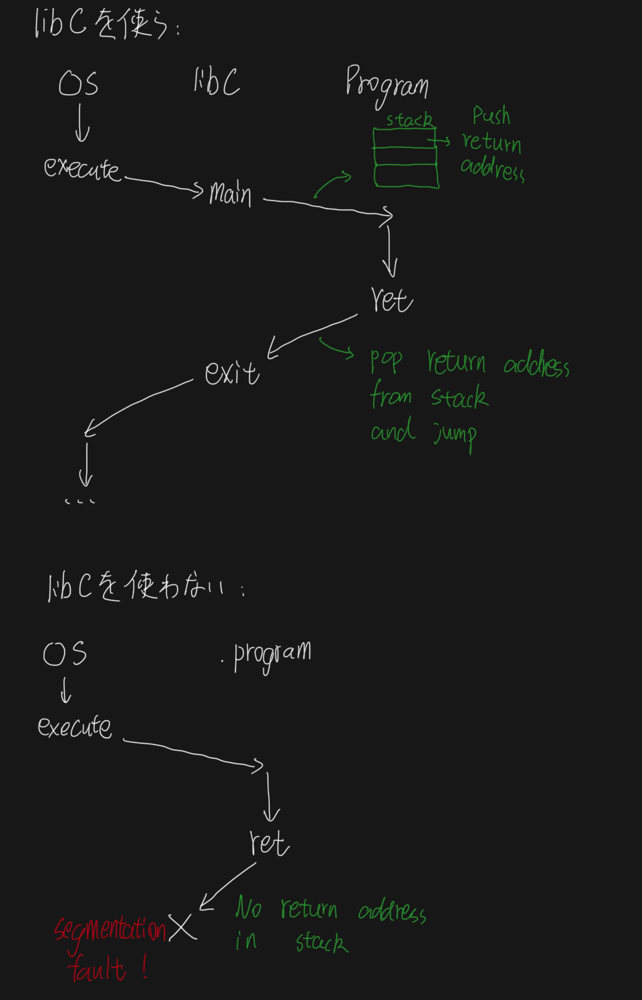

The way of using `exit` syscall:

* AArch64:

```assembly
mov     x0, #0
mov     x8, #93
svc     #0
```

* ARM(32):

```assembly
mov     r0, #0
mov     r7, #1
swi     #0
```

x0, r0: return value

x8, r7: number of syscall (found in /usr/include/asm/unistd.h)

I had told the solution to Ms. Kei by Slack.

## 2022/7/3

These days I prepared for the '輪読'.

---

I try to write a tiling gemm program.

```c
#include <stdio.h>
#include <stdlib.h>
#include <sys/time.h>
#include <omp.h>

#define BLOCK_SIZE 8
#define THREADS 1

void tiling_gemm(const float *__restrict__ a,
                 const float *__restrict__ b,
                 float *__restrict__ c, int size)
{
    // clean c
    for (int i = 0; i < size; i++)
	    for (int j = 0; j < size; j++)
	        c[i * size + j] = 0.0;
    // gemm
    // split into submatrix
#pragma omp parallel for
    for (int k_out = 0; k_out < size; k_out += BLOCK_SIZE)
	    for (int j_out = 0; j_out < size; j_out += BLOCK_SIZE)
            // for submatrix do ikj
	        for (int i = 0; i < size; i++)
		        for (int k = k_out; k < k_out + BLOCK_SIZE; k++) {
		            float r = a[i * size + k];
		            for (int j = j_out; j < j_out + BLOCK_SIZE; j++)
			            c[i * size +j] += r * b[k * size +j];
		        }
}

int main(int argc, char const *argv[])
{
    int size = argc >= 2 ? atoi(argv[1]) : 2048;
    float *a = malloc(sizeof(float) * size * size);
    float *b = malloc(sizeof(float) * size * size);
    float *c = malloc(sizeof(float) * size * size);
    struct timeval start, end;
    omp_set_num_threads(THREADS);
    gettimeofday(&start, NULL);
    tiling_gemm(a, b, c, size);
    gettimeofday(&end, NULL);
    double time = (((double)end.tv_sec + end.tv_usec * 1e-6) - ((double)start.tv_sec + start.tv_usec * 1e-6)) * 1e3;
    printf("%.3f ms\n", time);
    return 0;
}
```

But the result is not good, it is much slower than the no-tiling version.

| N     | Simple - 1 thread | Tiling - 1 thread |
| ----- | ----------------- | ----------------- |
| 512   | 23.9              | 57.5              |
| 1024  | 149.8             | 537.8             |
| 2048  | 1698.3            | 6660.0            |
| 4096  | 13856.1           | 120381.8          |
| 8192  | 116180.8          | 944722.0          |
| 16384 | 936094.1          | -TOO LONG-        |

I think maybe my block size is too small.

I think if all the 3 (sub)matrice can been put in L1 cache, the tiling is effective.

The L1 cache of parmigiano is 3MB, so I set the block size to 512.

(512 * 512 * 4B * 3 = 3MB)

Time: [ms]

| N     | simple  1thread | simple 2threads | simple 4threads | simple 8threads | simple 16threads | Tiling 1thread | Tiling 2threads | Tiling 4threads | Tiling 8threads | Tiling 16threads |
| ----- | --------------- | --------------- | --------------- | --------------- | ---------------- | -------------- | --------------- | --------------- | --------------- | ---------------- |
| 512   | 23.9            | 17.6            | 10.4            | 5.7             | 3.4              | 21.8           | 20.5            | 24.5            | 23.2            | 20.8             |
| 1024  | 149.8           | 80.7            | 45.5            | 28.3            | 18.5             | 137.6          | 127.3           | 128.3           | 138.1           | 111.6            |
| 2048  | 1698.3          | 1494.7          | 1150.1          | 889.9           | 461.8            | 1053.9         | 1647.3          | 316.2           | 309.0           | 293.0            |
| 4096  | 13856.1         | 11665.1         | 8132.7          | 7174.9          | 5830.1           | 8643.5         | 11030.9         | 2837.1          | 1376.6          | 2677.8           |
| 8192  | 116180.8        | 88233.8         | 64998.1         | 60842.2         | 51850.9          | 70233.7        | 97890.3         | 26574.6         | 18355.7         | 8077.1           |
| 16384 | 936094.1        | 754361.0        | 495086.0        | 504249.3        | 428548.8         | 565090.7       | 596839.6        | 189357.6        | 162220.2        | 85735.2          |

Speedup:

| N     | simple  1thread | simple 2threads | simple 4threads | simple 8threads | simple 16threads | Tiling 1thread | Tiling 2threads | Tiling 4threads | Tiling 8threads | Tiling 16threads |
| ----- | --------------- | --------------- | --------------- | --------------- | ---------------- | -------------- | --------------- | --------------- | --------------- | ---------------- |
| 512   | 1.0             | 1.4             | 2.3             | 4.2             | 6.9              | 1.0            | 1.1             | 0.9             | 0.9             | 1.1              |
| 1024  | 1.0             | 1.9             | 3.3             | 5.3             | 8.1              | 1.0            | 1.1             | 1.1             | 1.0             | 1.2              |
| 2048  | 1.0             | 1.1             | 1.5             | 1.9             | 3.7              | 1.0            | 0.6             | 3.3             | 3.4             | 3.6              |
| 4096  | 1.0             | 1.2             | 1.7             | 1.9             | 2.4              | 1.0            | 0.8             | 3.0             | 6.3             | 3.2              |
| 8192  | 1.0             | 1.3             | 1.8             | 1.9             | 2.2              | 1.0            | 0.7             | 2.6             | 3.8             | 8.7              |
| 16384 | 1.0             | 1.2             | 1.9             | 1.9             | 2.2              | 1.0            | 0.9             | 3.0             | 3.5             | 6.6              |

Throughput: [GOP/s]

| N     | simple  1thread | simple 2threads | simple 4threads | simple 8threads | simple 16threads | Tiling 1thread | Tiling 2threads | Tiling 4threads | Tiling 8threads | Tiling 16threads |
| ----- | --------------- | --------------- | --------------- | --------------- | ---------------- | -------------- | --------------- | --------------- | --------------- | ---------------- |
| 512   | 11              | 15              | 26              | 47              | 78               | 12             | 13              | 11              | 12              | 13               |
| 1024  | 14              | 27              | 47              | 76              | 116              | 16             | 17              | 17              | 16              | 19               |
| 2048  | 10              | 11              | 15              | 19              | 37               | 16             | 10              | 54              | 56              | 59               |
| 4096  | 10              | 12              | 17              | 19              | 24               | 16             | 12              | 48              | 100             | 51               |
| 8192  | 9               | 12              | 17              | 18              | 21               | 16             | 11              | 41              | 60              | 136              |
| 16384 | 9               | 12              | 18              | 17              | 21               | 16             | 15              | 46              | 54              | 103              |

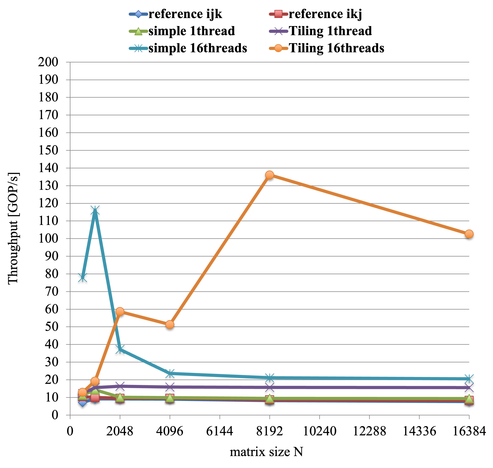

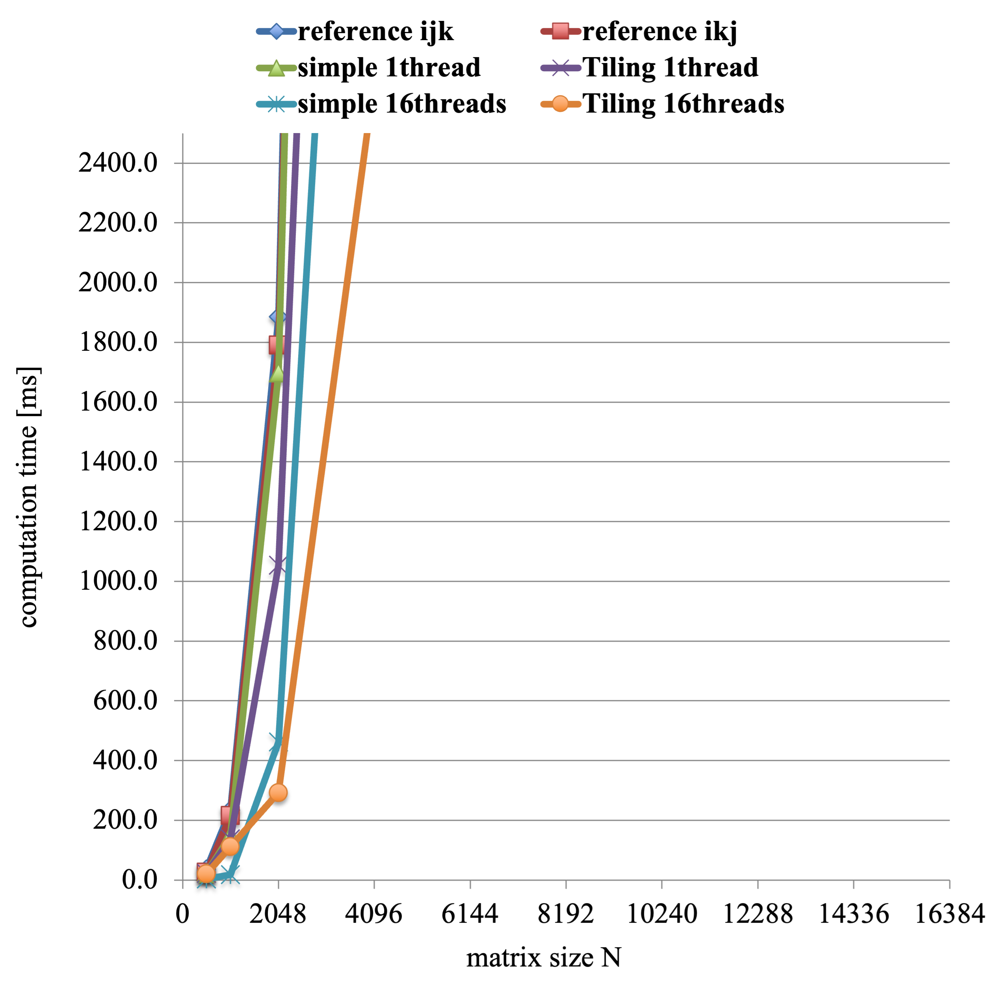

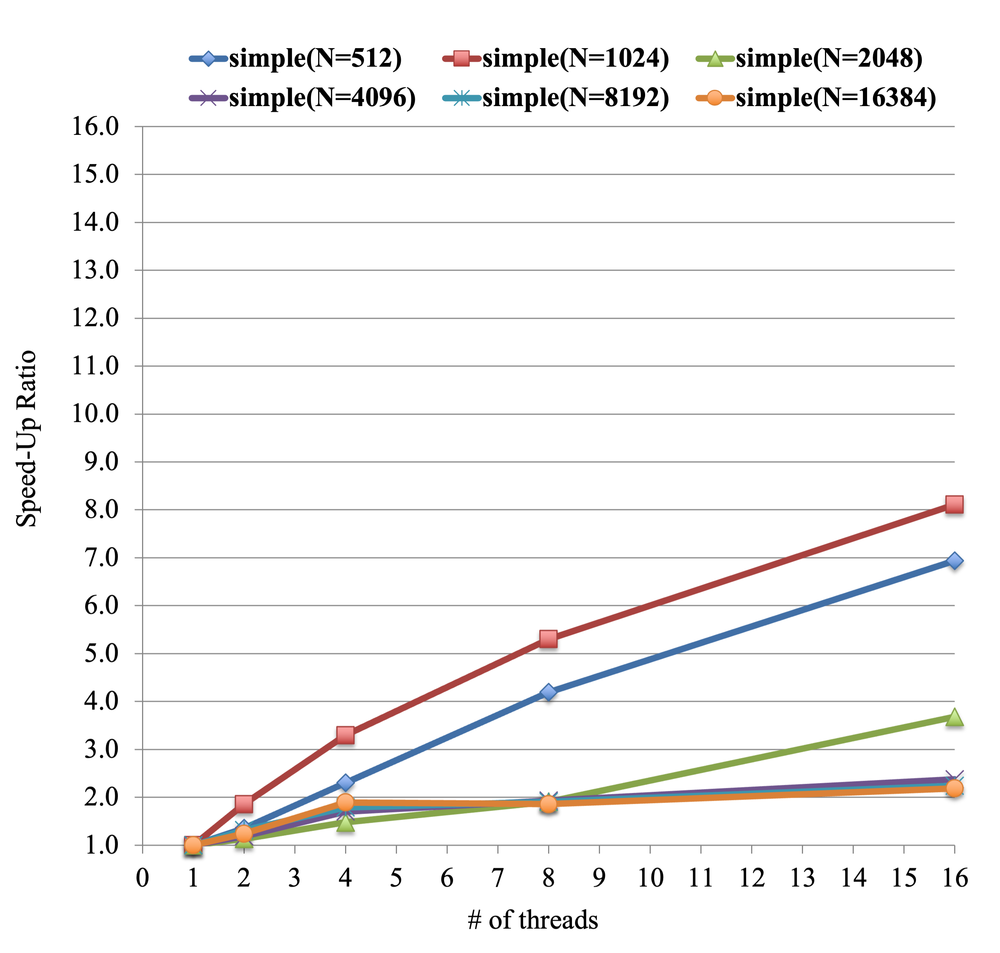

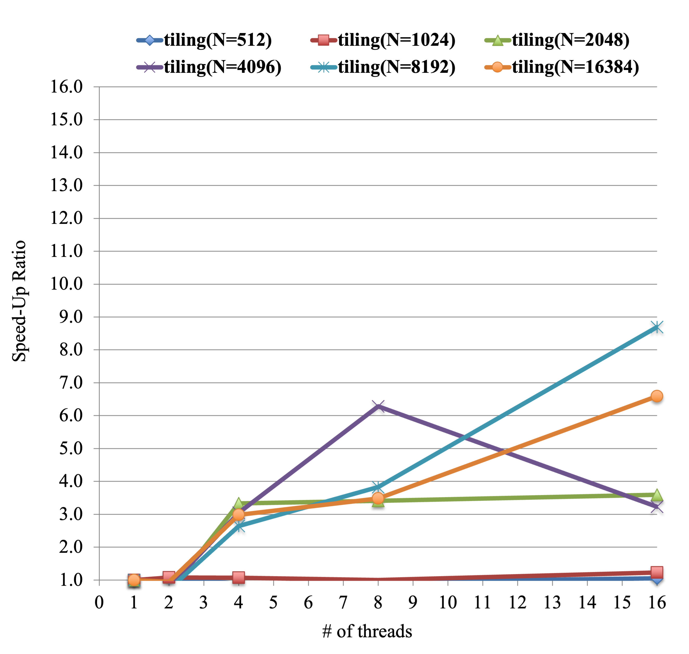

When the size of matrix is large and number of threads is high, the tiling GEMM has a much better performance than the normal GEMM.

But, block size is too large will make the tiling GEMM become normal GEMM when the size of matrix is small.

So, I reduce the block size to 128:

Time: [ms]

| N     | Tiling 1thread | Tiling 2threads | Tiling 4threads | Tiling 8threads | Tiling 16threads |
| ----- | -------------- | --------------- | --------------- | --------------- | ---------------- |
| 512   | 26.3           | 28.5            | 13.3            | 14.8            | 18.5             |
| 1024  | 180.7          | 109.7           | 68.3            | 41.0            | 37.5             |
| 2048  | 1409.9         | 833.2           | 455.1           | 290.3           | 153.5            |
| 4096  | 11366.7        | 17101.8         | 3799.6          | 1994.8          | 2322.8           |
| 8192  | 91030.4        | 73635.0         | 34684.9         | 20248.8         | 12363.5          |
| 16384 | 857288.0       | 432222.1        | 251661.0        | 123518.6        | 85872.3          |

Speedup:

| N     | Tiling 1thread | Tiling 2threads | Tiling 4threads | Tiling 8threads | Tiling 16threads |
| ----- | -------------- | --------------- | --------------- | --------------- | ---------------- |
| 512   | 1.0            | 0.9             | 2.0             | 1.8             | 1.4              |
| 1024  | 1.0            | 1.6             | 2.6             | 4.4             | 4.8              |
| 2048  | 1.0            | 1.7             | 3.1             | 4.9             | 9.2              |
| 4096  | 1.0            | 0.7             | 3.0             | 5.7             | 4.9              |
| 8192  | 1.0            | 1.2             | 2.6             | 4.5             | 7.4              |
| 16384 | 1.0            | 2.0             | 3.4             | 6.9             | 10.0             |

Throughput: [GOP/s]

| N     | Tiling 1thread | Tiling 2threads | Tiling 4threads | Tiling 8threads | Tiling 16threads |
| ----- | -------------- | --------------- | --------------- | --------------- | ---------------- |
| 512   | 10             | 9               | 20              | 18              | 14               |
| 1024  | 12             | 20              | 31              | 52              | 57               |
| 2048  | 12             | 21              | 38              | 59              | 112              |
| 4096  | 12             | 8               | 36              | 69              | 59               |
| 8192  | 12             | 15              | 32              | 54              | 89               |
| 16384 | 10             | 20              | 35              | 71              | 102              |

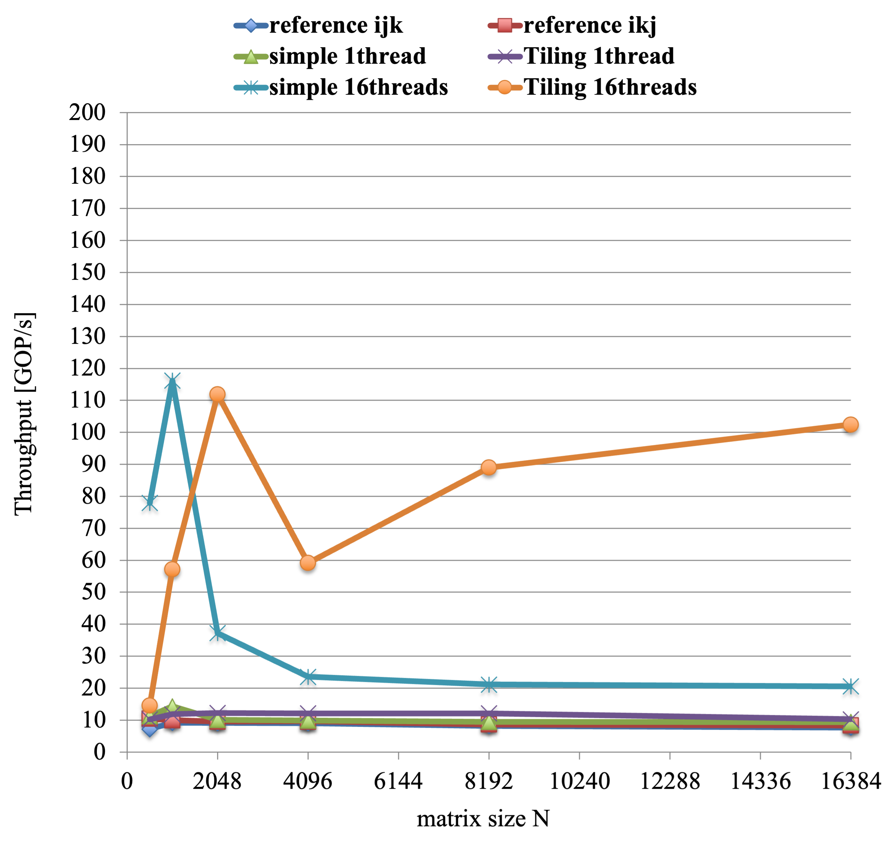

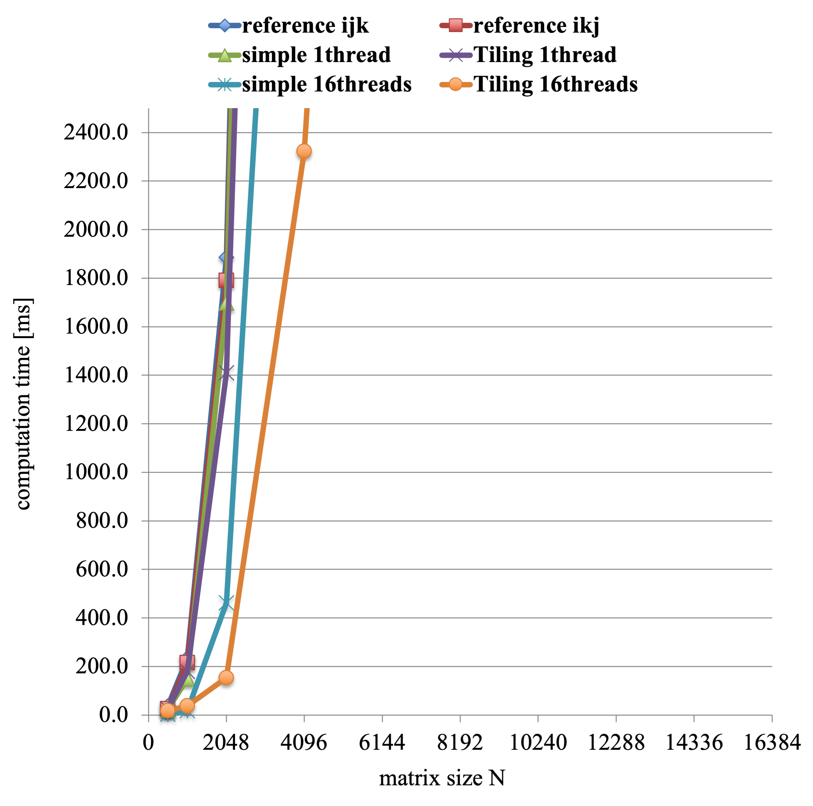


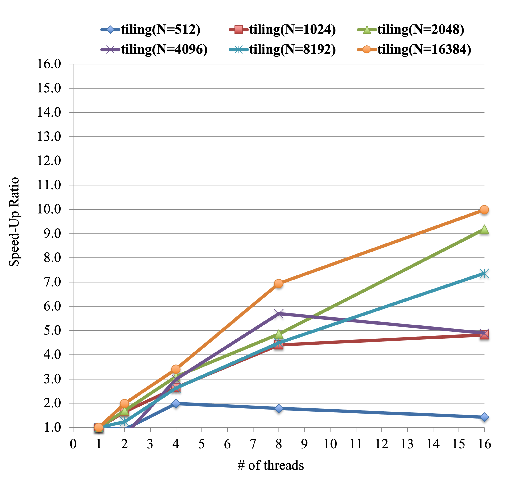

From this result, normally, block size 128 program has a better performance than block size 512 one.

## 2022/6/30

Seminar:

* Now I can ignore such details (about why the global variable can influence the performance of a program)
* Try to write a tiling matrix multiplication program
* I can try different block size or nest-blocking or loop-order
* The reference data in my result should be the data from a reference book or sample code from a reference book (already correct)
* The calculation of theoretical performance:

Theoretical Throughput = [CPUClockFreq] * [Core] * ([SIMD width] / [float width]) * [# of SIMD Unit] * [# of Operation/SIMD(=FMA)]

I try to use the AVX instruction, reference:

* [AVX指令集 (Chinese)](https://blog.csdn.net/nbu_dahe/article/details/122157205)
* [并发编程：SIMD 介绍 (Chinese)](https://zhuanlan.zhihu.com/p/416172020)
* [SIMD指令集分析(C/C++) (Chinese)](https://blog.csdn.net/AAAA202012/article/details/123983364)
* [AVX/AVX2による浮動小数点・整数の加算＋x87による加算 (Japanese)](https://qiita.com/fukushima1981/items/201442864dfb5ce9039f)
* [Intel Offical Guide](https://www.intel.com/content/www/us/en/docs/intrinsics-guide/index.html#)

Try to write a vector add program with AVX instruction:

```c
#include <stddef.h>
#include <immintrin.h>

#define FLOAT_PER_256BIT (256 / 32)

void vadd(float const *__restrict__ a,
          float const *__restrict__ b,
          float       *__restrict__ c, int size)
{
    size_t block = size / FLOAT_PER_256BIT;
    __m256 va, vb, vc;
    for (size_t i = 0; i < block; i++) {
        va = _mm256_load_ps(&a[i * FLOAT_PER_256BIT]);
        vb = _mm256_load_ps(&b[i * FLOAT_PER_256BIT]);
        vc = _mm256_add_ps(va, vb);
        _mm256_store_ps(&c[i * FLOAT_PER_256BIT], vc);
    }
}
```

The main function is like this:

```c
#include <stdio.h>
#include <stdlib.h>
#include <string.h>
#include <sys/time.h>

#define LOOP_COUNT 1000

void add(float*, float*, float*, int);
void vadd(float*, float*, float*, int);

int main(int argc, char const *argv[])
{
    size_t size = argc == 2 ? atoi(argv[1]) : 2048;
    if (size % 8)
        return -1;
    __attribute__((aligned((256/8)))) float a[size], b[size], c[size];
    for (size_t i = 0; i < size; i++) {
        a[i] = (float)i;
        b[i] = (float)i;
    }
    struct timeval start, end;
    double time;
    gettimeofday(&start, NULL);
    for (size_t i = 0; i < LOOP_COUNT; i++)
        add(a, b, c, size);
    gettimeofday(&end, NULL);
    time = (((double)end.tv_sec + end.tv_usec * 1e-6) - ((double)start.tv_sec + start.tv_usec * 1e-6)) * 1e3;
    printf("%.6f ms\n", time);
    memset(c, 0, sizeof(*c * size));
    gettimeofday(&start, NULL);
    for (size_t i = 0; i < LOOP_COUNT; i++)
        vadd(a, b, c, size);
    gettimeofday(&end, NULL);
    time = (((double)end.tv_sec + end.tv_usec * 1e-6) - ((double)start.tv_sec + start.tv_usec * 1e-6)) * 1e3;
    printf("%.6f ms\n", time);
    return 0;
}
```

And I find the AVX program is slower than the normal version. Mr. Gocho explain it for me:

```
down clock when avx instruction issued.
example:
* base 3.0GHz (non avx instruction)
* avx 2.8GHz?
avx instrunction accererates computation.
if computation is bottlneck, application will be faster.
メモリアクセス時間がボトルネックの時は、演算を速くしても、処理時間は短くならない。avxはdownclockする代わりに演算を速くするもの
つまり、演算がボトルネックじゃない時に、avxを使うと、downclockした分だけ、遅くなってしまう
```

So, when I run the program with a larger size (make computation to bottlneck), I will see the AVX program is faster than the normal version.

And another advice from Mr. Gocho: Make memory aligned when using AVX instruction.

* Using aligned attribute: `__attribute__((aligned((256/8)))) float array[size]`
* Using `posix_memalign` instead `malloc`, free memory with `free`
* Using `mlock(A, 4096)` fix to physical page <= virtual page, free with `munlock`

The example code from Mr. Gocho:

```c
#pragma GCC target ("avx,avx2,fma") // compile with option "-mavx -mavx2 -mfma"
#pragma GCC optimize ("unroll-loops") // compile with option "-funroll-loops"
#include <x86intrin.h>
#include <immintrin.h>
#include <assert.h>

#define BLK_M 64
#define BLK_N 64
#define BLK_K 64
#define USE_AVX

static __attribute__((always_inline))
void BLK_gemm( const float *__restrict__ A, size_t lda,
		       const float *__restrict__ B, size_t ldb,
		       float       *__restrict__ C, size_t ldc ) 
{
	for (int m = 0; m < BLK_M; m++, C += ldc, A += lda) {
		for (int k = 0; k < BLK_K; k++) {
			const float *Bk = B + k*ldb, amk = A[k];
#pragma GCC ivdep
			for (int n = 0; n < BLK_N; n++) C[n] += amk * Bk[n];		
		}
	}
}

static __attribute__((always_inline))
void BLK_gemm_avx2( const float *__restrict__ A, size_t lda,
		            const float *__restrict__ B, size_t ldb,
		            float       *__restrict__ C, size_t ldc ) 
{	
	for (int m = 0; m < BLK_M; m++, C += ldc, A += lda) {
		for (int k = 0; k < BLK_K; k++) { // ここをunrollした方が速くなる
			const float *Bk = B + k*ldb;
			__m256 amk = _mm256_set1_ps( A[k] );
			for (int n = 0; n < BLK_N; n += 8) {
				__m256 cmn = _mm256_loadu_ps( C+n  );
				__m256 bkn = _mm256_loadu_ps( Bk+n );
				cmn = _mm256_fmadd_ps( amk, bkn, cmn );
				_mm256_storeu_ps( C+n, cmn );		
			}
		}
	}
}

void tiled_gemm( const float *__restrict__ A, size_t lda,
		         const float *__restrict__ B, size_t ldb,
		         float       *__restrict__ C, size_t ldc, 
				 int M, int N, int K ) 
{
	assert( N%BLK_N == 0 && lda >= K );
	assert( M%BLK_M == 0 && ldb >= N );
	assert( K%BLK_K == 0 && ldc >= N );
	size_t fillsize = sizeof( float )*BLK_N;
#pragma omp parallel for
	for (int mb = 0; mb < M; mb += BLK_M) {
		for (int nb = 0; nb < N; nb += BLK_N) {	
			for (int m = 0; m < BLK_M; m++) memset( C+mb*ldc+nb, 0, fillsize );
			for (int kb = 0; kb < K; kb += BLK_K) { 
#ifdef USE_AVX	
				BLK_gemm_avx( A+mb*lda+kb, lda,
						      B+kb*ldb+nb, ldb,
						      C+mb*ldc+nb, ldc );
#else
				BLK_gemm( A+mb*lda+kb, lda,
						  B+kb*ldb+nb, ldb,
						  C+mb*ldc+nb, ldc );
#endif
			}
		}
	}
}
```

## 2022/6/28

I test how much improvement a program can have with AVX instruction:

* A-program, compile with option -O3:

Time: [ms]

| N     | 1thread ikj | 2threads ikj | 4threads ikj | 8threads ikj | 16threads ikj |
| ----- | ----------- | ------------ | ------------ | ------------ | ------------- |
| 512   | 23.9        | 17.6         | 10.4         | 5.7          | 3.4           |
| 1024  | 149.8       | 80.7         | 45.5         | 28.3         | 18.5          |
| 2048  | 1698.3      | 1494.7       | 1150.1       | 889.9        | 461.8         |
| 4096  | 13856.1     | 11665.1      | 8132.7       | 7174.9       | 5830.1        |
| 8192  | 116180.8    | 88233.8      | 64998.1      | 60842.2      | 51850.9       |
| 16384 | 936094.1    | 754361.0     | 495086.0     | 504249.3     | 428548.8      |

Speedup:

| N     | 1thread ikj | 2threads ikj | 4threads ikj | 8threads ikj | 16threads ikj |
| ----- | ----------- | ------------ | ------------ | ------------ | ------------- |
| 512   | 1.0         | 1.4          | 2.3          | 4.2          | 6.9           |
| 1024  | 1.0         | 1.9          | 3.3          | 5.3          | 8.1           |
| 2048  | 1.0         | 1.1          | 1.5          | 1.9          | 3.7           |
| 4096  | 1.0         | 1.2          | 1.7          | 1.9          | 2.4           |
| 8192  | 1.0         | 1.3          | 1.8          | 1.9          | 2.2           |
| 16384 | 1.0         | 1.2          | 1.9          | 1.9          | 2.2           |

Throughput: [GOP/s]

| N     | 1thread ikj | 2threads ikj | 4threads ikj | 8threads ikj | 16threads ikj |
| ----- | ----------- | ------------ | ------------ | ------------ | ------------- |
| 512   | 11          | 15           | 26           | 47           | 78            |
| 1024  | 14          | 27           | 47           | 76           | 116           |
| 2048  | 10          | 11           | 15           | 19           | 37            |
| 4096  | 10          | 12           | 17           | 19           | 24            |
| 8192  | 9           | 12           | 17           | 18           | 21            |
| 16384 | 9           | 12           | 18           | 17           | 21            |

* B-program, compile with option -O3 -mavx -mavx2 -mfma:

Time: [ms]

| N     | 1thread ikj | 2threads ikj | 4threads ikj | 8threads ikj | 16threads ikj |
| ----- | ----------- | ------------ | ------------ | ------------ | ------------- |
| 512   | 21.2        | 16.9         | 10.3         | 5.8          | 5.0           |
| 1024  | 128.7       | 80.7         | 45.2         | 27.1         | 18.8          |
| 2048  | 1853.2      | 1554.5       | 1168.3       | 897.0        | 455.9         |
| 4096  | 14607.1     | 11880.2      | 8469.2       | 7452.5       | 4833.9        |
| 8192  | 118188.0    | 92110.5      | 62086.9      | 61026.8      | 45698.4       |
| 16384 | 953774.9    | 815629.1     | 489670.6     | 521199.0     | 441290.4      |

Speedup:

| N     | 1thread ikj | 2threads ikj | 4threads ikj | 8threads ikj | 16threads ikj |
| ----- | ----------- | ------------ | ------------ | ------------ | ------------- |
| 512   | 1.0         | 1.3          | 2.1          | 3.7          | 4.3           |
| 1024  | 1.0         | 1.6          | 2.8          | 4.7          | 6.8           |
| 2048  | 1.0         | 1.2          | 1.6          | 2.1          | 4.1           |
| 4096  | 1.0         | 1.2          | 1.7          | 2.0          | 3.0           |
| 8192  | 1.0         | 1.3          | 1.9          | 1.9          | 2.6           |
| 16384 | 1.0         | 1.2          | 1.9          | 1.8          | 2.2           |

Throughput: [GOP/s]

| N     | 1thread ikj | 2threads ikj | 4threads ikj | 8threads ikj | 16threads ikj |
| ----- | ----------- | ------------ | ------------ | ------------ | ------------- |
| 512   | 13          | 16           | 26           | 46           | 54            |
| 1024  | 17          | 27           | 47           | 79           | 114           |
| 2048  | 9           | 11           | 15           | 19           | 38            |
| 4096  | 9           | 12           | 16           | 18           | 28            |
| 8192  | 9           | 12           | 18           | 18           | 24            |
| 16384 | 9           | 11           | 18           | 17           | 20            |

* Reference Data: (the program from CSAPP)

| N     | reference ijk | reference ikj |
| ----- | ------------- | ------------- |
| 512   | 37            | 25.6          |
| 1024  | 234.5         | 215.9         |
| 2048  | 1885.1        | 1790.2        |
| 4096  | 15187.7       | 14267.5       |
| 8192  | 133989.1      | 127022.4      |
| 16384 | 1139124.3     | 1053643.1     |

A-program:

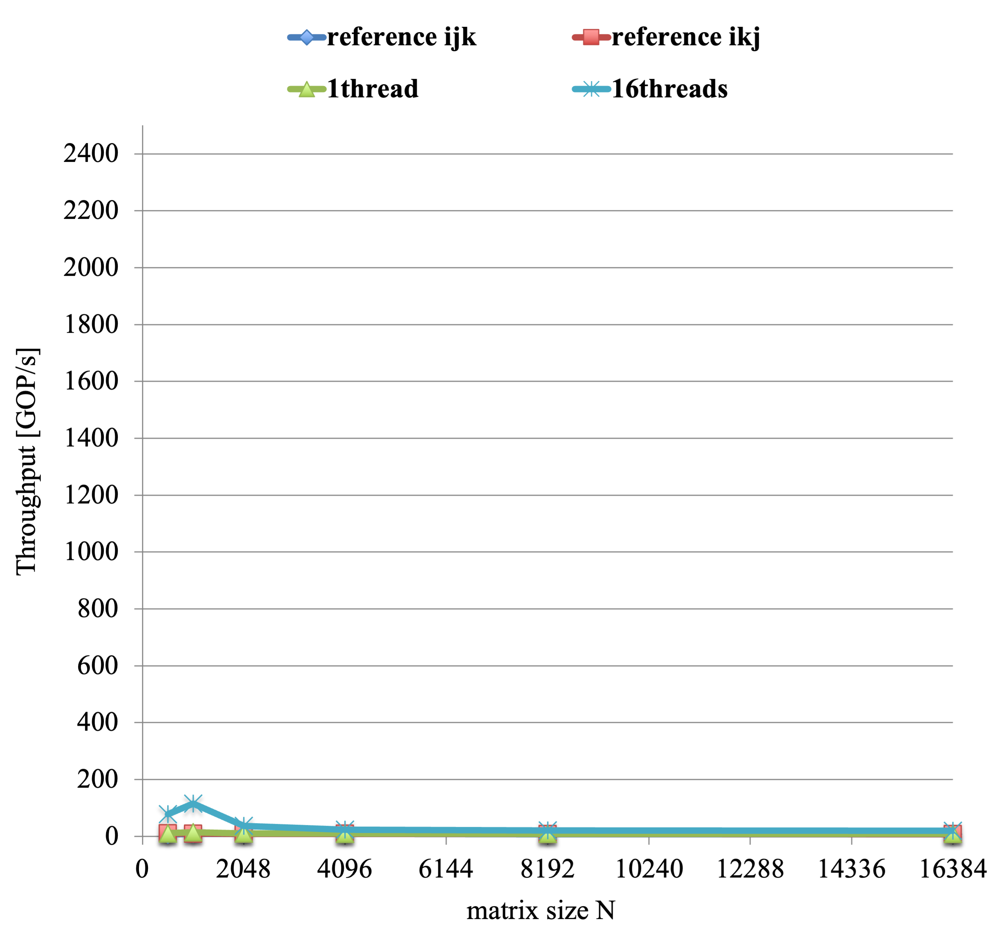

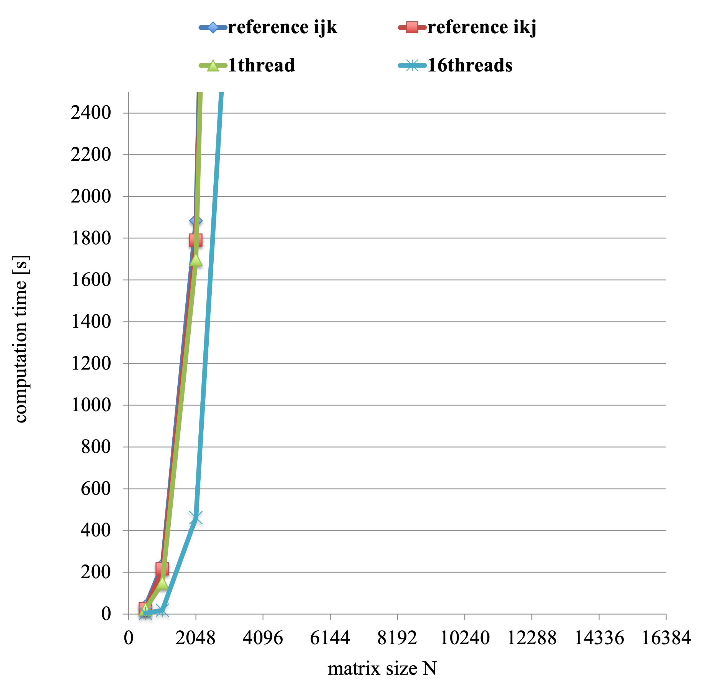

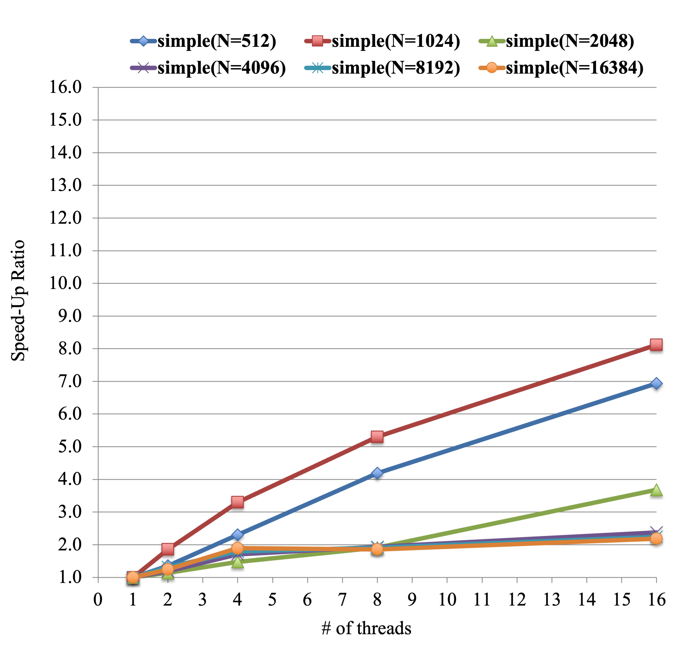

B-program:

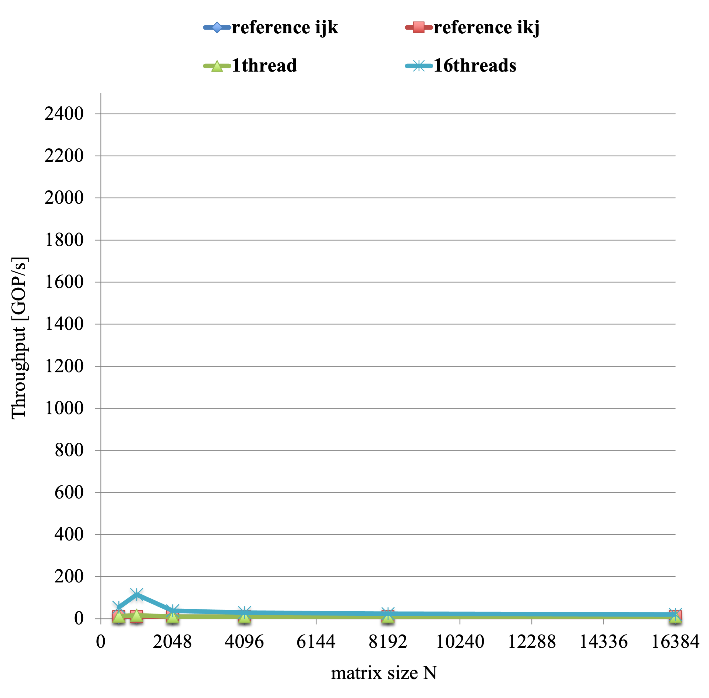

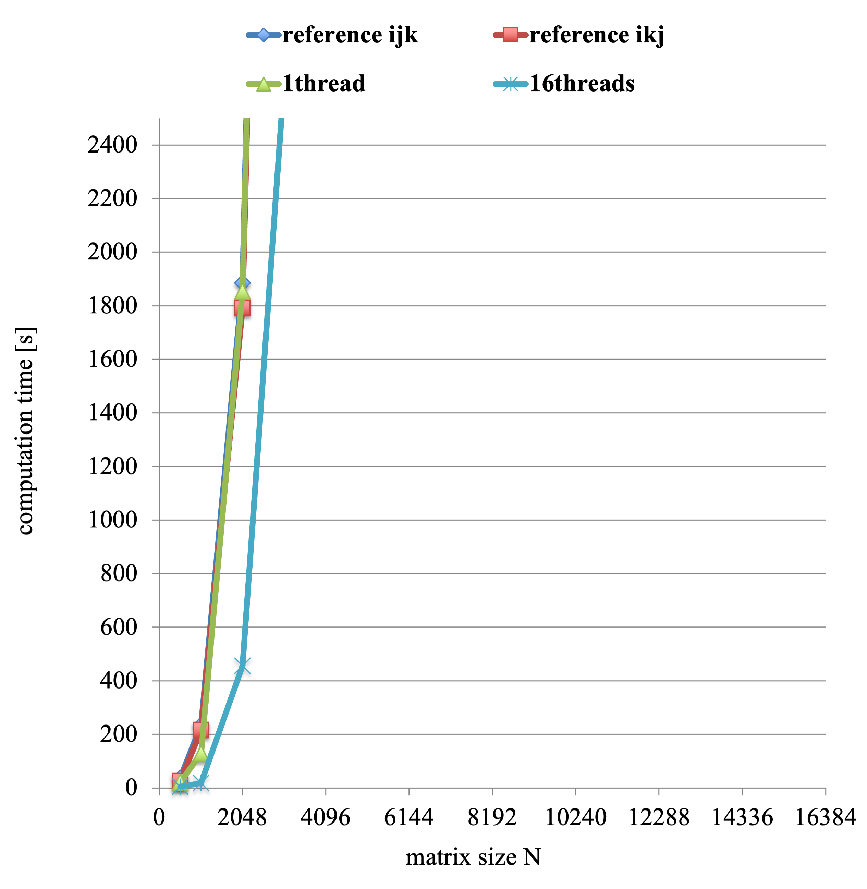

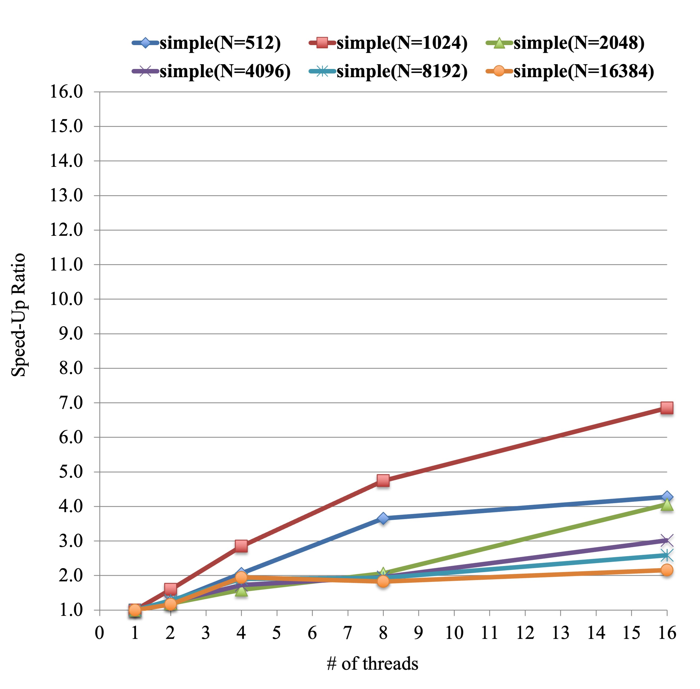

I find the program using AVX instrction is slower than the program without AVX instrction sometime. I am confused by this result.

## 2022/6/27

Pesudocode:

Function with local variable:

```c
void __cdecl mm()
{
  signed int v0; // ebx
  __int64 v1; // rdi
  __int64 v2; // r14
  unsigned int v3; // r11d
  _DWORD *v4; // r12
  int v5; // esi
  _DWORD *v6; // rbp
  _DWORD *v7; // rax
  signed int v8; // r13d
  _DWORD *v9; // rcx
  int v10; // r10d
  _DWORD *v11; // r15
  unsigned int *v12; // r9
  unsigned int v13; // esi
  __int64 v14; // rdx
  __m128i v15; // xmm2
  __m128i v16; // xmm3
  int *v17; // rdi
  _DWORD *v18; // rdx
  int v19; // r15d
  unsigned int *v20; // [rsp+0h] [rbp-70h]
  signed int v21; // [rsp+Ch] [rbp-64h]
  _DWORD *v22; // [rsp+10h] [rbp-60h]
  _DWORD *v23; // [rsp+18h] [rbp-58h]
  _DWORD *v24; // [rsp+20h] [rbp-50h]
  __int64 v25; // [rsp+28h] [rbp-48h]
  int v26; // [rsp+30h] [rbp-40h]
  int v27; // [rsp+34h] [rbp-3Ch]

  v0 = g_size;
  if ( g_size > 0 )
  {
    v1 = c;
    v2 = 4LL * g_size;
    v3 = g_size & 0xFFFFFFFC;
    v21 = (g_size & 0xFFFFFFFC) + 2;
    v4 = (_DWORD *)b;
    v5 = 0;
    v20 = (unsigned int *)(v2 + a);
    v6 = (_DWORD *)(v2 + c);
    v7 = (_DWORD *)c;
    v26 = 0;
    v8 = (g_size & 0xFFFFFFFC) + 1;
    do
    {
      v27 = v5;
      v9 = v4;
      v25 = v1;
      v10 = 0;
      v11 = (_DWORD *)(v1 + 4LL * (int)(v3 + v5));
      v12 = &v20[v2 / 0xFFFFFFFFFFFFFFFCLL];
      v22 = (_DWORD *)(v1 + 4LL * (v8 + v5));
      v23 = (_DWORD *)(v1 + 4LL * (v5 + v21));
      do
      {
        v13 = *v12;
        if ( (unsigned __int64)((char *)v7 - (char *)(v9 + 1)) <= 8 || (unsigned int)(v0 - 1) <= 2 )
        {
          v24 = v11;
          v17 = v9;
          v18 = v7;
          do
          {
            v19 = *v17++;
            *v18++ += v13 * v19;
          }
          while ( v18 != v6 );
          v11 = v24;
        }
        else
        {
          v14 = 0LL;
          v15 = _mm_shuffle_epi32(_mm_cvtsi32_si128(v13), 0);
          v16 = _mm_srli_epi64(v15, 0x20u);
          do
          {
            *(__m128i *)&v7[v14] = _mm_add_epi32(
                                     _mm_loadu_si128((const __m128i *)&v7[v14]),
                                     _mm_unpacklo_epi32(
                                       _mm_shuffle_epi32(
                                         _mm_mul_epu32(_mm_loadu_si128((const __m128i *)&v9[v14]), v15),
                                         8),
                                       _mm_shuffle_epi32(
                                         _mm_mul_epu32(
                                           _mm_srli_epi64(_mm_loadu_si128((const __m128i *)&v9[v14]), 0x20u),
                                           v16),
                                         8)));
            v14 += 4LL;
          }
          while ( 4LL * ((unsigned int)v0 >> 2) != v14 );
          if ( v3 != v0 )
          {
            *v11 += v13 * v4[v10 + v3];
            if ( v0 > v8 )
            {
              *v22 += v13 * v4[v10 + v8];
              if ( v0 > v21 )
                *v23 += v4[v10 + v21] * v13;
            }
          }
        }
        ++v12;
        v9 = (_DWORD *)((char *)v9 + v2);
        v10 += v0;
      }
      while ( v12 != v20 );
      ++v26;
      v7 = (_DWORD *)((char *)v7 + v2);
      v6 = (_DWORD *)((char *)v6 + v2);
      v20 = (unsigned int *)((char *)v20 + v2);
      v1 = v25;
      v5 = v0 + v27;
    }
    while ( v0 != v26 );
  }
}
```

Function with global variable:

```c
void __cdecl g_mm()
{
  int v0; // eax
  __int64 v1; // r11
  int v2; // r8d
  __int64 v3; // rsi
  __int64 v4; // r10
  int v5; // edi
  int i; // r9d
  int v7; // ecx
  int v8; // edx
  __int64 v9; // rax
  int v10; // edx

  v0 = g_size;
  if ( g_size > 0 )
  {
    v1 = a;
    v2 = 0;
    v3 = c;
    v4 = b;
    do
    {
      v5 = 0;
      for ( i = *(_DWORD *)(v1 + 4LL * v2 * v0); ; i = *(_DWORD *)(v1 + 4LL * (v5 + v2 * g_size)) )
      {
        v7 = 0;
        do
        {
          v8 = v0;
          v9 = v7 + v5 * v0;
          v10 = v7 + v2 * v8;
          ++v7;
          *(_DWORD *)(v3 + 4LL * v10) += i * *(_DWORD *)(v4 + 4 * v9);
          v0 = g_size;
        }
        while ( g_size > v7 );
        if ( g_size <= ++v5 )
          break;
      }
      ++v2;
    }
    while ( g_size > v2 );
  }
}
```

From the pesudocode, I think the optimized function `mm` (using local variable) folded loops and make the progress faster than normal.

The function using global variable cannot be optimized because the compiler cannot predict the behavior of a global variable, so it will not optimize the function using global variable.

## 2022/6/24

Using IDA Pro to analysis these codes:

Program using local variable:

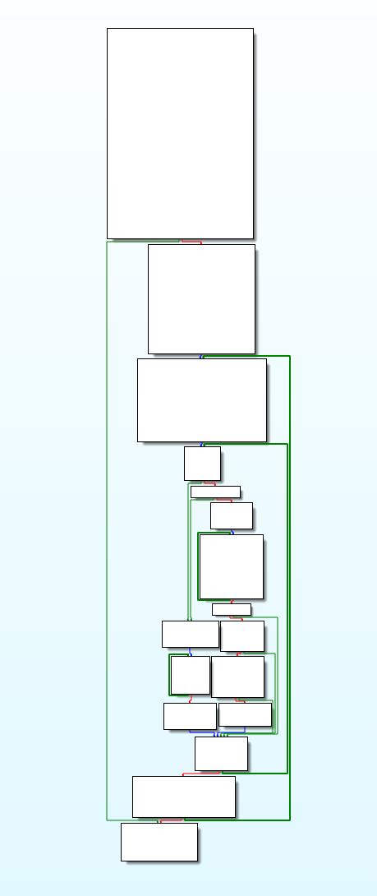

Program using global variable:

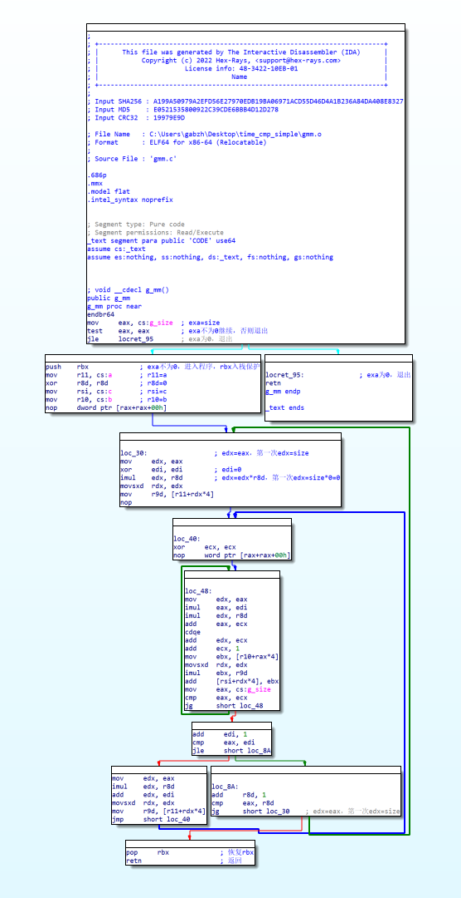

From the structure of function, I think the function using local variable has been optimized by the compiler.

The assembly code of function with global variable is very easy for understanding, but the local variable one is very complicated. I am trying to read it.

## 2022/6/23

Seminar:

* Using Assembly code to find out the reason of the wrong performance of non-nested array and why the global variable can influence the performance of a program is a good idea.
* I can make the matrix multiplication function out of the `main.c` file, and compile two `.o` file and link them to a new executable file. By doing this, I can disassemble the code of matrix multiplication function only and prevent the influence of other code.
* I will using some tools like IDA Pro to find out the reason.

* From Mr. Gocho:
  * Metal is very like OpenCL, and it is not very suitable for a beginner
  * I can try CUDA instead of Metal or OpenCL
  * The algorithm of my program is not a good parallel algorithm, a good parallel algorithm for adding two array is like this:

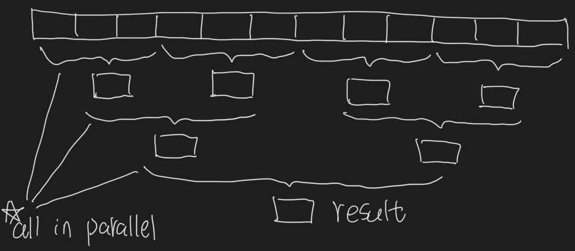

## 2022/6/22

For running the Metal kernel function in GPU, I wirte a swift program:

```swift
import Metal

typealias DataType = CFloat

var timer = Timer()

let count = 10_000_000
let elementsPerSum = 10_000
var dataCount = CUnsignedInt(count)
var elementsPerSumC = CUnsignedInt(elementsPerSum)

let resultsCount = (count + elementsPerSum - 1) / elementsPerSum

let device = MTLCreateSystemDefaultDevice()!
let sumfunc = try! device.makeLibrary(filepath: "./ArrayAddMetalLib.metallib").makeFunction(name: "sum")!
let pipeline = try! device.makeComputePipelineState(function:sumfunc)

var data = (0..<count).map{ _ in DataType(1.5) }

let dataBuffer = device.makeBuffer(bytes:&data, length: MemoryLayout<DataType>.size * count, options: [])
let resultsBuffer = device.makeBuffer(length:MemoryLayout<DataType>.size * resultsCount, options: [])

let results = UnsafeBufferPointer<DataType>(start: resultsBuffer!.contents().assumingMemoryBound(to:DataType.self), count: resultsCount)

let threadgroupsPerGrid = MTLSize(width: (resultsCount + pipeline.threadExecutionWidth - 1) / pipeline.threadExecutionWidth, height: 1, depth: 1)
let threadsPerThreadgroup = MTLSize(width: pipeline.threadExecutionWidth, height: 1, depth: 1)
let queue = device.makeCommandQueue()
let cmds = queue!.makeCommandBuffer()
let encoder = cmds!.makeComputeCommandEncoder()!
encoder.setComputePipelineState(pipeline)
encoder.setBuffer(dataBuffer, offset: 0, index: 0)
encoder.setBytes(&dataCount, length: MemoryLayout<CUnsignedInt>.size, index: 1)
encoder.setBuffer(resultsBuffer, offset: 0, index: 2)
encoder.setBytes(&elementsPerSumC, length: MemoryLayout<CUnsignedInt>.size, index: 3)
encoder.dispatchThreadgroups(threadgroupsPerGrid, threadsPerThreadgroup: threadsPerThreadgroup)
encoder.endEncoding()

var result: DataType = 0

timer.start()
cmds!.commit()
cmds!.waitUntilCompleted()
for elem in results {
    result += elem
}
timer.end()
print(result, timer.getString(), separator: " / ")

result = 0

timer.start()
data.withUnsafeBufferPointer { buffer in
    for elem in buffer {
        result += elem
    }
}
timer.end()
print(result, timer.getString(), separator: " / ")
```

In this function, for the compatible with C language, we must use `CInt`, `CFloat`, etc. instead of traditional `Int`, `Float`.

And this is a timer program:

```swift
import Foundation

class Timer {
    var _start: UInt64 = 0, _end: UInt64 = 0
    func start() {
        _start = mach_absolute_time()
    }
    func end() {
        _end = mach_absolute_time()
    }
    func getDouble() -> Double {
        return Double(_end - _start) / Double(NSEC_PER_SEC)
    }
    func getString() -> String {
        return String(format: "%.9f", self.getDouble())
    }
}

```

The kernel function must compile in a `MetalLib` project (target), and call this library in the swift project.

The reference of my code is the [sample](https://developer.apple.com/documentation/metal/performing_calculations_on_a_gpu) providing by Apple, but this sample is wrote in Object-C.

## 2022/6/20

After many debugs with gdb, I still can't find the reason.

But I find a very useful command for gdb: `layout`.

command `layout`: Used to split the window, you can view the code while testing.

* `layout src`: view source code
* `layout asm`: view assembly code
* `layout regs`: view registers
* `layout split`: view source code and assembly code (in two windows)
* `layout next`: next window
* `layout prev`: previous window
* `Ctrl + L`: refresh window
* `Ctrl + x, 1`: single window
* `Ctrl + x, 2`: two windows
* `Ctrl + x, a`: exit layout mode

---

I am a little tired and for switching emotion, I think I can write a Metal (the GPU programming library for Apple device) program.

The development documentations of Apple is very concise and clear design: [Metal](https://developer.apple.com/documentation/metal/).

And Apple also provide a C++ version Metal API: [Metal-cpp](https://developer.apple.com/metal/cpp/).

After reading the materials, I try to write a core function for the add of two array:

```
#include <metal_stdlib>

kernel void sum(const device float* data [[ buffer(0) ]],
                   const device unsigned int& dataLength [[ buffer(1) ]],
                   device float* sums [[ buffer(2) ]],
                   const device unsigned int& elementsPerSum [[ buffer(3) ]],
                   const unsigned int tgPos [[ threadgroup_position_in_grid ]],
                   const unsigned int tPerTg [[ threads_per_threadgroup ]],
                   const unsigned int tPos [[ thread_position_in_threadgroup ]])
{
    unsigned int resultIndex = tgPos * tPerTg + tPos;
    unsigned int dataIndex = resultIndex * elementsPerSum;
    unsigned int endIndex = dataIndex + elementsPerSum < dataLength ? dataIndex + elementsPerSum : dataLength;
    for (; dataIndex < endIndex; dataIndex++)
        sums[resultIndex] += data[dataIndex];
}
```

## 2022/6/16

Seminar:

I am stil trying to find out the reason of the wrong performance of program with non-nested array.

And I receive a very beautiful sample excel file of perfomance evaluation from Mr. Gocho: [Excel File](./file/performance_eval_sample.xlsx)

## 2022/6/15

I wanna write a program to get the precisest running time of a program for various architectures.

First, I need to distinguish architectures:

```c
#include <iostream>

int main() {
#ifdef __amd64__
    std::cout << "amd64" << std::endl;
#endif
#ifdef __aarch64__
    std::cout << "arm64" << std::endl;
#endif
#ifdef __arm__
    std::cout << "arm" << std::endl;
#endif
#ifdef __i386__
    std::cout << "i386" << std::endl;
#endif
    return 0;
}
```

In x86 or amd64 architecture, I use `rdtsc` instruction to read the `tsc` register to get a precisest time.

```c
#ifdef __cplusplus
extern "C" {
#endif
#ifdef __i386__
void get_time_stamp(time_stamp_t *ts)
{
    __asm__(
        "rdtsc;\n\t"
        : "=a"(*ts)
        : /* No Input */
        : "edx", "eax"
    );
}
#endif

#ifdef __amd64__
void get_time_stamp(time_stamp_t *ts)
{
    uint32_t lo, hi;
    __asm__(
        "rdtsc;\n\t"
        : "=a"(lo), "=d"(hi)
        : /* No Input */
        : "edx", "eax"
    );
    *ts = hi;
    *ts <<= 32;
    *ts += lo;
}
#endif
#ifdef __cplusplus
}
#endif
```

But I find there is not a instruction for ARM or AArch64 to read time register (`PMCCNTR_EL0`) from CPU **in user mode**.

About `PMCCNTR_EL0` register: [Link](http://ilinuxkernel.com/?p=1755) (Chinese, but part in English)

## 2022/6/14

After a lot of tries, I find if I use the global variable, the performance of the program will decrese.

Such as:

* The version using local variable:

```c
void matmul(const int *__restrict__ a,
            const int *__restrict__ b,
            int *__restrict__ c, int msize)
{
  for (int k = 0; k < msize; k++)
    for (int i = 0; i < msize; i++) {
      int t = a[i * msize + k];
      for (int j = 0; j < msize; j++)
        c[i * msize + j] += t * b[k * msize + j];
    }
}
```

* The version using global variable:

```c
int msize;
int *a, *b, *r;

void matmul() {
    for (int k = 0; k < msize; k++)
        for (int i = 0; i < msize; i++) {
            int t = a[i * msize + k];
            for (int j = 0; j < msize; j++)
                r[i * msize + j] += t * b[k * msize +j];
        }
}
```

In the 2nd version of code, when I make one of matrices variable or size variable a local variable, the program has a very close performance to the 1st version code. Such as:

```c
int gmsize;
int *a, *b, *r;

void matmul() {
    int msize = gmsize; // make size a local variable
    for (int k = 0; k < msize; k++)
        for (int i = 0; i < msize; i++) {
            int t = a[i * msize + k];
            for (int j = 0; j < msize; j++)
                r[i * msize + j] += t * b[k * msize +j];
        }
}
```

or

```c
int msize;

void matmul(const int *__restrict__ a,
            const int *__restrict__ b,
            int *__restrict__ c)
{
  for (int k = 0; k < msize; k++)
    for (int i = 0; i < msize; i++) {
      int t = a[i * msize + k];
      for (int j = 0; j < msize; j++)
        c[i * msize + j] += t * b[k * msize + j];
    }
}
```

But I do not the reason for this, now.

## 2022/6/11

I remove the `restrict` mark in the program, and try to find out whether `restrict` affects the performance of the program.

But I get a running time that is very close to the code with `restrict` mark.

So, `restrict` mark is not the key point of the high performance of Mr. Gocho's program.

## 2022/6/10

Mr. Gocho write a program that the performance of non-nested array is right (faster than the nested one), but the reason of the wrong performance of my program is not clear.

This is the program from Mr. Gocho:

[File: simpleGEMM.tar.gz](./file/simpleGEMM.tar.gz)

I find Mr. Gocho use `restrict` to mark the parameter of matrix multiplication function in his program.

I search the usage of  `restrict` on Internet,

* [Restricted Pointers](https://gcc.gnu.org/onlinedocs/gcc/Restricted-Pointers.html)
* [Does the restrict keyword provide significant benefits in gcc/g++?](https://stackoverflow.com/questions/1965487/does-the-restrict-keyword-provide-significant-benefits-in-gcc-g)
* [Wikipedia: Restrict](https://en.wikipedia.org/wiki/Restrict)
* [restrict修饰符(Chinese)](https://blog.csdn.net/scanery/article/details/7389439)

And I write a simple program to test  `restrict`:

```c
#include <stdio.h>
#include <stdlib.h>
#include <string.h>
#include <sys/time.h>

/* add/add_c:
 * | | | | | | | a
 *  + + + + + +
 * | | | | | | | b
 *  ↓ ↓ ↓ ↓ ↓ ↓
 * | | | | | | | c
 */

void add_c(const int *__restrict__ a, const int *__restrict__ b, int *__restrict__ c, unsigned int size) {
    for (int i = 0; i < size; ++i)
        c[i] = a[i] + b[i];
}

void add(const int *a, const int *b, int *c, unsigned int size) {
    for (int i = 0; i < size; ++i)
        c[i] = a[i] + b[i];
}

int main(__attribute__((unused)) int argc, char *argv[]) {
    struct timeval start, end;
    long time_usec;
    double time_sec;
    unsigned int size = (int)strtol(argv[1], NULL, 10);
    int *a = malloc(sizeof(int) * size);
    int *b = malloc(sizeof(int) * size);
    int *c = malloc(sizeof(int) * size);
    for (int i = 0; i < size; ++i) {
        a[i] = 1;
        b[i] = 1;
    }
    memset(c, 0, sizeof(int) * size);
    gettimeofday(&start, NULL);
    for (int i = 0; i < 1000000; ++i)
        add(a, b, c, size);
    gettimeofday(&end, NULL);
    time_usec = 1000000 * (end.tv_sec - start.tv_sec) + end.tv_usec - start.tv_usec;
    time_sec = ((double)time_usec / 1000000);
    printf("without restrict: %f\n", time_sec);
    for (int i = 0; i < size; ++i) {
        a[i] = 1;
        b[i] = 1;
    }
    memset(c, 0, sizeof(int) * size);
    gettimeofday(&start, NULL);
    for (int i = 0; i < 1000000; ++i)
        add_c(a, b, c, size);
    gettimeofday(&end, NULL);
    time_usec = 1000000 * (end.tv_sec - start.tv_sec) + end.tv_usec - start.tv_usec;
    time_sec = ((double)time_usec / 1000000);
    printf("with restrict: %f\n", time_sec);
    free(a);
    free(b);
    free(c);
    return 0;
}
```

## 2022/6/9

Seminar:

* I'm trying to explain why program with non-nested array is slower than the nested one, but not much progress so far.
* I can use comment in code to vividly show how the function work.

## 2022/6/6

These days I was prepareing for my presentation.

[PDF file](./file/20220606.pdf)

And about the nested-point, there are some useful idea from Mr. Gocho:

```
Let’s write code like the following example.

float *C= (float *)malloc( sizeof( float ) * M*N);// traditional C & C++ style.
std::vector<float> B( K*N ), A(M*K);// C++ stdlib style.
#pragma omp parallel for
for (int m=0; m<M; m++) {
  memset( C+m*N, 0, sizeof( float )* N );
  for (int k =0; k < K; k++) {
     float kA = A[m*K+k];
     for (int n =0; n<N; n++)
         C[m*N+n] += kA * B[k*N+n];
    }
}
```

```
Nested pointer arrays can cause some overheads or performance disadvantages.
( It’s not an unsafe problem. )
Single pointer arrays are always guaranteed to be cache-efficient linear memory (continuous memory region), and the high performance BLAS API( https://github.com/xianyi/OpenBLAS) can also be called.
In either case, it can be occurred some illegal memory accesses, such as the overflow, incorrect indexing, and race conditions.
Therefore, please be careful when implementing single- or multi-threaded programs.
```

```
Race condition exampleも紹介しておきます

・Invalid code
float A=0;
#pragma omp parallel for
for (int i=0; i <N; i++) A += data[i];

・valid code
float A=0;
#pragma omp parallel for reduction( +: A )
for (int i=0; i <N; i++) A += data[i];

or

std::vector<float> buf( num_thr, 0.0f );
#pragma omp parallel for num_threads( num_thr )
for (int i=0; i <N; i++) {
  int tid = omp_get_thread_num();
  buf[tid] += data[i];
}  // all threads join after finished the loop
// single threads sumup reduced values
float A=0.0f;
for (int t=0; t < num_thr; t++) A += buf[t];
```

But as the pdf file said, I found my non-nested program is slower than the nested one, I will try to find out the reason.

## 2022/6/2

Seminar:

* Mr. Gocho point out my may to use the array is wrong and will reduce the performance of program.

My way:

```c
ga = malloc(sizeof(float *) * MAXN);
gb = malloc(sizeof(float *) * MAXN);
gc = malloc(sizeof(float *) * MAXN);
for (int i = 0; i < MAXN; i++) {
    ga[i] = malloc(sizeof(float) * MAXN);
    gb[i] = malloc(sizeof(float) * MAXN);
    gc[i] = malloc(sizeof(float) * MAXN);
}
```

The right way:

```c
ga = malloc(sizeof(float *) * MAXN * MAXN);
gb = malloc(sizeof(float *) * MAXN * MAXN);
gc = malloc(sizeof(float *) * MAXN * MAXN);
```

I will repair it.

* I should make the number of threads is the cloumn and the size of matrix is row in a table, such as:

| size  | 1-thread | 2-threads | 4-threads | 8-threads | 16-threads |
| ----- | -------- | --------- | --------- | --------- | ---------- |
| 512   |          |           |           |           |            |
| 1024  |          |           |           |           |            |
| 2048  |          |           |           |           |            |
| 4096  |          |           |           |           |            |
| 8192  |          |           |           |           |            |
| 16384 |          |           |           |           |            |

---

I write a OpenMP version of matrix multiplication program (for learning the usage of OpenMP):

```c
#include <stdio.h>
#include <stdlib.h>
#include <omp.h>
#include <sys/time.h>

struct matrix {
    int **matrix;
    int size;
};

void matinit(struct matrix *m, int size) {
    m->size = size;
    m->matrix = malloc(sizeof(int*) * size);
    #pragma omp parallel for
    for (int i = 0; i < size; i++) {
        m->matrix[i] = malloc(sizeof(int) * size);
        for (int j = 0; j < size; j++) {
            m->matrix[i][j] = 0;
        }
    }
}

void matgen(struct matrix *m) {
    int size = m->size;
    srandom(*((unsigned int*)&m));
    #pragma omp parallel for
    for (int i = 0; i < size; i++) {
        for (int j = 0; j < size; j++) {
            m->matrix[i][j] = (int)random() % 100;
        }
    }
}

__attribute__((unused)) void matprt(struct matrix *m) {
    int size = m->size;
    for (int i = 0; i < size; i++) {
        for (int j = 0; j < size; j++)
            printf("%d ", m->matrix[i][j]);
        putchar('\n');
    }
    putchar('\n');
}

void matmul(struct matrix *a, struct matrix *b, struct matrix *r) {
    int size = a->size;
    #pragma omp parallel for
    for (int k = 0; k < size; k++) {
        for (int i = 0; i < size; i++) {
            int t = a->matrix[i][k];
            for (int j = 0; j < size; j++) {
                r->matrix[i][j] += t * b->matrix[k][j];
            }
        }
    }
}

int main(int argc, char* argv[]) {
    if (argc != 3) {
        printf("Usage: %s <size> <number of threads>\n", argv[0]);
        return -1;
    }
    int size = (int)strtol(argv[1], NULL, 10);
    int threads_num = (int)strtol(argv[2], NULL, 10);
    if (!threads_num || !size) {
        printf("Error input.\n");
        return -1;
    }
    omp_set_num_threads(threads_num);
    struct matrix a, b, r;
    double start, end;
    matinit(&a, size);
    matinit(&b, size);
    matinit(&r, size);
    matgen(&a);
    matgen(&b);
    start = omp_get_wtime();
    matmul(&a, &b, &r);
    end = omp_get_wtime();
    // matprt(&a);
    // matprt(&b);
    // matprt(&r);
    printf("%f\n", end - start);
    return 0;
}
```

About the nested loops:

* [NestedParallelismAOEM15](https://materials.prace-ri.eu/454/3/NestedParallelismAOEM15.pdf)
* [How does OpenMP handle nested loops?](https://stackoverflow.com/questions/13357065/how-does-openmp-handle-nested-loops)
* [OpenMP - Nested for-loop becomes faster when having parallel before outer loop. Why?](https://stackoverflow.com/questions/31321071/openmp-nested-for-loop-becomes-faster-when-having-parallel-before-outer-loop)

## 2022/5/31

Benchmark:

Time(s): C

| **threads** | **1000**    | **2000**    | **3000**     | **4000**     | **5000**     | **6000**     | **7000**     | **8000**      | **9000**      | **10000**     |
| ----------- | ----------- | ----------- | ------------ | ------------ | ------------ | ------------ | ------------ | ------------- | ------------- | ------------- |
| 1           | 0.2150945   | 3.538020625 | 12.484331125 | 29.515970375 | 57.219937875 | 98.048101625 | 154.36952325 | 228.418179875 | 325.65527625  | 443.254990375 |
| 2           | 0.195584875 | 1.7083235   | 5.059017125  | 11.6600465   | 23.125592375 | 39.916405375 | 64.000874    | 93.12387025   | 134.206596125 | 177.914364625 |
| 4           | 0.13335225  | 1.09289775  | 3.20339975   | 7.23954425   | 14.4661055   | 25.2697855   | 41.323306625 | 64.527921125  | 92.67895875   | 128.009135375 |
| 8           | 0.0746825   | 0.7194285   | 2.236958     | 5.19659625   | 11.09609775  | 18.829258625 | 32.4087495   | 48.6970355    | 69.082239     | 98.189590625  |
| 16          | 0.040905375 | 0.396547625 | 1.1564415    | 3.090512     | 6.399203125  | 12.327618625 | 21.573443875 | 30.955059125  | 46.2589625    | 66.0418885    |
| 32          | 0.026092    | 0.21728075  | 0.675382875  | 1.641752625  | 3.83599275   | 7.577224125  | 16.116267375 | 22.076997     | 37.251913625  | 47.655076375  |

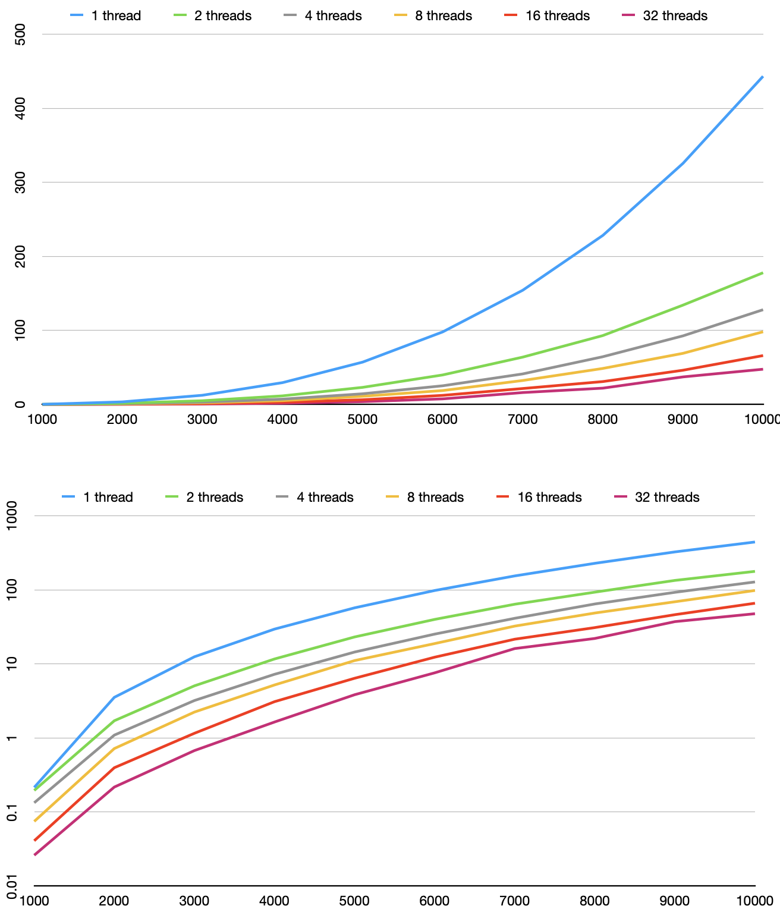

(Up: Linearity; Down: Logarithm)

Time(s): C++

| **threads** | **1000**    | **2000**    | **3000**   | **4000**   | **5000**    | **6000**   | **7000**   | **8000**   | **9000**   | **10000**  |
| ----------- | ----------- | ----------- | ---------- | ---------- | ----------- | ---------- | ---------- | ---------- | ---------- | ---------- |
| 1           | 0.203070375 | 3.92559375  | 13.1114875 | 29.94645   | 57.350275   | 97.9557    | 153.5125   | 228.73325  | 325.152    | 445.2935   |
| 2           | 0.1072805   | 1.56977625  | 5.08685125 | 11.9222125 | 22.98695    | 41.091925  | 69.080225  | 96.744475  | 140.951875 | 188.04425  |
| 4           | 0.059723    | 1.087904375 | 3.28801625 | 7.53337    | 14.7029     | 27.077975  | 43.5442125 | 67.253475  | 94.807075  | 130.790375 |
| 8           | 0.03474875  | 0.814612625 | 2.7524725  | 6.64562375 | 13.163225   | 23.63635   | 38.193525  | 56.4852625 | 81.8788375 | 114.222625 |
| 16          | 0.021469    | 0.428517125 | 1.88304625 | 4.5489125  | 10.73210625 | 19.253575  | 34.64125   | 49.8425    | 75.7736875 | 98.9783125 |
| 32          | 0.018161625 | 0.26147475  | 1.1390575  | 2.21853125 | 7.331105    | 13.7497125 | 28.61185   | 36.0874875 | 63.7281375 | 86.1108125 |

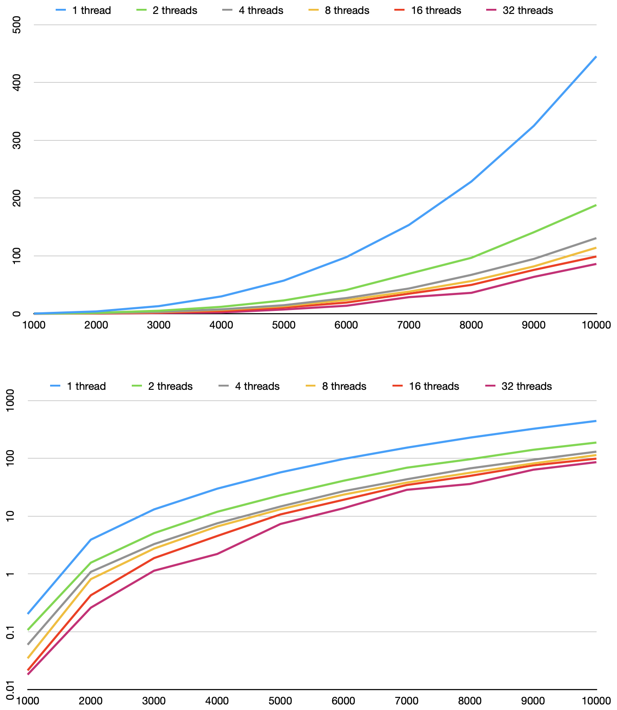

(Up: Linearity; Down: Logarithm)

Speedup ratio: C

| **threads** | **1000**           | **2000**          | **3000**          | **4000**          | **5000**          | **6000**          | **7000**          | **8000**          | **9000**          | **10000**         |
| ----------- | ------------------ | ----------------- | ----------------- | ----------------- | ----------------- | ----------------- | ----------------- | ----------------- | ----------------- | ----------------- |
| 1           | -                  | -                 | -                 | -                 | -                 | -                 | -                 | -                 | -                 | -                 |
| 2           | 0.0907025749147468 | 0.517152758260136 | 0.594770670983785 | 0.604958049765626 | 0.595847300192477 | 0.592889564270541 | 0.585404731111651 | 0.592309726393226 | 0.587887542709513 | 0.59861847359128  |
| 4           | 0.380029475416619  | 0.69109910149266  | 0.743406377328044 | 0.754724504801242 | 0.747184180248466 | 0.742271547524212 | 0.732309164691289 | 0.717500939897549 | 0.715407777766659 | 0.71120655569675  |
| 8           | 0.652792144847962  | 0.796657912360248 | 0.820818754516975 | 0.823939508544787 | 0.806079870721985 | 0.807958967966403 | 0.790057332446934 | 0.786807532015845 | 0.787866974564334 | 0.77848057493514  |
| 16          | 0.809826029954276  | 0.887918226875797 | 0.907368565570628 | 0.895293566136058 | 0.888164801244989 | 0.874269685790054 | 0.860248037172065 | 0.86448075568267  | 0.857951134608709 | 0.851007005145892 |
| 32          | 0.878695178165876  | 0.93858691821504  | 0.945901557060791 | 0.944377480931795 | 0.932960557238284 | 0.922719318381296 | 0.895599422504532 | 0.903348336756376 | 0.885609365664316 | 0.892488347768667 |

Speedup ratio: C++

| **threads** | **1000**          | **2000**          | **3000**          | **4000**          | **5000**          | **6000**          | **7000**          | **8000**          | **9000**          | **10000**         |
| ----------- | ----------------- | ----------------- | ----------------- | ----------------- | ----------------- | ----------------- | ----------------- | ----------------- | ----------------- | ----------------- |
| 1           | -                 | -                 | -                 | -                 | -                 | -                 | -                 | -                 | -                 | -                 |
| 2           | 0.471707776183503 | 0.600117498149165 | 0.612030957585857 | 0.601882276530273 | 0.599183264596377 | 0.580505014001227 | 0.550002605651006 | 0.577042362664807 | 0.566504665510284 | 0.577707175155263 |
| 4           | 0.705899986642562 | 0.722868833536328 | 0.749226298694179 | 0.748438629620539 | 0.743629825663434 | 0.723569174637106 | 0.71634744727628  | 0.705974207947467 | 0.708422291728176 | 0.70628276631031  |
| 8           | 0.828883213516496 | 0.79248677349764  | 0.790071683323498 | 0.778083086642991 | 0.770476689083008 | 0.758703679316262 | 0.751202507939093 | 0.753051808165188 | 0.748182888310698 | 0.743489125711469 |
| 16          | 0.894278030461115 | 0.890840175451166 | 0.856381951323219 | 0.848098439047032 | 0.812867396886937 | 0.803446098593548 | 0.774342480254051 | 0.782093333610221 | 0.766959183704852 | 0.777723428480317 |
| 32          | 0.910564871907091 | 0.933392305304134 | 0.913125227019436 | 0.925916719677958 | 0.872169662656369 | 0.859633359773857 | 0.81361876068724  | 0.842228939168223 | 0.80400508838943  | 0.80662010000146  |

Speedup ratio of C and C++: ((Cpp-time - C-time) / Cpp-time)

| **threads** | **1000**            | **2000**             | **3000**            | **4000**           | **5000**             | **6000**              | **7000**            | **8000**            | **9000**             | **10000**           |
| ----------- | ------------------- | -------------------- | ------------------- | ------------------ | -------------------- | --------------------- | ------------------- | ------------------- | -------------------- | ------------------- |
| 1           | -0.0592116156775699 | 0.0987298099809742   | 0.0478325876449945  | 0.014374980172942  | 0.00227265039269646  | -0.000943300134652705 | -0.0055827587330022 | 0.00137745660064726 | -0.00154781840493062 | 0.00457790114834373 |
| 2           | -0.823116736033109  | -0.0882592343972588  | 0.00547177883371368 | 0.021989710383035  | -0.00603135148421169 | 0.0286070712189804    | 0.0735282926481493  | 0.0374244084739723  | 0.047855190823109    | 0.0538696895810428  |
| 4           | -1.23284580479882   | -0.00458990249028091 | 0.0257348180684934  | 0.0390032283028711 | 0.0161052921532487   | 0.0667771315986517    | 0.0510034686010225  | 0.0405265880313248  | 0.0224468084264808   | 0.0212648646737193  |
| 8           | -1.14921400050362   | 0.116845875056258    | 0.187291426163204   | 0.218042362088284  | 0.157038054883967    | 0.203377060121381     | 0.151459586408953   | 0.137880690560657   | 0.15628700761659     | 0.140366537496402   |
| 16          | -0.905322791000978  | 0.0746049530692618   | 0.385866650912053   | 0.320604210346979  | 0.40373278311515     | 0.359723135833215     | 0.377232522642803   | 0.378942486331946   | 0.389511530635222    | 0.332764048689959   |
| 32          | -0.436655585609768  | 0.169018232161997    | 0.407068673003777   | 0.259982195427718  | 0.476751083226881    | 0.448917631914122     | 0.436727531599669   | 0.388236795371249   | 0.415455792584555    | 0.446584290735847   |

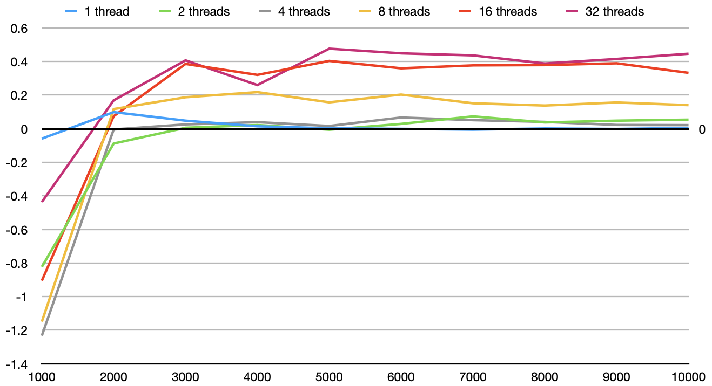

In summary: when matrix size and the number of threads is small, C++ has a better performance than C.

But with the increasing of matrix size and the number of threads, the performance of C is much better than C++.

## 2022/5/26

I have a fever this week, progressing of my research is very slow.

When I get better I will complete the benchmark of the new C++ program (with nested vector).

## 2022/5/22

I find the auto-benchmark program will stop when the terminal closes even if I add `nohup` to run a subprocess.

After searching on Internet, I think the reason might be the subprocess also receives the `SIGINT` signal when closing the terminal.

So, ignoing the `SIGINT` signal:

```python
# ...
def pf():
    signal.signal(signal.SIGINT, signal.SIG_IGN)
# ...
if sys.version_info.minor > 6:
    retc = subprocess.run(
                    ['nohup', matmultc, f'{size}', f'{thread_num}'], capture_output=True, preexec_fn=pf)
    retcpp = subprocess.run(
                    ['nohup', matmultcpp, f'{size}', f'{thread_num}'], capture_output=True, preexec_fn=pf)
else:
    retc = subprocess.run(
                    ['nohup', matmultc, f'{size}', f'{thread_num}'], stdout=PIPE, stderr=PIPE, preexec_fn=pf)
    retcpp = subprocess.run(
                    ['nohup', matmultcpp, f'{size}', f'{thread_num}'], stdout=PIPE, stderr=PIPE, preexec_fn=pf)
```

## 2022/5/21

I wanna develop a program to do the benchmark automatically to save my time.

I write a python program to implement it.

```python
import subprocess
import pandas as pd
import sys
from subprocess import PIPE


matmultc = './matmultc'
matmultcpp = './matmultcpp'
start_size = 1000
end_size = 10000
size_block = 1000
thread_nums = [1, 2, 4, 8, 16, 32]
test_num = 10
xls_name = './benchmark_results.xlsx'
log_file = './benchmark.log'

datac = {}
datacpp = {}
xls_datac = {'threads': thread_nums}
xls_datacpp = {'threads': thread_nums}

log = open(log_file, mode='a')

for size in range(start_size, end_size + size_block, size_block):
    log.write(f'Size {size}:\n')
    log.flush()
    datac[f'{size}'] = {}
    datacpp[f'{size}'] = {}
    for thread_num in thread_nums:
        log.write(f'\tThreads {thread_num}: ')
        log.flush()
        datac[f'{size}'][f'{thread_num}'] = []
        datacpp[f'{size}'][f'{thread_num}'] = []
        for _ in range(0, test_num):
            retc = subprocess.run(
                    ['nohup', matmultc, f'{size}', f'{thread_num}'], capture_output=True)
            retcpp = subprocess.run(
                    ['nohup', matmultcpp, f'{size}', f'{thread_num}'], capture_output=True)
            timec = float(retc.stdout.decode().replace('\n', ''))
            timecpp = float(retcpp.stdout.decode().replace('\n', ''))
            datac[f'{size}'][f'{thread_num}'].append(timec)
            datacpp[f'{size}'][f'{thread_num}'].append(timecpp)
            log.write(f'{timec}/{timecpp}   ')
            log.flush()
        log.write('\n')
        log.flush()
log.write('Get all data.\n')
log.flush()
log.write('Compute results.\n')
log.flush()
for size in range(start_size, end_size + size_block, size_block):
    xls_datac[f'{size}'] = []
    xls_datacpp[f'{size}'] = []
    for thread_num in thread_nums:
        timec = 0
        timecpp = 0
        datac[f'{size}'][f'{thread_num}'].remove(min(datac[f'{size}'][f'{thread_num}']))
        datac[f'{size}'][f'{thread_num}'].remove(max(datac[f'{size}'][f'{thread_num}']))
        datacpp[f'{size}'][f'{thread_num}'].remove(min(datacpp[f'{size}'][f'{thread_num}']))
        datacpp[f'{size}'][f'{thread_num}'].remove(max(datacpp[f'{size}'][f'{thread_num}']))
        for time in datac[f'{size}'][f'{thread_num}']:
            timec += time
        for time in datacpp[f'{size}'][f'{thread_num}']:
            timecpp += time
        timec /= len(datac[f'{size}'][f'{thread_num}'])
        timecpp /= len(datacpp[f'{size}'][f'{thread_num}'])
        xls_datac[f'{size}'].append(timec)
        xls_datacpp[f'{size}'].append(timecpp)
log.write('Computed.\n')
log.flush()
log.write('Save results.\n')
log.flush()
xls_datac = pd.DataFrame(xls_datac)
xls_datacpp = pd.DataFrame(xls_datacpp)
writer = pd.ExcelWriter(xls_name)
xls_datac.to_excel(writer, sheet_name='C')
xls_datacpp.to_excel(writer, sheet_name='CPP')
writer.save()
log.write('Excel file saved.\n')
log.close()
```

I get an error because the python version on parmigiano is under 3.6, there is no `capture_output` parameter in method `subprocess.run`.

Modification:

```python
# ...
if sys.version_info.minor > 6:
    retc = subprocess.run(
                    ['nohup', matmultc, f'{size}', f'{thread_num}'], capture_output=True)
    retcpp = subprocess.run(
                    ['nohup', matmultcpp, f'{size}', f'{thread_num}'], capture_output=True)
else:
    retc = subprocess.run(
                    ['nohup', matmultc, f'{size}', f'{thread_num}'], stdout=PIPE, stderr=PIPE)
    retcpp = subprocess.run(
                    ['nohup', matmultcpp, f'{size}', f'{thread_num}'], stdout=PIPE, stderr=PIPE)
# ...
```

## 2022/5/20

Rewriting the matmult program in C++: (with nested vector)

```c++
#include <iostream>
#include <vector>
#include <thread>
#include <random>
#include <sys/time.h>

typedef std::vector<std::vector<int>> matrix;

void matgen_thread(matrix &m, int start, int rows, std::default_random_engine &e, std::uniform_int_distribution<int> &uniform_dist) {
    unsigned int size = m.size();
    for (int i = start; i < start + rows; ++i)
        for (int j = 0; j < size; ++j)
            m[i][j] = uniform_dist(e);
}

void matgen(matrix &m) {
    unsigned int thread_num = std::thread::hardware_concurrency();
    unsigned int size = m.size();
    if (thread_num > size)
        thread_num = size;
    std::random_device r;
    std::default_random_engine e(r());
    std::uniform_int_distribution<int> uniform_dist(0, 100);
    std::vector<std::thread> threads(thread_num);
    for (int t = 0; t < thread_num; ++t) {
        unsigned int start = (size / thread_num) * t;
        unsigned int rows = (t == thread_num - 1) ? size - start : size / thread_num;
        threads[t] = std::thread(matgen_thread, std::ref(m), (int)start, (int)rows, std::ref(e), std::ref(uniform_dist));
    }
    for (std::thread &t : threads)
        t.join();
}

void matmult_thread(matrix &a, matrix &b, matrix &r, int count, int start_row, int start_column) {
    unsigned int size = a.size();
    int k = start_column;
    for (int i = start_row; i < size; ++i) {
        for (; k < size; ++k) {
            int t = a[i][k];
            for (int j = 0; j < size; ++j)
                r[i][j] += t * b[k][j];
            if (!(--(count)))
                return;
        }
        k = 0;
    }
}

void matmult(matrix &a, matrix &b, matrix &r, int thread_num) {
    unsigned int size = a.size();
    if (thread_num == 1) {
        for (int k = 0; k < size; ++k)
            for (int i = 0; i < size; ++i) {
                int t = a[i][k];
                for (int j = 0; j < size; ++j)
                    r[i][j] += t * b[k][j];
            }
    }
    else {
        unsigned int block_size = (size * size) / thread_num;
        std::vector<std::thread> threads(thread_num);
        for (int t = 0; t < thread_num; ++t) {
            unsigned int count = t == thread_num - 1 ? (size * size - block_size * t) : block_size;
            unsigned int start_row = block_size * t / size;
            unsigned int start_column = block_size * t % size;
            threads[t] = std::thread(
                    matmult_thread, std::ref(a), std::ref(b), std::ref(r), count, start_row, start_column);
        }
        for (std::thread &t : threads)
            t.join();
    }
}

[[maybe_unused]] void printmat(matrix &m) {
    for (int i = 0; i < m.size(); ++i) {
        for (int j = 0; j < m.size(); ++j)
            std::cout << m[i][j] << " ";
        std::cout << std::endl;
    }
    std::cout << std::endl;
}

int main(int argc, char *argv[]) {
    if (argc != 3) {
        std::cout << "Usage: " << argv[0] << " <size> <threads>." << std::endl;
        return -1;
    }
    int size = std::stoi(argv[1]);
    int thread_num = std::stoi(argv[2]);
    timeval start{}, end{};
    long time_usec;
    matrix a(size, std::vector<int>(size, 0));
    matrix b(size, std::vector<int>(size, 0));
    matrix r(size, std::vector<int>(size, 0));
    matgen(a);
    matgen(b);
    // printmat(a);
    // printmat(b);
    gettimeofday(&start, nullptr);
    matmult(a, b, r, thread_num);
    gettimeofday(&end, nullptr);
    // printmat(r);
    time_usec = 1000000 * (end.tv_sec - start.tv_sec) + end.tv_usec - start.tv_usec;
    double time_sec = ((double)time_usec / 1000000);
    std::cout << time_sec << std::endl;
    return 0;
}
```

## 2022/5/19

Seminar:

* Writing a C++ version matmult program
* Comparing it with the C version program

---

About the unsafe of `rand` function:

* Using GNU `random` function
* I write a simple program to read a random value from `/dev/random`:

```c
#include <stdio.h>
#include <unistd.h>
#include <fcntl.h>
#include <stdlib.h>

int random_dev(int s, int e) {
    int n;
    int fd= open("/dev/random", O_RDONLY);
    read(fd, &n, sizeof(int));
    if (n < 0)
        n = -n;
    n = n % e;
    if (n < s)
        n = n + s;
    return n;
}
```

The introduce of `/dev/random`: [Wikipedia: /dev/random](https://en.wikipedia.org/wiki//dev/random)

## 2022/5/17

Rewriting the matmult program in C:

```c
// https://www.cs.cmu.edu/~213/schedule.html
// http://csapp.cs.cmu.edu/3e/code.html

#include <stdio.h>
#include <stdlib.h>
#include <pthread.h>
#include <sys/time.h>

#define THREADS_MAKE_MAT 4
#define FLAG_RESET 0
#define FLAG_RAND 1

struct matrix {
    int **matrix;
    int size;
};

struct mmt_t {
    struct matrix *m;
    int start;
    int rows;
    int flag;
};

void *make_matrix_thread(void *mmt_arg) {
    struct mmt_t *mmt = mmt_arg;
    for (int i = mmt->start; i < mmt->start + mmt->rows; i++)
        for (int j = 0; j < mmt->m->size; j++)
            if (mmt->flag == FLAG_RAND)
                mmt->m->matrix[i][j] = rand() % 100; // NOLINT(cert-msc30-c, cert-msc50-cpp)
            else if (mmt->flag == FLAG_RESET)
                mmt->m->matrix[i][j] = 0;
    pthread_exit(NULL);
}

void make_matrix(struct matrix *m, int flag) {
    m->matrix = malloc(sizeof(int*) * m->size);
    for (int i = 0; i < m->size; i++)
        m->matrix[i] = malloc(sizeof(int) * m->size);
    int threads_num;
    if (m->size > THREADS_MAKE_MAT)
        threads_num = THREADS_MAKE_MAT;
    else
        threads_num = m->size;
    pthread_t threads[threads_num];
    struct mmt_t mmts[threads_num];
    srand(*((unsigned int*)&m)); // NOLINT(cert-msc32-c, cert-msc51-cpp)
    for (int i = 0; i < threads_num; i++) {
        mmts[i].m = m;
        mmts[i].start = (m->size / threads_num) * i;
        mmts[i].rows = (i == threads_num - 1) ? m->size - mmts[i].start : m->size / threads_num;
        mmts[i].flag = flag;
        pthread_create(&threads[i], NULL, make_matrix_thread, (mmts + i));
    }
    for (int i = 0; i < threads_num; i++)
        pthread_join(threads[i], NULL);
}

void destroy_matrix(struct matrix *m) {
    if (m->matrix) {
        for (int i = 0; i < m->size; i++) {
            free(m->matrix[i]);
            m->matrix[i] = NULL;
        }
        free(m->matrix);
        m->matrix = NULL;
    }
}

__attribute__((unused)) void show_matrix(struct matrix *m) {
    for (int i = 0; i < m->size; i++) {
        for (int j = 0; j < m->size; j++)
            printf("%d ", m->matrix[i][j]);
        putchar('\n');
    }
    putchar('\n');
}

struct mmul_t {
    struct matrix *a, *b, *r;
    unsigned int count;
    int start_row, start_column;
};

void *mat_mul_thread(void *mmul_arg) {
    struct mmul_t *mmul = mmul_arg;
    int size = mmul->a->size;
    int k = mmul->start_column;
    for (int i = mmul->start_row; i < size; i++) {
        for (; k < size; k++) {
            int r = mmul->a->matrix[i][k];
            for (int j = 0; j < size; j++)
                mmul->r->matrix[i][j] += r * mmul->b->matrix[k][j];
            if (!(--(mmul->count)))
                pthread_exit(NULL);
        }
        k = 0;
    }
    pthread_exit(NULL);
}

void mat_mul(struct matrix *a, struct matrix *b, struct matrix *r, int threads_num) {
    int size = a->size;
    if (threads_num == 1) {
        for (int k = 0; k < size; k++)
            for (int i = 0; i < size; i++) {
                int t = a->matrix[i][k];
                for (int j = 0; j < size; j++)
                    r->matrix[i][j] += t * b->matrix[k][j];
            }
    }
    else {
        int block_size = (size * size) / threads_num;
        pthread_t threads[threads_num];
        struct mmul_t mmul[threads_num];
        for (int i = 0; i < threads_num; i++) {
            mmul[i].a = a;
            mmul[i].b = b;
            mmul[i].r = r;
            mmul[i].count = i == threads_num - 1 ? (size * size - block_size * i) : block_size;
            mmul[i].start_row = block_size * i / size;
            mmul[i].start_column = block_size * i % size;
            pthread_create(&threads[i], NULL, mat_mul_thread, (mmul + i));
        }
        for (int i = 0; i < threads_num; i++)
            pthread_join(threads[i], NULL);
    }
}

int main(int argc, char* argv[]) {
    if (argc != 3) {
        printf("Usage: %s <size> <number of threads>\n", argv[0]);
        return -1;
    }
    struct timeval start, end;
    long time_usec;
    struct matrix a, b, r;
    int size = (int)strtol(argv[1], NULL, 10);
    int threads_num = (int)strtol(argv[2], NULL, 10);
    if (!threads_num || !size) {
        printf("Error input.\n");
        return -1;
    }
    a.size = size;
    b.size = size;
    r.size = size;
    make_matrix(&a, FLAG_RAND);
    make_matrix(&b, FLAG_RAND);
    make_matrix(&r, FLAG_RESET);
    // show_matrix(&a);
    // show_matrix(&b);
    gettimeofday(&start, NULL);
    mat_mul(&a, &b, &r, threads_num);
    gettimeofday(&end, NULL);
    // show_matrix(&r);
    time_usec = 1000000 * (end.tv_sec - start.tv_sec) + end.tv_usec - start.tv_usec;
    double time_sec = ((double)time_usec / 1000000);
    printf("%f\n", time_sec);
    destroy_matrix(&a);
    destroy_matrix(&b);
    destroy_matrix(&r);
    return 0;
}
```

Using the comment

```c
// NOLINT(cert-msc30-c, cert-msc50-cpp)
```

to ignore the unsafety warning of `rand` function.

Benchmark data:

Time (s) - matmul C-language pthread (kij, with option -O3)

|           | **1**      | **2**      | **4**      | **8**     | **16**    | **32**    |
| --------- | ---------- | ---------- | ---------- | --------- | --------- | --------- |
| **1000**  | 0.218944   | 0.112182   | 0.119319   | 0.074301  | 0.038378  | 0.025284  |
| **2000**  | 3.803318   | 1.793167   | 1.132760   | 0.754458  | 0.366983  | 0.241527  |
| **3000**  | 12.827674  | 4.550951   | 3.239807   | 2.078549  | 1.194251  | 0.643621  |
| **4000**  | 29.640276  | 11.947993  | 7.328067   | 4.925441  | 2.999658  | 1.851029  |
| **5000**  | 57.086600  | 22.192516  | 14.964778  | 10.317044 | 8.700290  | 3.776686  |
| **6000**  | 97.825357  | 39.059777  | 25.087296  | 18.488165 | 10.946701 | 6.921832  |
| **7000**  | 154.443504 | 60.448497  | 41.857228  | 31.532610 | 20.671493 | 16.932829 |
| **8000**  | 228.170791 | 88.538038  | 63.953897  | 49.293915 | 32.497162 | 27.469340 |
| **9000**  | 326.296593 | 127.048526 | 92.805025  | 72.209772 | 42.432854 | 37.041792 |
| **10000** | 445.575332 | 177.343510 | 124.111802 | 95.206342 | 62.148527 | 50.778776 |

Speedup ratio of matmul C-language pthread (kij, with option -O3):

|           | **1** | **2**            | **4**            | **8**            | **16**           | **32**           |
| --------- | ----- | ---------------- | ---------------- | ---------------- | ---------------- | ---------------- |
| **1000**  | 1     | 1.95168565366993 | 1.83494665560389 | 2.94671673328757 | 5.70493511907864 | 8.6593893371302  |
| **2000**  | 1     | 2.12100601895975 | 3.35756735760444 | 5.04112621245981 | 10.3637443696302 | 15.7469682478563 |
| **3000**  | 1     | 2.81867987592044 | 3.95939449479552 | 6.17145614560927 | 10.7411875727967 | 19.9304777190303 |
| **4000**  | 1     | 2.480774469821   | 4.04476050778466 | 6.01779130031199 | 9.88121845890432 | 16.0128641960769 |
| **5000**  | 1     | 2.57233564684599 | 3.81473082995284 | 5.53323219325225 | 6.561459         | 15.1155272108934 |
| **6000**  | 1     | 2.50450372514928 | 3.89939820537056 | 5.29124210001371 | 8.93651493724    | 14.1328707486688 |
| **7000**  | 1     | 2.55496020025113 | 3.68976904060632 | 4.89789789046958 | 7.47132797810008 | 9.12095102360037 |
| **8000**  | 1     | 2.57709337313303 | 3.56773866336871 | 4.62878209206958 | 7.02125284047881 | 8.30638053189483 |
| **9000**  | 1     | 2.56828318496194 | 3.51593669631574 | 4.51873179990099 | 7.6897159215357  | 8.8088770921234  |
| **10000** | 1     | 2.51249866431537 | 3.59011250195207 | 4.68010137391898 | 7.16952361557982 | 8.77483403696064 |

Time (s): (Logarithm)

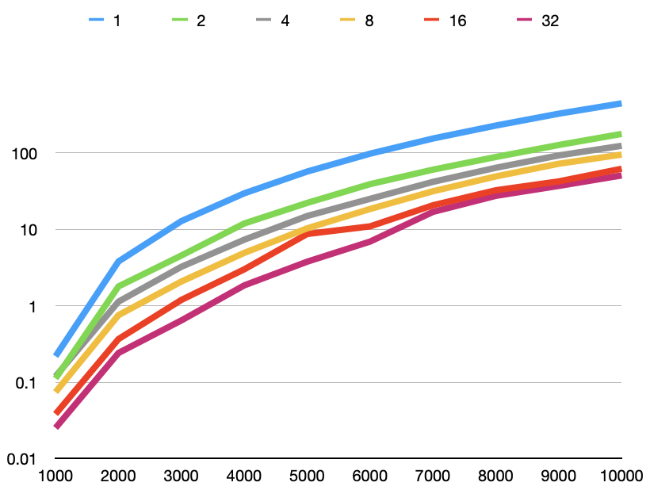

Speedup ratio:

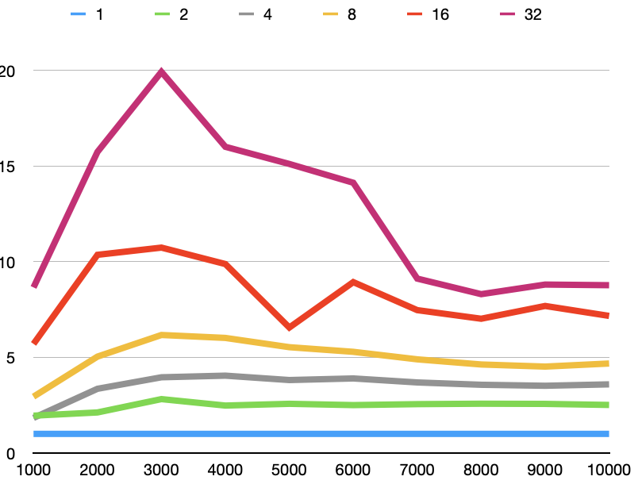

Comparing with the C++ program writed before:

Time(s): matmul Cpp-language std::thread (kij, with ooption -O3)

|           | **1**    | **2**    | **4**    | **8**     | **16**    | **32**    |
| --------- | -------- | -------- | -------- | --------- | --------- | --------- |
| **1000**  | 0.474739 | 0.276397 | 0.144257 | 0.0777432 | 0.0467154 | 0.0435566 |
| **2000**  | 4.83889  | 2.43226  | 1.23941  | 0.691335  | 0.369236  | 0.351779  |
| **3000**  | 17.0006  | 7.66996  | 4.19797  | 2.47964   | 1.40495   | 1.34554   |
| **4000**  | 39.619   | 18.2724  | 9.73804  | 5.48442   | 2.86971   | 2.98587   |
| **5000**  | 76.6745  | 39.9545  | 20.4358  | 12.8892   | 6.93409   | 8.14916   |
| **6000**  | 130.592  | 69.0382  | 35.9899  | 22.1806   | 12.1559   | 12.1795   |
| **7000**  | 207.475  | 103.12   | 55.6538  | 33.0999   | 18.9279   | 19.4872   |
| **8000**  | 309.584  | 152.936  | 83.4647  | 49.9184   | 29.9634   | 30.9191   |
| **9000**  | 436.826  | 215.97   | 116.812  | 74.5194   | 44.1076   | 43.9164   |
| **10000** | 599.951  | 312.146  | 162.663  | 100.711   | 64.4033   | 68.3879   |

Speedup ratio: matmul Cpp-language std::thread (kij, with ooption -O3)

|           | **1** | **2**            | **4**            | **8**            | **16**           | **32**           |
| --------- | ----- | ---------------- | ---------------- | ---------------- | ---------------- | ---------------- |
| **1000**  | 1     | 1.71759823731806 | 3.29092522373264 | 6.10650191913891 | 10.1623661576268 | 10.8993585357902 |
| **2000**  | 1     | 1.9894624752288  | 3.90418828313472 | 6.99934185308136 | 13.1051414271631 | 13.755482845764  |
| **3000**  | 1     | 2.21651742642726 | 4.04971926907529 | 6.85607588198287 | 12.100501797217  | 12.6347786018996 |
| **4000**  | 1     | 2.16824281429916 | 4.0684778456445  | 7.22391793480441 | 13.8059246404689 | 13.2688295203743 |
| **5000**  | 1     | 1.91904541415861 | 3.75196958279098 | 5.94874003041306 | 11.0576153467867 | 9.40888386042242 |
| **6000**  | 1     | 1.89159045282177 | 3.62857357202993 | 5.88766760141745 | 10.7430959451789 | 10.7222792397061 |
| **7000**  | 1     | 2.0119763382467  | 3.72795747999238 | 6.26814582521397 | 10.9613322132936 | 10.6467322139661 |
| **8000**  | 1     | 2.02427159073076 | 3.70916087879067 | 6.20180133978653 | 10.3320717942557 | 10.0127105898943 |
| **9000**  | 1     | 2.02262351252489 | 3.73956442831216 | 5.86190978456617 | 9.90364472335833 | 9.9467624850853  |
| **10000** | 1     | 1.92202046478251 | 3.68830649871206 | 5.9571546305766  | 9.31553196808238 | 8.77276535761443 |

Time(s): (Logarithm)

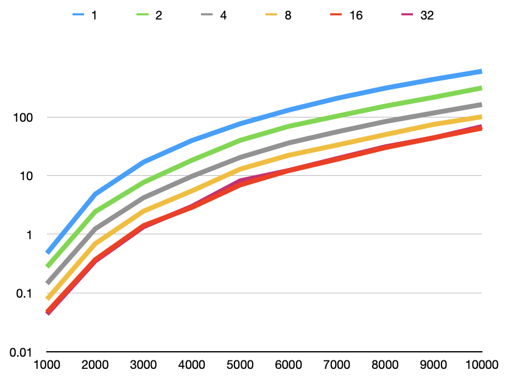

Speedup ratio:

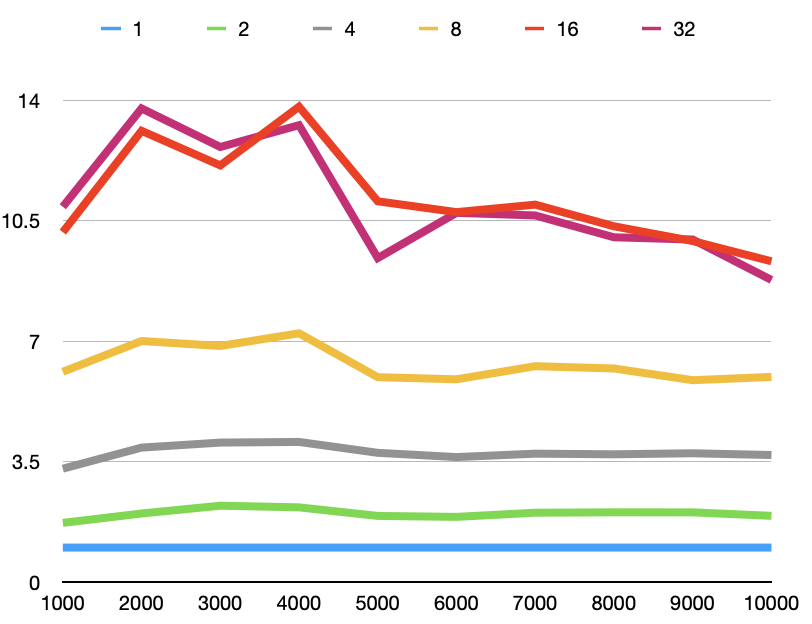

In summary:

 C language (using pthread) has a better performance than C++ language (using std::thread).

## 2022/5/15

// rust

## 2022/5/13

I wanna learn some different lanuage, such as Rust, and try the parallelization of them.

Compiling and running a Rust file:

```
rustc main.rs
./main
```

The main function of Rust:

```rust
fn main() {
	// Code
}
```

Print "Hello, World":

```rust
println!("Hello, world!");
```

(Using `println!` macro but not the `println` function)

// ===

## 2022/5/12

The first time individually speak to Prof. Ueda face-to-face.

* The parallelization of C/C++ (pthread)
* OpenMP is a black box, so using pthread instead of OpenMP
* The parallelization of other language, such as Rust
* The using of thread pool
* GPGPU

## 2022/4/28

日本に行きます！

## 2022/4/21

These days I was perparing for going to japan and did not update my research daily.

But I had complete the benchmark of kij (with option -O3).

The benchmark data:

Times(s)-kij(O3):

| size  | 1        | 2        | 4        | 8         | 16        | 32        |
| ----- | -------- | -------- | -------- | --------- | --------- | --------- |
| 1000  | 0.474739 | 0.276397 | 0.144257 | 0.0777432 | 0.0467154 | 0.0435566 |
| 2000  | 4.83889  | 2.43226  | 1.23941  | 0.691335  | 0.369236  | 0.351779  |
| 3000  | 17.0006  | 7.66996  | 4.19797  | 2.47964   | 1.40495   | 1.34554   |
| 4000  | 39.619   | 18.2724  | 9.73804  | 5.48442   | 2.86971   | 2.98587   |
| 5000  | 76.6745  | 39.9545  | 20.4358  | 12.8892   | 6.93409   | 8.14916   |
| 6000  | 130.592  | 69.0382  | 35.9899  | 22.1806   | 12.1559   | 12.1795   |
| 7000  | 207.475  | 103.12   | 55.6538  | 33.0999   | 18.9279   | 19.4872   |
| 8000  | 309.584  | 152.936  | 83.4647  | 49.9184   | 29.9634   | 30.9191   |
| 9000  | 436.826  | 215.97   | 116.812  | 74.5194   | 44.1076   | 43.9164   |
| 10000 | 599.951  | 312.146  | 162.663  | 100.711   | 64.4033   | 68.3879   |

Times(s)-ijk:

| size  | 1       | 2       | 4       | 8       | 16       | 32       |
| ----- | ------- | ------- | ------- | ------- | -------- | -------- |
| 1000  | 8.52906 | 4.45836 | 2.3513  | 1.2378  | 0.763111 | 0.535989 |
| 2000  | 71.3644 | 36.805  | 19.7069 | 10.1539 | 5.81795  | 3.99485  |
| 3000  | 298.745 | 154.896 | 79.6555 | 41.8107 | 24.2573  | 16.3239  |
| 4000  | 730.137 | 366.376 | 187.582 | 97.7374 | 55.2911  | 33.9036  |
| 5000  | 1476.91 | 746.183 | 378.157 | 196.704 | 112.978  | 75.8605  |
| 6000  | 2568.21 | 1295.03 | 658.478 | 344.233 | 199.61   | 151.092  |
| 7000  | 4064.19 | 2061.31 | 1044.3  | 553.488 | 305.055  | 249.628  |
| 8000  | 6166.43 | 3107.07 | 1582.01 | 839.961 | 507.085  | 430.235  |
| 9000  | 8837.49 | 4469.31 | 2265.07 | 1179.62 | 666.312  | 778.507  |
| 10000 | 12105.2 | 7443.1  | 3104.67 | 1656.75 | 1176.3   | 1058.96  |

Improve(times-ijk/times-kij):

| size  | 1                | 2                | 4                | 8                | 16               | 32               |
| ----- | ---------------- | ---------------- | ---------------- | ---------------- | ---------------- | ---------------- |
| 1000  | 17.9657875169304 | 16.1302763778189 | 16.2993823523295 | 15.9216497391412 | 16.3353198302915 | 12.3055748152978 |
| 2000  | 14.7480930543988 | 15.1320171363259 | 15.9002267207784 | 14.6873802136446 | 15.7567246964001 | 11.356135528272  |
| 3000  | 17.5726150841735 | 20.1951509525473 | 18.9747663751766 | 16.8616008775467 | 17.2655966404498 | 12.1318578414614 |
| 4000  | 18.4289608521164 | 20.0507869792693 | 19.2628085323125 | 17.8209181645461 | 19.2671384913458 | 11.3546805453687 |
| 5000  | 19.2620753966443 | 18.6758187438211 | 18.5046340246039 | 15.2611488688204 | 16.2931257021469 | 9.30899626464568 |
| 6000  | 19.6659060279343 | 18.7581657690959 | 18.2961886529276 | 15.5195531229994 | 16.4208326820721 | 12.4054353626996 |
| 7000  | 19.5888179298711 | 19.9894297905353 | 18.7642173580241 | 16.7217423617594 | 16.1166848937283 | 12.8098444106901 |
| 8000  | 19.9184389374128 | 20.3161453156876 | 18.9542405352203 | 16.8266811436264 | 16.9234799789076 | 13.9148616874359 |
| 9000  | 20.2311446662973 | 20.6941241839144 | 19.3907304044105 | 15.8297034060929 | 15.1065122563912 | 17.7270222513685 |
| 10000 | 20.1769811201248 | 23.8449315384468 | 19.0865162944247 | 16.4505366841755 | 18.2645920317748 | 15.4846105816965 |

Time of kij(O3):

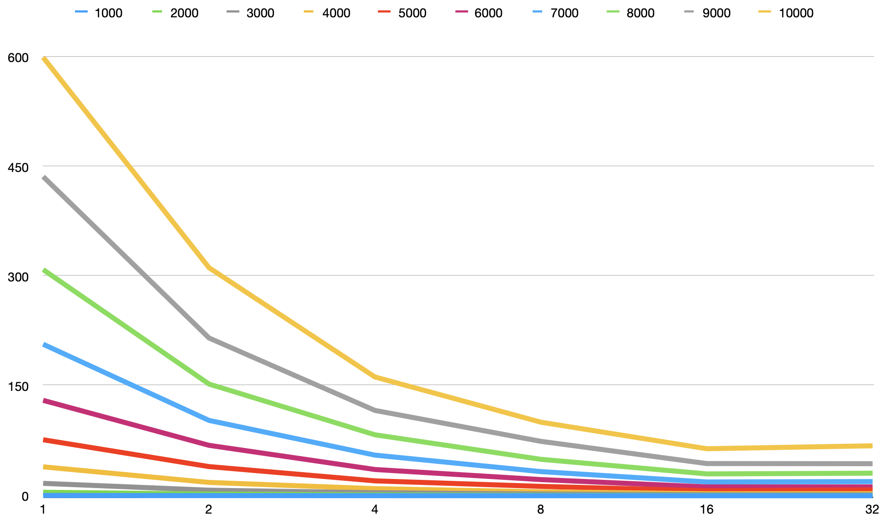

Improve:

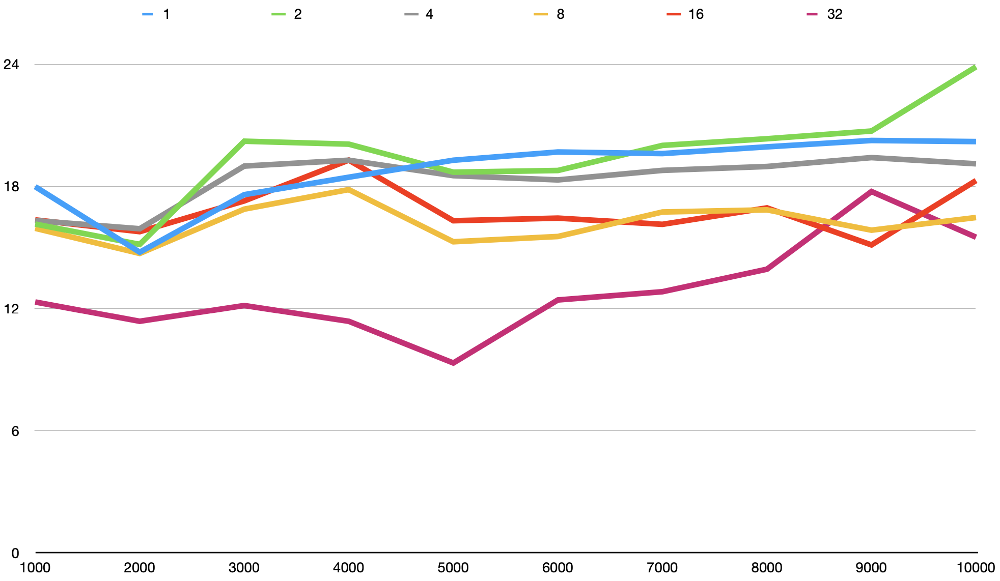

## 2022/4/18

The answer of LMNtal practice problem made by myself: [PDF](./file/20220418.pdf)

## 2022/3/31

Benchmark:

//

Meeting:

From Pro. Ueda:

```
For meaningful parallel programming experiments, it is important to
1. choose a good sequential algorithm and program, and
2. use an appropriate compiler option.
```

## 2022/3/29

Parallelized *kij*:

```c++
#include <iostream>
#include <fstream>
#include <thread>
#include <vector>

class Matrix {
    friend class Matrix_kij;
public:
    typedef int** matrix_t;
    typedef int* vector_t;
protected:
    matrix_t matrix = nullptr;
    int column = 0;
    int row = 0;
public:
    ~Matrix() {
        for (int i = 0; i < row; ++i) {
            delete [] matrix[i];
            matrix[i] = nullptr;
        }
        delete [] matrix;
        matrix = nullptr;
    }
    Matrix() = default;
    Matrix(int row, int column, matrix_t matrix) {
        this->row = row;
        this->column = column;
        this->matrix = new vector_t[row];
        for (int i = 0; i < row; ++i) {
            this->matrix[i] = new int[column];
            for (int j = 0; j < column; ++j)
                this->matrix[i][j] = matrix[i][j];
        }
    }
    Matrix(Matrix &m) {
        row = m.row;
        column = m.column;
        matrix = new vector_t[row];
        for (int i = 0; i < row; ++i) {
            matrix[i] = new int[column];
            for (int j = 0; j < column; ++j)
                matrix[i][j] = m.matrix[i][j];
        }
    }
    Matrix &operator=(const Matrix &m) {
        row = m.row;
        column = m.column;
        matrix = new vector_t[row];
        for (int i = 0; i < row; ++i) {
            matrix[i] = new int[column];
            for (int j = 0; j < column; ++j)
                matrix[i][j] = m.matrix[i][j];
        }
        return *this;
    }
    friend std::ifstream &operator>>(std::ifstream &input, Matrix &m) {
        input >> m.row;
        input >> m.column;
        m.matrix = new vector_t[m.row];
        for (int i = 0; i < m.row; ++i) {
            m.matrix[i] = new int[m.column];
            for (int j = 0; j < m.column; ++j)
                input >> m.matrix[i][j];
        }
        return input;
    }
    friend std::ostream &operator<<(std::ostream &output, const Matrix &m) {
        for (int i = 0; i < m.row; ++i) {
            for (int j = 0; j < m.column; ++j)
                std::cout << m.matrix[i][j] << "\t";
            std::cout << std::endl;
        }
        return output;
    }
};

class Matrix_kij: protected Matrix {
private:
    unsigned long _thread_num = 1;
    static void _thread(void *m1, void *m2, Matrix::matrix_t tmp, unsigned int count, int start_row, int start_column) {
        auto *mA = (Matrix_kij*)m1;
        auto *mB = (Matrix_kij*)m2;
        int k = start_column;
        for (int i = start_row; i < mA->row; ++i) {
            for (; k < mA->column; ++k) {
                int r = mA->matrix[i][k];
                for (int j = 0; j < mB->column; ++j)
                    tmp[i][j] += r * mB->matrix[k][j];
                if (!(--count))
                    return;
            }
            k = 0;
        }
    }
public:
    explicit Matrix_kij(Matrix &m) {
        row = m.row;
        column = m.column;
        matrix = new vector_t[row];
        for (int i = 0; i < row; ++i) {
            matrix[i] = new int[column];
            for (int j = 0; j < column; ++j)
                matrix[i][j] = m.matrix[i][j];
        }
    }
    void set_thread_num(unsigned long threads) {
        if (threads < std::thread::hardware_concurrency())
            _thread_num = threads;
    }
    Matrix operator*(const Matrix_kij &m) const {
        Matrix::matrix_t tmp;
        tmp = new Matrix::vector_t[row];
        for (int i = 0; i < row; ++i) {
            tmp[i] = new int[m.column];
            memset(tmp[i], 0, m.column * sizeof(int));
        }
        if (_thread_num == 1)
            for (int k = 0; k < column; ++k)
                for (int i = 0; i < row; ++i) {
                    int r = matrix[i][k];
                    for (int j = 0; j < m.column; ++j)
                        tmp[i][j] += r * m.matrix[k][j];
                }
        else if (_thread_num > 1) {
            unsigned int block_size = (row * column) / _thread_num;
            std::vector<std::thread> threads;
            for (unsigned long t = 0; t < _thread_num; ++t)
                threads.emplace_back(std::thread(_thread, (void*)this, (void*)&m, tmp, (t == _thread_num - 1 ? (row * column - block_size * t) : block_size), (block_size * t / row), (block_size * t % row)));
            for (std::thread &t : threads)
                t.join();
        }
        return {row, m.column, tmp};
    }
};

class Timer {
private:
    std::chrono::time_point<std::chrono::steady_clock> _start, _end;
    std::chrono::duration<double> diff{};
public:
    Timer() {
        _start = std::chrono::steady_clock::now();
        _end = _start;
        diff = _end - _start;
    }
    void start() {
        _start = std::chrono::steady_clock::now();
    }
    void end() {
        _end = std::chrono::steady_clock::now();
        diff = _end - _start;
    }
    double time() {
        return diff.count();
    }
};

int main() {
    std::ifstream mA;
    mA.open("./mA.txt", std::ios::in);
    std::ifstream mB;
    mB.open("./mB.txt", std::ios::in);
    Matrix A, B;
    mA >> A;
    mB >> B;
    mA.close();
    mB.close();
    Timer timer;
    // kij
    Matrix_kij A_kij(A);
    Matrix_kij B_kij(B);
    timer.start();
    Matrix Result_kij = A_kij * B_kij;
    timer.end();
    std::cout << timer.time() << std::endl;
    // kij - 2
    A_kij.set_thread_num(2);
    B_kij.set_thread_num(2);
    timer.start();
    Matrix Result_kij_2 = A_kij * B_kij;
    timer.end();
    std::cout << timer.time() << std::endl;
    // kij - 4
    A_kij.set_thread_num(4);
    B_kij.set_thread_num(4);
    timer.start();
    Matrix Result_kij_4 = A_kij * B_kij;
    timer.end();
    std::cout << timer.time() << std::endl;
    // kij - 8
    A_kij.set_thread_num(8);
    B_kij.set_thread_num(8);
    timer.start();
    Matrix Result_kij_8 = A_kij * B_kij;
    timer.end();
    std::cout << timer.time() << std::endl;
    // kij - 16
    A_kij.set_thread_num(16);
    B_kij.set_thread_num(16);
    timer.start();
    Matrix Result_kij_16 = A_kij * B_kij;
    timer.end();
    std::cout << timer.time() << std::endl;
    // kij - 32
    A_kij.set_thread_num(32);
    B_kij.set_thread_num(32);
    timer.start();
    Matrix Result_kij_32 = A_kij * B_kij;
    timer.end();
    std::cout << timer.time() << std::endl;
    return 0;
}
```

* *X* elements per thread:

$$
X = \begin{cases}
(Row \times Column) \div NumberOfThreads& \text{not last thread}\\
Row \times Column - [(Row \times Column) \div NumberOfThreads] \times (NumberOfThreads - 1)& \text{last thread}
\end{cases}
$$

## 2022/3/27

Benchmark:

Specs:

```
Model Name:	Mac Pro
Model Identifier:	MacPro7,1
Enclosure:	Tower
Processor Name:	16-Core Intel Xeon W
Processor Speed:	3.2 GHz
Number of Processors:	1
Total Number of Cores:	16
L2 Cache (per Core):	1 MB
L3 Cache:	22 MB
Hyper-Threading Technology:	Enabled
Memory:	96 GB
System Firmware Version:	1731.100.130.0.0 (iBridge: 19.16.14242.0.0,0)
OS Loader Version:	540.100.7~14
```

Times:

| **size** | **ijk**     | **kij**    | **jki**     |
| -------- | ----------- | ---------- | ----------- |
| **50**   | 0.000303847 | 0.00027725 | 0.000306025 |
| **100**  | 0.00245108  | 0.00222869 | 0.00258165  |
| **150**  | 0.00834827  | 0.00738206 | 0.00817197  |
| **200**  | 0.019842    | 0.0177448  | 0.019953    |
| **250**  | 0.0380355   | 0.0332996  | 0.0413782   |
| **300**  | 0.0826602   | 0.057593   | 0.0779464   |
| **350**  | 0.131497    | 0.0902291  | 0.123746    |
| **400**  | 0.188632    | 0.137508   | 0.206703    |
| **450**  | 0.268237    | 0.196668   | 0.309942    |
| **500**  | 0.393399    | 0.270333   | 0.450042    |
| **550**  | 0.534819    | 0.355445   | 0.52384     |
| **600**  | 0.694997    | 0.459113   | 0.683589    |
| **650**  | 0.8968      | 0.585037   | 0.921857    |
| **700**  | 1.11802     | 0.727566   | 1.16442     |

Cycles per inner loop iteration:
$$
([Times]\div(1\div(3.2\times10^9)))\div[Size]^3
$$

| **size** | **ijk**          | **kij**          | **jki**          |
| -------- | ---------------- | ---------------- | ---------------- |
| **50**   | 7.7784832        | 7.0976           | 7.83424          |
| **100**  | 7.843456         | 7.131808         | 8.26128          |
| **150**  | 7.91539674074074 | 6.99928651851852 | 7.74823822222222 |
| **200**  | 7.9368           | 7.09792          | 7.9812           |
| **250**  | 7.7896704        | 6.81975808       | 8.47425536       |
| **300**  | 9.79676444444444 | 6.82583703703704 | 9.23809185185185 |
| **350**  | 9.81435335276968 | 6.73430017492711 | 9.23585306122449 |
| **400**  | 9.4316           | 6.8754           | 10.33515         |
| **450**  | 9.41957091906722 | 6.90631111111111 | 10.8841086419753 |
| **500**  | 10.0710144       | 6.9205248        | 11.5210752       |
| **550**  | 10.2865262208866 | 6.83650788880541 | 10.0753598797896 |
| **600**  | 10.2962518518519 | 6.80167407407407 | 10.1272444444444 |
| **650**  | 10.4497405553027 | 6.81699918070096 | 10.7417110605371 |
| **700**  | 10.4305072886297 | 6.78778775510204 | 10.8633935860058 |

**Graph**:

Times:

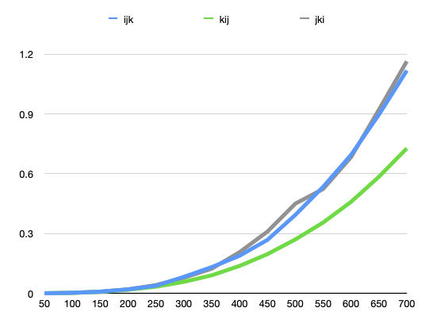

Cycles per inner loop iteration:

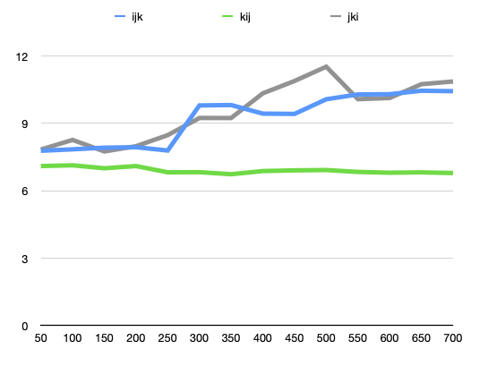

\[Reference data]:

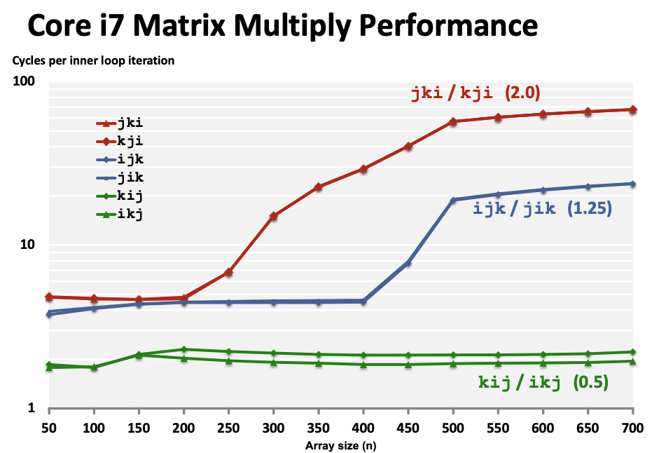

**Conclusion**:

* The experimental data (results) and the reference data have roughly the same trend.
* The trend of *jki* is not totally same as  reference data, I think it might have something to do with the generated matrix data or the computer specifications.

TODO:

Increase the amount of experimental data.

## 2022/3/26

Program of *ijk*, *kij* and *jki*:

```c++
#include <iostream>
#include <fstream>

class Matrix {
    friend class Matrix_ijk;
    friend class Matrix_kij;
    friend class Matrix_jki;
public:
    typedef int** matrix_t;
    typedef int* vector_t;
protected:
    matrix_t matrix = nullptr;
    int column = 0;
    int row = 0;
public:
    ~Matrix() {
        for (int i = 0; i < row; ++i) {
            delete [] matrix[i];
            matrix[i] = nullptr;
        }
        delete [] matrix;
        matrix = nullptr;
    }
    Matrix() = default;
    Matrix(int row, int column, matrix_t matrix) {
        this->row = row;
        this->column = column;
        this->matrix = new vector_t[row];
        for (int i = 0; i < row; ++i) {
            this->matrix[i] = new int[column];
            for (int j = 0; j < column; ++j)
                this->matrix[i][j] = matrix[i][j];
        }
    }
    Matrix(Matrix &m) {
        row = m.row;
        column = m.column;
        matrix = new vector_t[row];
        for (int i = 0; i < row; ++i) {
            matrix[i] = new int[column];
            for (int j = 0; j < column; ++j)
                matrix[i][j] = m.matrix[i][j];
        }
    }
    Matrix &operator=(const Matrix &m) {
        row = m.row;
        column = m.column;
        matrix = new vector_t[row];
        for (int i = 0; i < row; ++i) {
            matrix[i] = new int[column];
            for (int j = 0; j < column; ++j)
                matrix[i][j] = m.matrix[i][j];
        }
        return *this;
    }
    friend std::ifstream &operator>>(std::ifstream &input, Matrix &m) {
        input >> m.row;
        input >> m.column;
        m.matrix = new vector_t[m.row];
        for (int i = 0; i < m.row; ++i) {
            m.matrix[i] = new int[m.column];
            for (int j = 0; j < m.column; ++j)
                input >> m.matrix[i][j];
        }
        return input;
    }
    friend std::ostream &operator<<(std::ostream &output, const Matrix &m) {
        for (int i = 0; i < m.row; ++i) {
            for (int j = 0; j < m.column; ++j)
                std::cout << m.matrix[i][j] << "\t";
            std::cout << std::endl;
        }
        return output;
    }
};

class Matrix_ijk: protected Matrix {
public:
    explicit Matrix_ijk(Matrix &m) {
        row = m.row;
        column = m.column;
        matrix = new vector_t[row];
        for (int i = 0; i < row; ++i) {
            matrix[i] = new int[column];
            for (int j = 0; j < column; ++j)
                matrix[i][j] = m.matrix[i][j];
        }
    }
    Matrix operator*(const Matrix_ijk &m) const {
        Matrix::matrix_t tmp;
        tmp = new Matrix::vector_t[row];
        for (int i = 0; i < row; ++i) {
            tmp[i] = new int[m.column];
            for (int j = 0; j < m.column; ++j) {
                int sum = 0;
                for (int k = 0; k < row; ++k)
                    sum += matrix[i][k] * m.matrix[k][j];
                tmp[i][j] = sum;
            }
        }
        return {row, m.column, tmp};
    }
};

class Matrix_kij: protected Matrix {
public:
    explicit Matrix_kij(Matrix &m) {
        row = m.row;
        column = m.column;
        matrix = new vector_t[row];
        for (int i = 0; i < row; ++i) {
            matrix[i] = new int[column];
            for (int j = 0; j < column; ++j)
                matrix[i][j] = m.matrix[i][j];
        }
    }
    Matrix operator*(const Matrix_kij &m) const {
        Matrix::matrix_t tmp;
        tmp = new Matrix::vector_t[row];
        for (int i = 0; i < row; ++i) {
            tmp[i] = new int[m.column];
            memset(tmp[i], 0, m.column * sizeof(int));
        }
        for (int k = 0; k < column; ++k)
            for (int i = 0; i < row; ++i) {
                int r = matrix[i][k];
                for (int j = 0; j < m.column; ++j)
                    tmp[i][j] += r * m.matrix[k][j];
            }
        return {row, m.column, tmp};
    }
};

class Matrix_jki: protected Matrix {
public:
    explicit Matrix_jki(Matrix &m) {
        row = m.row;
        column = m.column;
        matrix = new vector_t[row];
        for (int i = 0; i < row; ++i) {
            matrix[i] = new int[column];
            for (int j = 0; j < column; ++j)
                matrix[i][j] = m.matrix[i][j];
        }
    }
    Matrix operator*(const Matrix_jki &m) const {
        Matrix::matrix_t tmp;
        tmp = new Matrix::vector_t[row];
        for (int i = 0; i < row; ++i) {
            tmp[i] = new int[m.column];
            memset(tmp[i], 0, m.column * sizeof(int));
        }
        for (int j = 0; j < m.column; ++j)
            for (int k = 0; k < column; ++k) {
                int r = m.matrix[k][j];
                for (int i = 0; i < row; ++i)
                    tmp[i][j] += matrix[i][k] * r;
            }
        return {row, m.column, tmp};
    }
};

class Timer {
private:
    std::chrono::time_point<std::chrono::steady_clock> _start, _end;
    std::chrono::duration<double> diff{};
public:
    Timer() {
        _start = std::chrono::steady_clock::now();
        _end = _start;
        diff = _end - _start;
    }
    void start() {
        _start = std::chrono::steady_clock::now();
    }
    void end() {
        _end = std::chrono::steady_clock::now();
        diff = _end - _start;
    }
    double time() {
        return diff.count();
    }
};

int main() {
    std::ifstream mA;
    mA.open("./mA.txt", std::ios::in);
    std::ifstream mB;
    mB.open("./mB.txt", std::ios::in);
    Matrix A, B;
    mA >> A;
    mB >> B;
    mA.close();
    mB.close();
    Timer timer;
    // ijk
    Matrix_ijk A_ijk(A);
    Matrix_ijk B_ijk(B);
    timer.start();
    Matrix Result_ijk = A_ijk * B_ijk;
    timer.end();
    std::cout << timer.time() << std::endl;
    // kij
    Matrix_kij A_kij(A);
    Matrix_kij B_kij(B);
    timer.start();
    Matrix Result_kij = A_kij * B_kij;
    timer.end();
    std::cout << timer.time() << std::endl;
    // jki
    Matrix_jki A_jki(A);
    Matrix_jki B_jki(B);
    timer.start();
    Matrix Result_jki = A_jki * B_jki;
    timer.end();
    std::cout << timer.time() << std::endl;
    return 0;
}
```

Use C-Array instead of std::vector.

## 2022/3/24

Matrix Multiplication：

* **ijk**:

  * Multiply mA(N x M) and mB(M x K)
  * total operations:

  $$
  O(N^2 \times K)
  $$

  * K reads per source element in mA and N reads per source element in mB
  * Miss rate: (set block size to 32B, and type of elements is *double*)
    * mA: 25%
    * mB: 100%
    * mResult: 0

* **kij**:

  * Miss rate:
    * mA: 0
    * mB: 25%
    * mResult: 25%

* **jki**:

  * Miss rate:
    * mA: 100%
    * mB: 0
    * mResult: 100%

## 2022/3/23

Review:

Layout of C Arrays in Memory:

* C arrays allocated in row-major order
  * each row in contiguous memory locations
  * a\[i][j] = a[i * N + j] where N is the number of columns
* Stepping through columns in one row
  * accesses successive elements
  * if block size (B) > sizeof(aij) bytes, exploit spatial locality
    * miss rate = sizeof(aij) / B
* Stepping through rows in one column
  * accesses distant elements
  * no spatial locality
    * miss rate = 1

## 2022/3/21

https://www.cs.cmu.edu/~213/lectures/10-cache-memories.pdf

https://www.cs.cmu.edu/~213/schedule.html

//

## 2022/3/18

Benchmark results:

//

## 2022/3/14

Doing benchmark on ***parmigiano***.

* `/proc/cpuinfo`: (final processor)

```
processor       : 31
vendor_id       : AuthenticAMD
cpu family      : 23
model           : 8
model name      : AMD Ryzen Threadripper 2990WX 32-Core Processor
stepping        : 2
microcode       : 0x800820b
cpu MHz         : 1717.568
cache size      : 512 KB
physical id     : 0
siblings        : 32
core id         : 11
cpu cores       : 32
apicid          : 59
initial apicid  : 59
fpu             : yes
fpu_exception   : yes
cpuid level     : 13
wp              : yes
flags           : fpu vme de pse tsc msr pae mce cx8 apic sep mtrr pge mca cmov pat pse36 clflush mmx fxsr sse sse2 ht syscall nx mmxext fxsr_opt pdpe1gb rdtscp lm constant_tsc rep_good nopl nonstop_tsc cpuid extd_apicid amd_dcm aperfmperf pni pclmulqdq monitor ssse3 fma cx16 sse4_1 sse4_2 movbe popcnt aes xsave avx f16c rdrand lahf_lm cmp_legacy svm extapic cr8_legacy abm sse4a misalignsse 3dnowprefetch osvw skinit wdt tce topoext perfctr_core perfctr_nb bpext perfctr_llc mwaitx cpb hw_pstate sme ssbd ibpb vmmcall fsgsbase bmi1 avx2 smep bmi2 rdseed adx smap clflushopt sha_ni xsaveopt xsavec xgetbv1 xsaves clzero irperf xsaveerptr arat npt lbrv svm_lock nrip_save tsc_scale vmcb_clean flushbyasid decodeassists pausefilter pfthreshold avic v_vmsave_vmload vgif overflow_recov succor smca
bugs            : sysret_ss_attrs null_seg spectre_v1 spectre_v2 spec_store_bypass
bogomips        : 5988.32
TLB size        : 2560 4K pages
clflush size    : 64
cache_alignment : 64
address sizes   : 43 bits physical, 48 bits virtual
power management: ts ttp tm hwpstate cpb eff_freq_ro [13] [14]
```

* `/proc/meminfo`:

```
MemTotal:       65693892 kB
MemFree:        54163396 kB
MemAvailable:   56192440 kB
Buffers:          137708 kB
Cached:          2270424 kB
SwapCached:         9280 kB
Active:          8279964 kB
Inactive:        1899792 kB
Active(anon):    7759152 kB
Inactive(anon):    11292 kB
Active(file):     520812 kB
Inactive(file):  1888500 kB
Unevictable:           0 kB
Mlocked:               0 kB
SwapTotal:       8388604 kB
SwapFree:        8316644 kB
Dirty:                 0 kB
Writeback:             0 kB
AnonPages:       7770284 kB
Mapped:            52528 kB
Shmem:                84 kB
Slab:             739976 kB
SReclaimable:     265956 kB
SUnreclaim:       474020 kB
KernelStack:        9312 kB
PageTables:        22956 kB
NFS_Unstable:          0 kB
Bounce:                0 kB
WritebackTmp:          0 kB
CommitLimit:    41235548 kB
Committed_AS:    8483852 kB
VmallocTotal:   34359738367 kB
VmallocUsed:           0 kB
VmallocChunk:          0 kB
HardwareCorrupted:     0 kB
AnonHugePages:         0 kB
ShmemHugePages:        0 kB
ShmemPmdMapped:        0 kB
CmaTotal:              0 kB
CmaFree:               0 kB
HugePages_Total:       0
HugePages_Free:        0
HugePages_Rsvd:        0
HugePages_Surp:        0
Hugepagesize:       2048 kB
DirectMap4k:      905664 kB
DirectMap2M:    26234880 kB
DirectMap1G:    39845888 kB
```

## 2022/3/13

Refactored the main function of the matrix multiplication algorithm:

```c++
int main([[maybe_unused]] int argc, [[maybe_unused]] char *argv[]) {
    if (argc == 4) {
        std::ifstream mA;
        mA.open(argv[1], std::ios::in);
        std::ifstream mB;
        mB.open(argv[2], std::ios::in);
        Timer timer;
        std::stringstream ss;
        ss << argv[3];
        unsigned long thread_num;
        ss >> thread_num;
        Matrix A;
        Matrix B;
        mA >> A;
        mB >> B;
#ifdef DEBUG
        std::cout << "Matrix A:" << std::endl;
        std::cout << A;
        std::cout << "Matrix B:" << std::endl;
        std::cout << B;
#endif
        if (thread_num == 1) {
            timer.start();
            Matrix R = A * B;
            timer.end();
#ifdef DEBUG
            std::cout << thread_num << " thread Result:" << std::endl;
            std::cout << R;
#endif
            std::cout << thread_num << " thread Time: " << timer.time() << std::endl;
        }
        else if (thread_num > 1) {
            PMatrix pA = (PMatrix)A;
            PMatrix pB = (PMatrix)B;
            pA.set_threads(thread_num);
            pB.set_threads(thread_num);
            timer.start();
            PMatrix pR = pA * pB;
            timer.end();
#ifdef DEBUG
            std::cout << thread_num << " threads Result:" << std::endl;
            std::cout << pR;
#endif
            std::cout << thread_num <<" threads Time: " << timer.time() << std::endl;
        }
        mA.close();
        mB.close();
    }
    else if (argc == 2) {
        if (std::string(argv[1]) == "-h")
            std::cout << "Hardware threads: " << PMatrix::hardware_threads() << std::endl;
    }
    return 0;
}
```

Using shell scripts to generate matrixs and make benchmark:

```shell
#!/bin/bash
echo "Start..."
mkdir benchmark
cp ./matrix_generator ./benchmark/
cd ./benchmark || exit
touch generator.log
for (( i = 100; i < 1000; i = i + 100 )); do
    echo "Generate $i"
    mkdir "$i"
    cd "./$i" || exit
    ../matrix_generator "mA.txt" "$i" "$i" >> ../generator.log || echo "Error in generate $i mA" >> ../generator.log
    ../matrix_generator "mB.txt" "$i" "$i" >> ../generator.log || echo "Error in generate $i mB" >> ../generator.log
    cd ..
done
for (( i = 1000; i < 10000; i = i + 1000 )); do
    echo "Generate $i"
    mkdir "$i"
    cd "./$i" || exit
    ../matrix_generator "mA.txt" "$i" "$i" >> ../generator.log || echo "Error in generate $i mA" >> ../generator.log
    ../matrix_generator "mB.txt" "$i" "$i" >> ../generator.log || echo "Error in generate $i mB" >> ../generator.log
    cd ..
done
for (( i = 10000; i <= 70000; i = i + 10000 )); do
    echo "Generate $i"
    mkdir "$i"
    cd "./$i" || exit
    ../matrix_generator "mA.txt" "$i" "$i" >> ../generator.log || echo "Error in generate $i mA" >> ../generator.log
    ../matrix_generator "mB.txt" "$i" "$i" >> ../generator.log || echo "Error in generate $i mB" >> ../generator.log
    cd ..
done
echo "Generated ALL DONE." >> ./generator.log
echo "Generated ALL DONE."
```

```shell
#!/bin/bash
echo "Start..."
cp ./matrix_multiplication ./benchmark/
cd benchmark || exit
touch results.log
./matrix_multiplication "-h" >> ./results.log || echo "Error in get hardware threads" >> ./results.log
for (( i = 100; i < 1000; i = i + 100 )); do
    echo "Benchmark $i"
    echo "Benchmark $i:" >> ./results.log
    cd "./$i" || exit
    for (( j = 1; j <= 256; j = j * 2 )); do
        ../matrix_multiplication "mA.txt" "mB.txt" "$j" >> ../results.log || echo "Error in benchmark $i threads $j" >> ../results.log
    done
    cd ..
done
for (( i = 1000; i < 10000; i = i + 1000 )); do
    echo "Benchmark $i"
    echo "Benchmark $i:" >> ./results.log
    cd "./$i" || exit
    for (( j = 1; j <= 256; j = j * 2 )); do
        ../matrix_multiplication "mA.txt" "mB.txt" "$j" >> ../results.log || echo "Error in benchmark $i threads $j" >> ../results.log
    done
    cd ..
done
for (( i = 10000; i <= 70000; i = i + 10000 )); do
    echo "Benchmark $i"
    echo "Benchmark $i:" >> ./results.log
    cd "./$i" || exit
    for (( j = 1; j <= 256; j = j * 2 )); do
        ../matrix_multiplication "mA.txt" "mB.txt" "$j" >> ../results.log || echo "Error in benchmark $i threads $j" >> ../results.log
    done
    cd ..
done
echo "Benchmark ALL DONE." >> ./results.log
echo "Benchmark ALL DONE."
```

## 2022/3/12

Matrix generation program has low performance, so I made some improvements:

* Using reference to prevent unnecessary copy of varables;
* Using arguments to generate different matrix

```c++
#include <iostream>
#include <vector>
#include <random>
#include <fstream>
#include <sstream>

class Matrix {
public:
    typedef std::vector<std::vector<int>> matrix_type;
    typedef unsigned long rank_type;
    typedef std::vector<int> vector_type;
private:
    [[maybe_unused]] rank_type row, column;
    matrix_type matrix;
public:
    explicit Matrix(matrix_type &m) {
        row = m.size();
        column = !row ? 0 : m[0].size();
        matrix = m;
    }
    friend std::ostream &operator<<(std::ostream &output, const Matrix &m) {
        for (const vector_type &v : m.matrix) {
            for (int element : v)
                output << element << " ";
            output << std::endl;
        }
        return output;
    }
};

class MatrixGenerator {
private:
    int row, column;
    Matrix *matrix = nullptr;
public:
    MatrixGenerator(int _row, int _column): row(_row), column(_column) {
        std::random_device r;
        std::default_random_engine e1(r());
        std::uniform_int_distribution<int> uniform_dist(0, 9);
        Matrix::matrix_type mv;
        for (int i = 0; i < row; ++i) {
            Matrix::vector_type v;
            for (int j = 0; j < column; ++j)
                v.push_back(uniform_dist(e1));
            mv.push_back(v);
        }
        matrix = new Matrix(mv);
    }
    ~MatrixGenerator() {
        delete matrix;
    }
    void save(const std::string &path) {
        if (matrix) {
            std::ofstream file;
            file.open(path, std::ios::out);
            file << row << " " << column << std::endl;
            file << *matrix << std::endl;
            file.close();
        }
    }
};

int main([[maybe_unused]] int argc, [[maybe_unused]] char * argv[]) {
    if (argc == 4) {
        int row, column;
        std::stringstream ss;
        ss << argv[2];
        ss >> row;
        ss.clear();
        ss.str("");
        ss << argv[3];
        ss >> column;
        MatrixGenerator mg(row, column);
        mg.save(std::string(argv[1]));
        std::cout << "Generate: matrix(" << row << " x " << column << ")" << std::endl;
    }
    else {
        std::cout << "Usage: " << argv[0] << " <file path> <row of matrix> <column of matrix>" << std::endl;
    }
    return 0;
}
```

The new program can generate 70000 * 70000 matrix on `parmigiano` (64Gbyte memory).

Matrix generation algorithms can also be accelerated by multithreading.

## 2022/3/10

Fix a bug of matrix multiplication program, and change the method for selecting the number of threads:

```c++
#include <iostream>
#include <utility>
#include <vector>
#include <thread>
#include <cmath>
#include <fstream>

//#define DEBUG
//#define RUN_SINGLE_THREAD

class Matrix {
private:
    typedef std::vector<std::vector<int>> matrix_type;
    typedef unsigned long rank_type;
    typedef std::vector<int> vector_type;
    friend class PMatrix;
    rank_type row, column;
    matrix_type matrix;
public:
    explicit Matrix(matrix_type m) {
        row = m.size();
        column = !row ? 0 : m[0].size();
        matrix = m;
    }
    Matrix(): Matrix(matrix_type()) {}
    friend std::ifstream &operator>>(std::ifstream &input, Matrix &m) {
        input >> m.row;
        input >> m.column;
        for (rank_type r = 0; r < m.row; ++r) {
            vector_type v;
            for (rank_type c = 0; c < m.column; ++c) {
                int t;
                input >> t;
                v.push_back(t);
            }
            m.matrix.push_back(v);
        }
        return input;
    }
    friend std::ostream &operator<<(std::ostream &output, const Matrix &m) {
        for (const vector_type &v : m.matrix) {
            for (int element : v)
                output << element << "\t";
            output << std::endl;
        }
        return output;
    }
    Matrix operator*(const Matrix &m) const {
        matrix_type tmp;
        if (column == m.row) {
            for (rank_type i = 0; i < row; ++i) {
                vector_type v;
                for (rank_type j = 0; j < m.column; ++j) {
                    int element = 0;
                    for (rank_type k = 0; k < column; ++k) {
                        element += matrix[i][k] * m.matrix[k][j];
                    }
                    v.push_back(element);
                }
                tmp.push_back(v);
            }
        }
        Matrix result(tmp);
        return result;
    }
};

class PMatrix: public Matrix {
private:
    static const unsigned long _threads_num = 4;
    static void _thread(matrix_type &result, PMatrix mA, PMatrix mB, rank_type block, rank_type start_row) {
        for (rank_type i = start_row; i < start_row + block; ++i) {
            vector_type v;
            for (rank_type j = 0; j < mB.column; ++j) {
                int element = 0;
                for (rank_type k = 0; k < mA.column; ++k) {
                    element += mA.matrix[i][k] * mB.matrix[k][j];
                }
                v.push_back(element);
            }
            result.push_back(v);
        }
    }
public:
    [[maybe_unused]] explicit PMatrix(const Matrix &m) {
        row = m.row;
        column = m.column;
        matrix = m.matrix;
    }
    explicit PMatrix(matrix_type m): Matrix(std::move(m)) {}
    PMatrix operator*(const PMatrix &m) const {
        matrix_type tmp;
        if (column == m.row) {
            unsigned long threads_num = row > _threads_num ? _threads_num : row;
            rank_type block = row / threads_num;
            std::vector<matrix_type> results(threads_num);
            std::vector<std::thread> threads;
            for (unsigned long t = 0; t < threads_num; ++t)
                threads.emplace_back(std::thread(_thread, std::ref(results[t]), *this, m, (t < threads_num - 1 ? block : row - t * block), t * block));
            for (std::thread &t : threads)
                t.join();
            for (matrix_type &r : results)
                tmp.insert(tmp.end(), r.begin(), r.end());
        }
        PMatrix result(tmp);
        return result;
    }
};

class Timer {
private:
    std::chrono::time_point<std::chrono::steady_clock> _start, _end;
    std::chrono::duration<double> diff{};
public:
    Timer() {
        _start = std::chrono::steady_clock::now();
        _end = _start;
        diff = _end - _start;
    }
    void start() {
        _start = std::chrono::steady_clock::now();
    }
    void end() {
        _end = std::chrono::steady_clock::now();
        diff = _end - _start;
    }
    double time() {
        return diff.count();
    }
};

int main([[maybe_unused]] int argc, [[maybe_unused]] char *argv[]) {
    std::ifstream mA;
    mA.open("./mA.txt", std::ios::in);
    std::ifstream mB;
    mB.open("./mB.txt", std::ios::in);
    Timer timer;
    Matrix A;
    Matrix B;
    mA >> A;
    mB >> B;
#ifdef DEBUG
    std::cout << "Matrix A:" << std::endl;
    std::cout << A;
    std::cout << "Matrix B:" << std::endl;
    std::cout << B;
#endif
#ifdef RUN_SINGLE_THREAD
    timer.start();
    Matrix R = A * B;
    timer.end();
#ifdef DEBUG
    std::cout << "Result:" << std::endl;
    std::cout << R;
#endif
    std::cout << "Time: " << timer.time() << std::endl;
#endif
    PMatrix pA = (PMatrix)A;
    PMatrix pB = (PMatrix)B;
    timer.start();
    PMatrix pR = pA * pB;
    timer.end();
#ifdef DEBUG
    std::cout << "P Result:" << std::endl;
    std::cout << pR;
#endif
    std::cout << "P Time: " << timer.time() << std::endl;
    return 0;
}
```

***Benchmark:*** (parmigiano)


## 2022/3/10

Get the number of concurrent threads system supported:

```c++
#include <thread>

unsigned int n = std::thread::hardware_concurrency();
```

## 2022/3/9

I find the matrix multiplication program performance is very poor(when two 1000 * 1000 matrixs are multiplied, it will spend a lot of time), so I improve the algorithm of multi-threads matrix multiplication:

```c++
#include <iostream>
#include <utility>
#include <vector>
#include <thread>
#include <cmath>
#include <fstream>

#define DEBUG

class Matrix {
private:
    typedef std::vector<std::vector<int>> matrix_type;
    typedef unsigned long rank_type;
    typedef std::vector<int> vector_type;
    friend class PMatrix;
    rank_type row, column;
    matrix_type matrix;
public:
    explicit Matrix(matrix_type m) {
        row = m.size();
        column = !row ? 0 : m[0].size();
        matrix = m;
    }
    Matrix(): Matrix(matrix_type()) {}
    friend std::ifstream &operator>>(std::ifstream &input, Matrix &m) {
        input >> m.row;
        input >> m.column;
        for (rank_type r = 0; r < m.row; ++r) {
            vector_type v;
            for (rank_type c = 0; c < m.column; ++c) {
                int t;
                input >> t;
                v.push_back(t);
            }
            m.matrix.push_back(v);
        }
        return input;
    }
    friend std::ostream &operator<<(std::ostream &output, const Matrix &m) {
        for (const vector_type &v : m.matrix) {
            for (int element : v)
                output << element << "\t";
            output << std::endl;
        }
        return output;
    }
    Matrix operator*(const Matrix &m) const {
        matrix_type tmp;
        if (column == m.row) {
            for (rank_type i = 0; i < row; ++i) {
                vector_type v;
                for (rank_type j = 0; j < m.column; ++j) {
                    int element = 0;
                    for (rank_type k = 0; k < column; ++k) {
                        element += matrix[i][k] * m.matrix[k][j];
                    }
                    v.push_back(element);
                }
                tmp.push_back(v);
            }
        }
        Matrix result(tmp);
        return result;
    }
};

class PMatrix: public Matrix {
private:
    static const unsigned long threads_num = 4;
    static void _thread(matrix_type &result, PMatrix mA, PMatrix mB, rank_type block, rank_type start_row) {
        for (rank_type i = start_row; i < start_row + block; ++i) {
            vector_type v;
            for (rank_type j = 0; j < mB.column; ++j) {
                int element = 0;
                for (rank_type k = 0; k < mA.column; ++k) {
                    element += mA.matrix[i][k] * mB.matrix[k][j];
                }
                v.push_back(element);
            }
            result.push_back(v);
        }
    }
public:
    [[maybe_unused]] explicit PMatrix(const Matrix &m) {
        row = m.row;
        column = m.column;
        matrix = m.matrix;
    }
    explicit PMatrix(matrix_type m): Matrix(std::move(m)) {}
    PMatrix operator*(const PMatrix &m) const {
        matrix_type tmp;
        if (column == m.row) {
            rank_type block = std::ceil((double)row / (double)threads_num);
            std::vector<matrix_type> results(threads_num);
            std::vector<std::thread> threads;
            for (unsigned long t = 0; t < threads_num; ++t)
                threads.emplace_back(std::thread(_thread, std::ref(results[t]), *this, m, (row - t * block >= block ? block : row - t * block), t * block));
            for (std::thread &t : threads)
                t.join();
            for (matrix_type &r : results)
                tmp.insert(tmp.end(), r.begin(), r.end());
        }
        PMatrix result(tmp);
        return result;
    }
};

class Timer {
private:
    std::chrono::time_point<std::chrono::steady_clock> _start, _end;
    std::chrono::duration<double> diff{};
public:
    Timer() {
        _start = std::chrono::steady_clock::now();
        _end = _start;
        diff = _end - _start;
    }
    void start() {
        _start = std::chrono::steady_clock::now();
    }
    void end() {
        _end = std::chrono::steady_clock::now();
        diff = _end - _start;
    }
    double time() {
        return diff.count();
    }
};

int main([[maybe_unused]] int argc, [[maybe_unused]] char *argv[]) {
    std::ifstream mA;
    mA.open("./mA.txt", std::ios::in);
    std::ifstream mB;
    mB.open("./mB.txt", std::ios::in);
    Timer timer;
    Matrix A;
    Matrix B;
    mA >> A;
    mB >> B;
#ifdef DEBUG
    std::cout << "Matrix A:" << std::endl;
    std::cout << A;
    std::cout << "Matrix B:" << std::endl;
    std::cout << B;
#endif
    timer.start();
    Matrix R = A * B;
    timer.end();
#ifdef DEBUG
    std::cout << "Result:" << std::endl;
    std::cout << R;
#endif
    std::cout << "Time: " << timer.time() << std::endl;
    PMatrix pA = (PMatrix)A;
    PMatrix pB = (PMatrix)B;
    timer.start();
    PMatrix pR = pA * pB;
    timer.end();
#ifdef DEBUG
    std::cout << "P Result:" << std::endl;
    std::cout << pR;
#endif
    std::cout << "P Time: " << timer.time() << std::endl;
    return 0;
}
```

Improve point:

Parallelized method in version 1 will use *n* threads to compute one element in result. It will execute *create-join* operation *matrixA.row \* matrixB.column \* n* times.

But in version 2, matrixA is divided into *n* small matrix, and one thread compute the multiplication of every small matrix and matrixB.

***Benchmark***:

| **row/column** | **time(1 thread)** | **time(4 threads)** | **time(8 threads)** |
| -------------- | ------------------ | ------------------- | ------------------- |
| **10**         | 0.000039554        | 0.000390017         | 0.000522796         |
| **20**         | 0.000133721        | 0.000360164         | 0.000447025         |
| **30**         | 0.000329015        | 0.000494832         | 0.000562465         |
| **40**         | 0.000645744        | 0.000647674         | 0.000681134         |
| **50**         | 0.00114985         | 0.000851287         | 0.000950188         |
| **60**         | 0.00191395         | 0.00107704          | 0.00123167          |
| **70**         | 0.00283829         | 0.00151404          | 0.0015221           |
| **80**         | 0.0040848          | 0.00193485          | 0.00190089          |
| **90**         | 0.00565676         | 0.00247712          | 0.00235211          |
| **100**        | 0.00753642         | 0.0031971           | 0.00268168          |
| **500**        | 0.960772           | 0.269345            | 0.145958            |
| **1000**       | 11.9551            | 3.22906             | 1.93215             |
| **2000**       | 134.269            | 35.539              | 18.0095             |

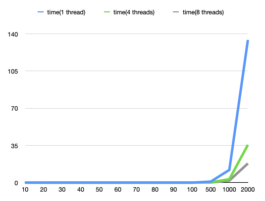

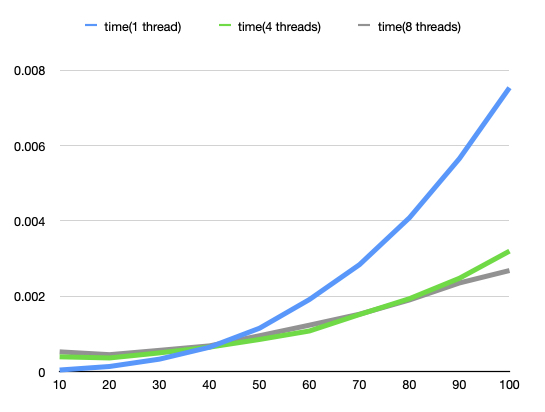

## 2022/3/8

Repair the matrix multiplication program:

```c++
#include <iostream>
#include <utility>
#include <vector>
#include <thread>
#include <cmath>
#include <fstream>

class Matrix {
private:
    typedef std::vector<std::vector<int>> matrix_type;
    typedef unsigned long rank_type;
    typedef std::vector<int> vector_type;
    friend class PMatrix;
    rank_type row, column;
    matrix_type matrix;
public:
    explicit Matrix(matrix_type m) {
        row = m.size();
        column = !row ? 0 : m[0].size();
        matrix = m;
    }
    Matrix(): Matrix(matrix_type()) {}
    friend std::ifstream &operator>>(std::ifstream &input, Matrix &m) {
        input >> m.row;
        input >> m.column;
        for (rank_type r = 0; r < m.row; ++r) {
            vector_type v;
            for (rank_type c = 0; c < m.column; ++c) {
                int t;
                input >> t;
                v.push_back(t);
            }
            m.matrix.push_back(v);
        }
        return input;
    }
    friend std::ostream &operator<<(std::ostream &output, const Matrix &m) {
        for (const vector_type &v : m.matrix) {
            for (int element : v)
                output << element << "\t";
            output << std::endl;
        }
        return output;
    }
    Matrix operator*(const Matrix &m) const {
        matrix_type tmp;
        if (column == m.row) {
            for (rank_type i = 0; i < row; ++i) {
                vector_type v;
                for (rank_type j = 0; j < m.column; ++j) {
                    int element = 0;
                    for (rank_type k = 0; k < column; ++k) {
                        element += matrix[i][k] * m.matrix[k][j];
                    }
                    v.push_back(element);
                }
                tmp.push_back(v);
            }
        }
        Matrix result(tmp);
        return result;
    }
};

std::mutex mut;

class PMatrix: public Matrix {
private:
    static const unsigned long threads_num = 4;
    static void _thread(int &element, PMatrix mA, PMatrix mB, rank_type i, rank_type j, rank_type k, rank_type gap) {
        while (gap--) {
            mut.lock();
            element += mA.matrix[i][k] * mB.matrix[k][j];
            mut.unlock();
            k++;
        }
    }
public:
    [[maybe_unused]] explicit PMatrix(const Matrix &m) {
        row = m.row;
        column = m.column;
        matrix = m.matrix;
    }
    explicit PMatrix(matrix_type m): Matrix(std::move(m)) {}
    PMatrix operator*(const PMatrix &m) const {
        matrix_type tmp;
        if (column == m.row) {
            for (rank_type i = 0; i < row; ++i) {
                vector_type v;
                for (rank_type j = 0; j < m.column; ++j) {
                    int element = 0;
                    rank_type gap = std::ceil((double)column / (double)threads_num);
                    std::vector<std::thread> threads;
                    for (unsigned long t = 0; t < threads_num; ++t) {
                        threads.emplace_back(std::thread(_thread, std::ref(element), *this, m, i, j, t * gap, (column - t * gap >= gap) ? gap : (column - t * gap)));
                    }
                    for (std::thread &t : threads) {
                        t.join();
                    }
                    v.push_back(element);
                }
                tmp.push_back(v);
            }
        }
        PMatrix result(tmp);
        return result;
    }
};

class Timer {
private:
    std::chrono::time_point<std::chrono::steady_clock> _start, _end;
    std::chrono::duration<double> diff{};
public:
    Timer() {
        _start = std::chrono::steady_clock::now();
        _end = _start;
        diff = _end - _start;
    }
    void start() {
        _start = std::chrono::steady_clock::now();
    }
    void end() {
        _end = std::chrono::steady_clock::now();
        diff = _end - _start;
    }
    double time() {
        return diff.count();
    }
};

int main([[maybe_unused]] int argc, [[maybe_unused]] char *argv[]) {
    std::ifstream mA;
    mA.open("/Users/gabriel/Desktop/matrix_multiplication/mA.txt", std::ios::in);
    std::ifstream mB;
    mB.open("/Users/gabriel/Desktop/matrix_multiplication/mB.txt", std::ios::in);
    Timer timer;
    Matrix A;
    Matrix B;
    mA >> A;
    mB >> B;
    std::cout << "Matrix A:" << std::endl;
    std::cout << A;
    std::cout << "Matrix B:" << std::endl;
    std::cout << B;
    timer.start();
    Matrix R = A * B;
    timer.end();
    std::cout << "Result:" << std::endl;
    std::cout << R;
    std::cout << "Time: " << timer.time() << std::endl;
    PMatrix pA = (PMatrix)A;
    PMatrix pB = (PMatrix)B;
    timer.start();
    PMatrix pR = pA * pB;
    timer.end();
    std::cout << "P Result:" << std::endl;
    std::cout << pR;
    std::cout << "Time: " << timer.time() << std::endl;
    return 0;
}
```

And write a program to generate matrix for benchmarking:

```c++
#include <iostream>
#include <vector>
#include <random>
#include <fstream>
#include <sstream>

class Matrix {
public:
    typedef std::vector<std::vector<int>> matrix_type;
    typedef unsigned long rank_type;
    typedef std::vector<int> vector_type;
private:
    [[maybe_unused]] rank_type row, column;
    matrix_type matrix;
public:
    explicit Matrix(matrix_type m) {
        row = m.size();
        column = !row ? 0 : m[0].size();
        matrix = m;
    }
    friend std::ostream &operator<<(std::ostream &output, const Matrix &m) {
        for (const vector_type &v : m.matrix) {
            for (int element : v)
                output << element << " ";
            output << std::endl;
        }
        return output;
    }
};

class MatrixGenerator {
private:
    int mArow, mAcolumn_mBrow, mBcolumn;
    Matrix *mA = nullptr, *mB = nullptr;
public:
    MatrixGenerator(int _mArow, int _mAcolumn_mBrow, int _mBcolumn): mArow(_mArow), mAcolumn_mBrow(_mAcolumn_mBrow), mBcolumn(_mBcolumn) {
        std::random_device r;
        std::default_random_engine e1(r());
        std::uniform_int_distribution<int> uniform_dist(0, 99);
        Matrix::matrix_type mAv, mBv;
        for (int i = 0; i < mArow; ++i) {
            Matrix::vector_type v;
            for (int j = 0; j < mAcolumn_mBrow; ++j)
                v.push_back(uniform_dist(e1));
            mAv.push_back(v);
        }
        for (int i = 0; i < mAcolumn_mBrow; ++i) {
            Matrix::vector_type v;
            for (int j = 0; j < mBcolumn; ++j)
                v.push_back(uniform_dist(e1));
            mBv.push_back(v);
        }
        mA = new Matrix(mAv);
        mB = new Matrix(mBv);
    }
    ~MatrixGenerator() {
        delete mA;
        delete mB;
    }
    void save() {
        if (mA && mB) {
            std::ofstream fileA, fileB;
            std::stringstream ss;
            fileA.open("./mA.txt", std::ios::out);
            ss << mArow << " " << mAcolumn_mBrow << std::endl;
            ss << *mA << std::endl;
            fileA << ss.str();
            fileA.close();
            ss.clear();
            ss.str("");
            fileB.open("./mB.txt", std::ios::out);
            ss << mAcolumn_mBrow << " " << mBcolumn << std::endl;
            ss << *mB << std::endl;
            fileB << ss.str();
            fileB.close();
        }
    }
};

int main([[maybe_unused]] int argc, [[maybe_unused]] char * argv[]) {
    int mArow, mAcolumn_mBrow, mBcolumn;
    std::cout << "Input Matrix A - row: ";
    std::cin >> mArow;
    std::cout << "Input Matrix A - column: ";
    std::cin >> mAcolumn_mBrow;
    std::cout << "Matrix B - row: " << mAcolumn_mBrow << std::endl;
    std::cout << "Input Matrix B - column: ";
    std::cin >> mBcolumn;
    MatrixGenerator mg(mArow, mAcolumn_mBrow, mBcolumn);
    mg.save();
    return 0;
}
```

TODO:

Benchmarking.

## 2022/3/7

Test program can run rightly by deleting reference from thread function:

```c++
static void _thread(int &result, PVector v1, PVector v2, int start, unsigned long gap) {
    while (gap--) {
        mut.lock();
        result += v1.vec[start] * v2.vec[start];
        mut.unlock();
        start++;
    }
}
```

Generate a thread by this:

```c++
threads.emplace_back(std::thread(_thread, std::ref(result), *this, v, i * gap, size - i * gap >= gap ? gap : size - i * gap));
```

So that it will not use any reference of object of class PVector.

***Reference Page*** of `std::thread` and `std::ref`:

* https://en.cppreference.com/w/cpp/thread/thread/thread
* https://en.cppreference.com/w/cpp/utility/functional/ref

## 2022/3/4

A simple program can cause same error:

```c++
#include <iostream>
#include <vector>
#include <thread>
#include <cmath>

std::mutex mut;

class PVector {
private:
    static const unsigned long threads_num = 2;
    unsigned long size;
    std::vector<int> vec;
    static void _thread(int &result, PVector &v1, PVector &v2, int start, unsigned long gap) {
        while (gap--) {
            mut.lock();
            result += v1.vec[start] * v2.vec[start];
            mut.unlock();
            start++;
        }
    }
public:
    explicit PVector(const std::vector<int> &v): vec(v), size(v.size()) {}
    int operator*(const PVector &v) const {
        int result = 0;
        unsigned long gap = std::ceil((double)size / (double)threads_num);
        std::vector<std::thread> threads;
        threads.reserve(threads_num);
        for (int i = 0; i < threads_num; ++i)
            threads.emplace_back(std::thread(_thread, std::ref(result),std::ref(*this), std::ref(v), i * gap, size - i * gap >= gap ? gap : size - i * gap));
        for (std::thread &t : threads)
            t.join();
        return result;
    }
};

int main() {
    PVector v1(std::vector{1, 2, 3, 4, 5, 6, 7, 8, 9});
    PVector v2(std::vector{9, 8, 7, 6, 5, 4, 3, 2, 1});
    int n = v1 * v2;
    std::cout << n << std::endl;
    return 0;
}
```

Just using clang to compile this program:

```
In file included from ./main.cpp:3:
/Applications/Xcode.app/Contents/Developer/Platforms/MacOSX.platform/Developer/SDKs/MacOSX.sdk/usr/include/c++/v1/thread:286:5: error: attempt to use a deleted function
    _VSTD::__invoke(_VSTD::move(_VSTD::get<1>(__t)), _VSTD::move(_VSTD::get<_Indices>(__t))...);
    ^
/Applications/Xcode.app/Contents/Developer/Platforms/MacOSX.platform/Developer/SDKs/MacOSX.sdk/usr/include/c++/v1/__config:856:15: note: expanded from macro '_VSTD'
#define _VSTD std::_LIBCPP_ABI_NAMESPACE
              ^
/Applications/Xcode.app/Contents/Developer/Platforms/MacOSX.platform/Developer/SDKs/MacOSX.sdk/usr/include/c++/v1/thread:297:12: note: in instantiation of function template specialization 'std::__thread_execute<std::unique_ptr<std::__thread_struct>, void (*)(int &, PVector &, PVector &, int, unsigned long), std::reference_wrapper<int>, std::reference_wrapper<const PVector>, std::reference_wrapper<const PVector>, unsigned long, unsigned long, 2, 3, 4, 5, 6>' requested here
    _VSTD::__thread_execute(*__p.get(), _Index());
           ^
/Applications/Xcode.app/Contents/Developer/Platforms/MacOSX.platform/Developer/SDKs/MacOSX.sdk/usr/include/c++/v1/thread:313:54: note: in instantiation of function template specialization 'std::__thread_proxy<std::tuple<std::unique_ptr<std::__thread_struct>, void (*)(int &, PVector &, PVector &, int, unsigned long), std::reference_wrapper<int>, std::reference_wrapper<const PVector>, std::reference_wrapper<const PVector>, unsigned long, unsigned long>>' requested here
    int __ec = _VSTD::__libcpp_thread_create(&__t_, &__thread_proxy<_Gp>, __p.get());
                                                     ^
./main.cpp:29:34: note: in instantiation of function template specialization 'std::thread::thread<void (&)(int &, PVector &, PVector &, int, unsigned long), std::reference_wrapper<int>, std::reference_wrapper<const PVector>, std::reference_wrapper<const PVector>, unsigned long, unsigned long, void>' requested here
            threads.emplace_back(std::thread(_thread, std::ref(result),std::ref(*this), std::ref(v), i * gap, size - i * gap >= gap ? gap : size - i * gap));
                                 ^
/Applications/Xcode.app/Contents/Developer/Platforms/MacOSX.platform/Developer/SDKs/MacOSX.sdk/usr/include/c++/v1/type_traits:1916:5: note: '~__nat' has been explicitly marked deleted here
    ~__nat() = delete;
    ^
1 error generated.
```

TODO:

Solve this problem.

## 2022/3/3

Matrix multiplication: (with some problems)

```c++
#include <iostream>
#include <utility>
#include <vector>
#include <thread>
#include <cmath>
#include <fstream>

class Matrix {
private:
    typedef std::vector<std::vector<int>> matrix_type;
    typedef unsigned long rank_type;
    typedef std::vector<int> vector_type;
    friend class PMatrix;
    rank_type row, column;
    matrix_type matrix;
public:
    explicit Matrix(matrix_type m) {
        row = m.size();
        column = !row ? 0 : m[0].size();
        matrix = m;
    }
    Matrix(): Matrix(matrix_type()) {}
    friend std::ifstream &operator>>(std::ifstream &input, Matrix &m) {
        input >> m.row;
        input >> m.column;
        for (rank_type r = 0; r < m.row; ++r) {
            vector_type v;
            for (rank_type c = 0; c < m.column; ++c) {
                int t;
                input >> t;
                v.push_back(t);
            }
            m.matrix.push_back(v);
        }
        return input;
    }
    friend std::ostream &operator<<(std::ostream &output, const Matrix &m) {
        for (const vector_type &v : m.matrix) {
            for (int element : v)
                output << element << "\t";
            output << std::endl;
        }
        return output;
    }
    Matrix operator*(const Matrix &m) const {
        matrix_type tmp;
        if (column == m.row) {
            for (rank_type i = 0; i < row; ++i) {
                vector_type v;
                for (rank_type j = 0; j < m.column; ++j) {
                    int element = 0;
                    for (rank_type k = 0; k < column; ++k) {
                        element += matrix[i][k] * m.matrix[k][j];
                    }
                    v.push_back(element);
                }
                tmp.push_back(v);
            }
        }
        Matrix result(tmp);
        return result;
    }
};

std::mutex mut;

class PMatrix: public Matrix {
private:
    static const unsigned long threads_num = 4;
    static void _thread(int &element, PMatrix &mA, PMatrix &mB, rank_type i, rank_type j, rank_type k, rank_type gap) {
        while (gap--) {
            mut.lock();
            element += mA.matrix[i][k] * mB.matrix[k][j];
            mut.unlock();
            k++;
        }
    }
public:
    [[maybe_unused]] explicit PMatrix(const Matrix &m) {
        row = m.row;
        column = m.column;
        matrix = m.matrix;
    }
    explicit PMatrix(matrix_type m): Matrix(std::move(m)) {}
    PMatrix operator*(const PMatrix &m) const {
        matrix_type tmp;
        if (column == m.row) {
            for (rank_type i = 0; i < row; ++i) {
                vector_type v;
                for (rank_type j = 0; j < m.column; ++j) {
                    int element = 0;
                    rank_type gap = std::ceil((double)column / (double)threads_num);
                    std::vector<std::thread> threads;
                    for (unsigned long t = 0; t < threads_num; ++t) {
                        threads.emplace_back(std::thread(_thread, std::ref(element), std::ref(*this), std::ref(m), i, j, t * gap, (column - t * gap >= gap) ? gap : (column - t * gap)));
                    }
                    for (std::thread &t : threads) {
                        t.join();
                    }
                    v.push_back(element);
                }
                tmp.push_back(v);
            }
        }
        PMatrix result(tmp);
        return result;
    }
};

class Timer {
private:
    std::chrono::time_point<std::chrono::steady_clock> _start, _end;
    std::chrono::duration<double> diff{};
public:
    Timer() {
        _start = std::chrono::steady_clock::now();
        _end = _start;
        diff = _end - _start;
    }
    void start() {
        _start = std::chrono::steady_clock::now();
    }
    void end() {
        _end = std::chrono::steady_clock::now();
        diff = _end - _start;
    }
    double time() {
        return diff.count();
    }
};

int main([[maybe_unused]] int argc, [[maybe_unused]] char *argv[]) {
    std::ifstream mA;
    mA.open("/Users/gabriel/Desktop/matrix_multiplication/mA.txt", std::ios::in);
    std::ifstream mB;
    mB.open("/Users/gabriel/Desktop/matrix_multiplication/mB.txt", std::ios::in);
    Timer timer;
    Matrix A;
    Matrix B;
    mA >> A;
    mB >> B;
    std::cout << "Matrix A:" << std::endl;
    std::cout << A;
    std::cout << "Matrix B:" << std::endl;
    std::cout << B;
    timer.start();
    Matrix R = A * B;
    timer.end();
    std::cout << "Result:" << std::endl;
    std::cout << R;
    std::cout << "Time: " << timer.time() << std::endl;
    PMatrix pA = (PMatrix)A;
    PMatrix pB = (PMatrix)B;
    timer.start();
    PMatrix pR = pA * pB;
    timer.end();
    std::cout << "P Result:" << std::endl;
    std::cout << pR;
    std::cout << "Time: " << timer.time() << std::endl;
    return 0;
}
```

I got error messages:

```
====================[ Build | matrix_multiplication | Debug ]===================
"/Users/gabriel/Library/Application Support/JetBrains/Toolbox/apps/CLion/ch-0/213.6777.58/CLion.app/Contents/bin/cmake/mac/bin/cmake" --build /Users/gabriel/Desktop/matrix_multiplication/cmake-build-debug --target matrix_multiplication
[1/2] Building CXX object CMakeFiles/matrix_multiplication.dir/main.cpp.o
FAILED: CMakeFiles/matrix_multiplication.dir/main.cpp.o 
/Applications/Xcode.app/Contents/Developer/Toolchains/XcodeDefault.xctoolchain/usr/bin/c++   -g -isysroot /Applications/Xcode.app/Contents/Developer/Platforms/MacOSX.platform/Developer/SDKs/MacOSX12.1.sdk -std=gnu++17 -MD -MT CMakeFiles/matrix_multiplication.dir/main.cpp.o -MF CMakeFiles/matrix_multiplication.dir/main.cpp.o.d -o CMakeFiles/matrix_multiplication.dir/main.cpp.o -c /Users/gabriel/Desktop/matrix_multiplication/main.cpp
In file included from /Users/gabriel/Desktop/matrix_multiplication/main.cpp:4:
/Applications/Xcode.app/Contents/Developer/Platforms/MacOSX.platform/Developer/SDKs/MacOSX12.1.sdk/usr/include/c++/v1/thread:286:5: error: attempt to use a deleted function
    _VSTD::__invoke(_VSTD::move(_VSTD::get<1>(__t)), _VSTD::move(_VSTD::get<_Indices>(__t))...);
    ^
/Applications/Xcode.app/Contents/Developer/Platforms/MacOSX.platform/Developer/SDKs/MacOSX12.1.sdk/usr/include/c++/v1/__config:856:15: note: expanded from macro '_VSTD'
#define _VSTD std::_LIBCPP_ABI_NAMESPACE
              ^
/Applications/Xcode.app/Contents/Developer/Platforms/MacOSX.platform/Developer/SDKs/MacOSX12.1.sdk/usr/include/c++/v1/thread:297:12: note: in instantiation of function template specialization 'std::__thread_execute<std::unique_ptr<std::__thread_struct>, void (*)(int &, PMatrix &, PMatrix &, unsigned long, unsigned long, unsigned long, unsigned long), std::reference_wrapper<int>, std::reference_wrapper<const PMatrix>, std::reference_wrapper<const PMatrix>, unsigned long, unsigned long, unsigned long, unsigned long, 2, 3, 4, 5, 6, 7, 8>' requested here
    _VSTD::__thread_execute(*__p.get(), _Index());
           ^
/Applications/Xcode.app/Contents/Developer/Platforms/MacOSX.platform/Developer/SDKs/MacOSX12.1.sdk/usr/include/c++/v1/thread:313:54: note: in instantiation of function template specialization 'std::__thread_proxy<std::tuple<std::unique_ptr<std::__thread_struct>, void (*)(int &, PMatrix &, PMatrix &, unsigned long, unsigned long, unsigned long, unsigned long), std::reference_wrapper<int>, std::reference_wrapper<const PMatrix>, std::reference_wrapper<const PMatrix>, unsigned long, unsigned long, unsigned long, unsigned long>>' requested here
    int __ec = _VSTD::__libcpp_thread_create(&__t_, &__thread_proxy<_Gp>, __p.get());
                                                     ^
/Users/gabriel/Desktop/matrix_multiplication/main.cpp:95:46: note: in instantiation of function template specialization 'std::thread::thread<void (&)(int &, PMatrix &, PMatrix &, unsigned long, unsigned long, unsigned long, unsigned long), std::reference_wrapper<int>, std::reference_wrapper<const PMatrix>, std::reference_wrapper<const PMatrix>, unsigned long &, unsigned long &, unsigned long, unsigned long, void>' requested here
                        threads.emplace_back(std::thread(_thread, std::ref(element), std::ref(*this), std::ref(m), i, j, t * gap, (column - t * gap >= gap) ? gap : (column - t * gap)));
                                             ^
/Applications/Xcode.app/Contents/Developer/Platforms/MacOSX.platform/Developer/SDKs/MacOSX12.1.sdk/usr/include/c++/v1/type_traits:1916:5: note: '~__nat' has been explicitly marked deleted here
    ~__nat() = delete;
    ^
1 error generated.
ninja: build stopped: subcommand failed.
```

I thought this error caused by using std::thread with a class-method, so I wrote a test program:

```c++
#include <iostream>
#include <vector>
#include <thread>

std::mutex m;

class Test {
private:
    int number = 0;
    int count = 0;
    static void _thread(int num, int &e, Test &t) {
        std::cout << num;
        m.lock();
        t.count += num;
        e += num;
        m.unlock();
    }
public:
    void test() {
        int e = 0;
        std::vector<std::thread> threads;
        for (int i = 0; i < 6; ++i) {
            threads.emplace_back(std::thread(_thread, i, std::ref(e), std::ref(*this)));
            number++;
        }
        for (std::thread &t : threads)
            t.join();
        std::cout << std::endl;
        std::cout << number << std::endl;
        std::cout << count << std::endl;
        std::cout << e << std::endl;
    }
};

int main() {
    Test t;
    t.test();
    return 0;
}
```

But I got no error with this test program.

TODO:

Looking for how to solve this error.

## 2022/3/1

Parallelized *for-loop* with Pthreads:

//

## 2022/2/28

A own *for-loop* function:

```c++
#include <iostream>

using namespace std;

template <typename F>
void para_for(int start, F const &f) {
    for (int i = start; f(i); ++i)
        cout << i << endl;
}

int main(int argc, const char * argv[]) {
    int max = 9;
    auto cond = [&](int i) -> bool {
        return i < max;
    };
    para_for(0, cond);
    return 0;
}
```

## 2022/2/27

Pthreads:

Basic usage:

```c++
#include <iostream>
#include <thread>

using namespace std;

void thread_func(int n, int &num) {
    cout << n << endl;
    num = 9;
}

int main(int argc, const char * argv[]) {
    int num = 0;
    thread t0(thread_func, 0, ref(num));
    t0.join();
    cout << num << endl;
    return 0;
}
```

Using *for-loop* creating threads:

```c++
#include <iostream>
#include <thread>
#include <vector>

using namespace std;

void thread_func(int n, int &num) {
    cout << n;
    num = n;
}

int main(int argc, const char * argv[]) {
    int num = 0;
    vector<thread> threads;
    for (int i = 0; i < 8; ++i)
        threads.emplace_back(thread(thread_func, i, ref(num)));
    for (thread &t : threads)
        t.join();
    cout << endl;
    cout << num << endl;
    return 0;
}
```

Lambda:

Using lambda expressions as parameters:

```c++
#include <iostream>

using namespace std;

template <typename F>
void test_lambda(F const &f) {
    if (f())
        cout << "True" << endl;
    else
        cout << "False" << endl;
}

int main(int argc, const char * argv[]) {
    int num = 9;
    auto lambda = [&]() -> bool {return num < 9;};
    test_lambda(lambda);
    return 0;
}
```

## 2022/2/25

OCaml:

//

Homework:

```ocaml
let rec union a b =
	match (a, b) with
	| ([], b) -> b
	| (a, []) -> a
	| (ha::ta, hb::tb) ->
		if ha < hb then ha::(union ta b)
		else if ha > hb then hb::(union a tb)
		else ha::(union ta tb);;
```

```ocaml
let rec reverse ls = rev ls []
and rev ls r = match ls with
	| [] -> r
	| h::t -> rev t (h::r);;
```

## 2022/2/23

Parallelization of delta-stepping algorithm:

If there are `m` threads and the loop will be done `n` times:

1. Thread No. 1 will deal with loop 1, 1 + m, 1 + 2m...
2. Thread No. 2 will deal with loop 2, 2 + m, 2 + 2m...
3. Thread No. `x` will deal with loop x, x + m, x + 2m...

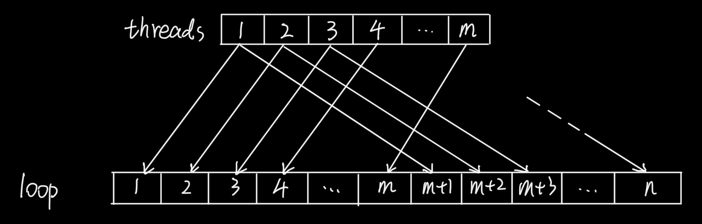

## 2022/2/20

Pthreads:

Looking for a generic method to parallelized *for-loop* simply.

## 2022/2/18

OCaml:

//

OCaml Homework:

1. Slide P.15:

```
# sqrt 2.0 *. 2.0;;
- : float = 2.82842712474619029
```

```
# let distance x y = sqrt (x ** 2.0 +. y ** 2.0);;
val distance : float -> float -> float = <fun>
```

2. Slide P.32:

```
# let rec range m n =
  if m > n then []
  else m::range (m + 1) n;;
```

3. Slide P.33:

```
# let rec union a b =
    match a with
    | [] -> b
    | h::t -> if member h b
    then union t b
    else union t (h::b);;
```

## 2022/2/16

Delta-stepping algorithm:

```c++
#include <iostream>
#include <vector>
#include <fstream>
#include <algorithm>
#include <map>
#include <tuple>
#include <string>
#include <queue>
#include <stack>
#include <thread>
#include <mutex>
#include <chrono>

#define INF 0x3f3f3f3f
#define N 14081999

class Graph {
    int V, E;
    std::map<int, std::vector<std::tuple<int, int, int>>> G;
public:
    bool input_graph(std::string path) {
        std::ifstream file;
        file.open(path, std::ios::in);
        if (!file.is_open())
            return false;
        file >> V;
        file >> E;
        for (int i = 0; i < E; ++i) {
            int u, v, w;
            file >> u >> v >> w;
            G[u].push_back(std::make_tuple(u, v, w));
        }
        return true;
    }
    void show_graph() {
        for (int v = 0; v < V; ++v) {
            std::cout << v << " : ";
            for (auto i = G[v].begin(); i != G[v].end(); ++i)
                std::cout << std::get<0>(*i) << "-(" << std::get<2>(*i) << ")->" << std::get<1>(*i) << "  ";
            std::cout << std::endl;
        }
    }
    int vertices() {
        return V;
    }
    std::vector<std::tuple<int, int, int>> &edges(int v) {
        return G[v];
    }
};

using namespace std;

struct edge {
    int to, cost;
};
struct req {
    int v, w;
};

int delta, tnum;
int n, m, maxbucket, cnt;
int tent[N];
vector<int> B[N];
vector<int> S;
vector<req> REQ;

bool bempty()
{
    for (int i = 0; i <= maxbucket; ++i)
        if(!B[i].empty())
            return false;
    return true;
}

void relax(int w, int d)
{
    if (d < tent[w]) {
        if (tent[w] != INF) {
            vector<int>::iterator res = find(B[tent[w] / delta].begin(), B[tent[w] / delta].end(), w);
            if (res != B[tent[w] / delta].end())
                B[tent[w] / delta].erase(res);
        }
        B[d / delta].push_back(w);
        if (d / delta > maxbucket)
            maxbucket = d / delta;
        tent[w] = d;
    }
}
 
void delta_stepping(int s, Graph G)
{
    maxbucket = 0;
    for (int i = 0; i < n; ++i)
        tent[i] = INF;
    relax(s, 0);
    int j = 0;
    while (!bempty()) {
        S.clear();
        while (!B[j].empty()) {
            REQ.clear();
            // for-loop can be parallelized
            for (int i = 0; i < B[j].size(); ++i) {
                int vv = B[j][i];
                for (int k = 0; k < G.edges(vv).size(); ++k) {
                    if (get<2>(G.edges(vv)[k]) <= delta) {
                        req r;
                        r.v = get<1>(G.edges(vv)[k]);
                        r.w = tent[vv] + get<2>(G.edges(vv)[k]);
                        REQ.push_back(r);
                    }
                }
                S.push_back(vv);
            }
            B[j].clear();
            // for-loop can be parallelized
            for (int i = 0; i < REQ.size(); ++i)
                relax(REQ[i].v, REQ[i].w);
        }
        REQ.clear();
        // for-loop can be parallelized
        for (int i = 0; i < S.size(); ++i) {
            int vv = S[i];
            for (int k = 0; k < G.edges(vv).size(); ++k)
                if (get<2>(G.edges(vv)[k]) > delta) {
                    req r;
                    r.v = get<1>(G.edges(vv)[k]);
                    r.w = tent[vv] + get<2>(G.edges(vv)[k]);
                    REQ.push_back(r);
                }
        }
        // for-loop can be parallelized
        for (int i = 0; i < REQ.size(); ++i)
            relax(REQ[i].v, REQ[i].w);
        j++;
    }
}

int main(int argc, char** argv)
{
    Graph G;
    G.input_graph("./graph.txt");
    delta_stepping(0, G);
    return 0;
}
```

TODO:

* Check the correctness
* Parallelized

## 2022/2/15

面谈:

1. complete the delta- stepping algorithm.
2. Pthreads is recommended, continue learning Pthreads.
3. After mastering how to use Pthreads, I can learn new programming languages.
4. Learning RasPi.
5. Learning GPU programming(on RasPi)
6. Functional programming: OCaml (or Haskell)
7. Material of parallel programming:
   * https://www.cs.cmu.edu/~blelloch/research.html
   * https://www3.cs.stonybrook.edu/~rezaul/CSE613-S17.html
   * https://www.cs.cmu.edu/~guyb/paralg/paralg/parallel.pdf
8. Learning Rust language.
9. Writing research dialog everyday, and supplement previous research logs

## 2022/2/15(前の日誌の整理)

OpenMP:

```c++
#include <omp.h>
#include <stdio.h>
#include <stdlib.h>

int main()
{
    int nthreads, tid;

    #pragma omp parallel private(nthreads, tid)
    {
        tid = omp_get_thread_num();
        printf("Hello World from thread = %d\n", tid);

        if (tid == 0)
        {
            nthreads = omp_get_num_threads();
            printf("Number of threads = %d\n", nthreads);
        }

    }
    return 0;
}
```

Two types of *for-loop*:

```c++
#include <iostream>
 
using namespace std;

int main()
{
#pragma omp parallel  
    for (int i=0; i<10; i++) 
    {
        cout << i;
    } 
 
    return 0;
}
```

```c++
#include <iostream>
 
using namespace std;

int main()
{
#pragma omp parallel for
    for (int i=0; i<10; i++) 
    {
        cout << i;
    } 
 
    return 0;
}
```

Deal with data in loops:

```c++
#include <iostream>
#include <math.h>
 
using namespace std;
int main()
{
    const int NUMBER = 100;
    int* dataA = new int[NUMBER];
    int* dataB = new int[NUMBER];
    for (int i= 0; i < NUMBER; i++) {
        dataA[i] = i + 1;
        dataB[i] = 2 * (i + 1);
    }    
    long double sum = 0.0;
 
    omp_set_num_threads(4);
    #pragma omp parallel for reduction(+:sum)
    for (int i = 0; i < NUMBER;  i++) {
        sum += dataA[i] + dataB[i];
    }   
    cout << sum << endl;
 
    delete [] dataA;
    delete [] dataB;
    return 0;
}
```

Other important functions:

```c++
// set the number of threads
_OMPIMP void _OMPAPI omp_set_num_threads(int _Num_threads);
 // get the number of threads now
_OMPIMP int  _OMPAPI omp_get_num_threads(void);
 // get max number of threads
_OMPIMP int  _OMPAPI omp_get_max_threads(void);
 // get thread id
_OMPIMP int  _OMPAPI omp_get_thread_num(void);
 // get cpu core number
_OMPIMP int  _OMPAPI omp_get_num_procs(void);
_OMPIMP void _OMPAPI omp_set_dynamic(int _Dynamic_threads);
_OMPIMP int  _OMPAPI omp_get_dynamic(void);
_OMPIMP int  _OMPAPI omp_in_parallel(void);
_OMPIMP void _OMPAPI omp_set_nested(int _Nested);
_OMPIMP int  _OMPAPI omp_get_nested(void);
_OMPIMP void _OMPAPI omp_init_lock(omp_lock_t * _Lock);
_OMPIMP void _OMPAPI omp_destroy_lock(omp_lock_t * _Lock); _OMPIMP void _OMPAPI omp_set_lock(omp_lock_t * _Lock);
_OMPIMP void _OMPAPI omp_unset_lock(omp_lock_t * _Lock);
_OMPIMP int  _OMPAPI omp_test_lock(omp_lock_t * _Lock);
_OMPIMP void _OMPAPI omp_init_nest_lock(omp_nest_lock_t * _Lock);
_OMPIMP void _OMPAPI omp_destroy_nest_lock(omp_nest_lock_t * _Lock);
_OMPIMP void _OMPAPI omp_set_nest_lock(omp_nest_lock_t * _Lock);
 _OMPIMP void _OMPAPI omp_unset_nest_lock(omp_nest_lock_t * _Lock);
_OMPIMP int  _OMPAPI omp_test_nest_lock(omp_nest_lock_t * _Lock);
_OMPIMP double _OMPAPI omp_get_wtime(void);
_OMPIMP double _OMPAPI omp_get_wtick(void);
```

Dijkstra's algorithm:

```c++
#include <iostream>
#include <fstream>
#include <map>
#include <vector>
#include <tuple>
#include <string>
#include <queue>
#include <stack>
#include <thread>
#include <mutex>
#include <chrono>

class Graph {
    int V, E;
    std::map<int, std::vector<std::tuple<int, int, int>>> G;
public:
    bool input_graph(std::string path) {
        std::ifstream file;
        file.open(path, std::ios::in);
        if (!file.is_open())
            return false;
        file >> V;
        file >> E;
        for (int i = 0; i < E; ++i) {
            int u, v, w;
            file >> u >> v >> w;
            G[u].push_back(std::make_tuple(u, v, w));
        }
        return true;
    }
    void show_graph() {
        for (int v = 0; v < V; ++v) {
            std::cout << v << " : ";
            for (auto i = G[v].begin(); i != G[v].end(); ++i)
                std::cout << std::get<0>(*i) << "-(" << std::get<2>(*i) << ")->" << std::get<1>(*i) << "  ";
            std::cout << std::endl;
        }
    }
    int vertices() {
        return V;
    }
    std::vector<std::tuple<int, int, int>> &edges(int v) {
        return G[v];
    }
};

// Dijkstra
class Dijkstra {
protected:
    Graph G;
    int s;
    int *distTo = nullptr;
    int *edgeTo = nullptr;
    std::chrono::time_point<std::chrono::steady_clock> _start, _end;
    std::chrono::duration<double> diff;
    static bool relax(Dijkstra &D, std::tuple<int, int, int> e, int &r) {
        int u = std::get<0>(e);
        int v = std::get<1>(e);
        int w = std::get<2>(e);
        if (D.distTo[v] > D.distTo[u] + w) {
            D.distTo[v] = D.distTo[u] + w;
            D.edgeTo[v] = u;
            r = v;
            return true;
        }
        return false;
    }
    void start() {
        _start = std::chrono::steady_clock::now();
    }
    void end() {
        _end = std::chrono::steady_clock::now();
        diff = _end - _start;
    }
public:
    static const int INFINITY = 99999;
    Dijkstra(Graph &G, int s): G(G), s(s) {
        distTo = new int[G.vertices()];
        edgeTo = new int[G.vertices()];
        _start = std::chrono::steady_clock::now();
        _end = _start;
    }
    ~Dijkstra() {
        delete [] distTo;
        delete [] edgeTo;
    }
    void run() {
        start();
        for (int v = 0; v < G.vertices(); ++v)
            distTo[v] = INFINITY;
        distTo[s] = 0;
        auto dist_greater = [&](const int &i, const int &j) -> bool { return distTo[i] > distTo[j]; };
        std::priority_queue<int, std::vector<int>, decltype(dist_greater)> minHeap(dist_greater);
        minHeap.push(s);
        while (!minHeap.empty()) {
            int v = minHeap.top();
            minHeap.pop();
            auto edges = G.edges(v);
            #pragma omp parallel for
            for (int i = 0; i < edges.size(); ++i) {
                int r;
                if (relax(*this, edges[i], r))
                    minHeap.push(r);
            }
        }
        end();
    }
    void result() {
        std::cout << "Source: " << s << std::endl;
        for (int i = 0; i < G.vertices(); ++i) {
            std::cout << s << "-(" << distTo[i] << ")->" << i << " : ";
            std::stack<int> path;
            for (int j = i; j != s; j = edgeTo[j])
                path.push(j);
            path.push(s);
            while (!path.empty()) {
                std::cout << path.top() << " ";
                path.pop();
            }
            std::cout << std::endl;
        }
    }
    void time() {
        std::cout << "Time: " << diff.count() << std::endl;
    }
};

// Main
int main(int argc, char *argv[])
{
    if (argc == 1) {
        Graph G;
        // G.input_graph(std::string(argv[1]));
        G.input_graph("./graph.txt");
        // G.show_graph();
        Dijkstra D(G, 0);
        D.run();
        D.result();
        D.time();
    }
    return 0;
}
```

## 2022/1/12

Delta-stepping algorithm:

```c++
#include <iostream>
#include <vector>
#include <fstream>
#include <algorithm>

#define INF 0x3f3f3f3f
#define N 14081999

using namespace std;

struct edge {
    int to, cost;
};
struct req {
    int v, w;
};

int delta, tnum;
int n, m, maxbucket, cnt;
fstream f, ss;
vector<edge> G[N];
int tent[N];
vector<int> B[N];
vector<int> S;
vector<req> REQ;
int source[999];

bool bempty()
{
    for (int i = 0; i <= maxbucket; ++i)
        if(!B[i].empty())
            return false;
    return true;
}

void relax(int w, int d)
{
    if (d < tent[w]) {
        if (tent[w] != INF) {
            vector<int>::iterator res = find(B[tent[w] / delta].begin(), B[tent[w] / delta].end(), w);
            if (res != B[tent[w] / delta].end())
                B[tent[w] / delta].erase(res);
        }
        B[d / delta].push_back(w);
        if (d / delta > maxbucket)
            maxbucket = d / delta;
        tent[w] = d;
    }
}
 
void delta_stepping(int s)
{
    maxbucket = 0;
    for (int i = 0; i < n; ++i)
        tent[i] = INF;
    relax(s, 0);
    int j = 0;
    while (!bempty()) {
        S.clear();
        while (!B[j].empty()) {
            REQ.clear();
            // for-loop can be parallelized
            for (int i = 0; i < B[j].size(); ++i) {
                int vv = B[j][i];
                for (int k = 0; k < G[vv].size(); ++k)
                    if (G[vv][k].cost <= delta) {
                        req r;
                        r.v = G[vv][k].to;
                        r.w = tent[vv] + G[vv][k].cost;
                        REQ.push_back(r);
                    }
                S.push_back(vv);
            }
            B[j].clear();
            // for-loop can be parallelized
            for (int i = 0; i < REQ.size(); ++i)
                relax(REQ[i].v, REQ[i].w);
        }
        REQ.clear();
        // for-loop can be parallelized
        for (int i = 0; i < S.size(); ++i) {
            int vv = S[i];
            for (int k = 0; k < G[vv].size(); ++k)
                if (G[vv][k].cost > delta) {
                    req r;
                    r.v = G[vv][k].to;
                    r.w = tent[vv] + G[vv][k].cost;
                    REQ.push_back(r);
                }
        }
        // for-loop can be parallelized
        for (int i = 0; i < REQ.size(); ++i)
            relax(REQ[i].v, REQ[i].w);
        j++;
    }
}
```

TODO:

* Graph Class
* Parallelized

## 2022/1/2

面白い問題一つです。

中国のDMアプリでオイラー路を解けたRed Packetがもらえるゲームがあります。彼女からとっても複雑のオイラー路問題がもらった、一応Undirected Graphのオイラー路を解けるプログラムを書きました。

```c++
#include <iostream>
#include <fstream>

int vertices, edges;
int matrix[999][999];
int degree[999];
int c_count = 0;
int circuit[999];

void DFS(int s)
{
    for (int i = 0; i < vertices; ++i) {
        if (matrix[s][i]) {
            matrix[s][i] = matrix[i][s] = 0;
            DFS(i);
        }
    }
    circuit[c_count++] = s;
}

int main(int argc, char const *argv[])
{
    for (int i = 0; i < 999; ++i)
        for (int j = 0; j < 999; ++j)
            matrix[i][j] = 0;
    std::ifstream file;
    file.open("./redpacket_graph.txt", std::ios::in);
    if (!file.is_open())
        return -1;
    file >> vertices;
    file >> edges;
    for (int i = 0; i < edges; ++i) {
        int u, v;
        file >> u >> v;
        matrix[u][v] = matrix[v][u] = 1;
        degree[u]++;
        degree[v]++;
    }
    int count = 0;
    int start = 0;
    for (int i = 0; i < vertices; ++i) {
        if (degree[i] % 2 == 1) {
            count++;
            start = i;
        }
    }
    if (count != 0 && count != 2) {
        return -1;
    }
    else {
        DFS(start);
        for (int i = 0; i < c_count; ++i) {
            std::cout << circuit[i] << " ";
        }
        std::cout << std::endl;
    }
    return 0;
}
```

DFSでオイラー路が解けます。プログラムが読める図はEdge Graph Formatで表示します。

今の研究と関係がないが、おもしろい問題ですそしてこれも図の問題です、だから研究日誌に記録します。